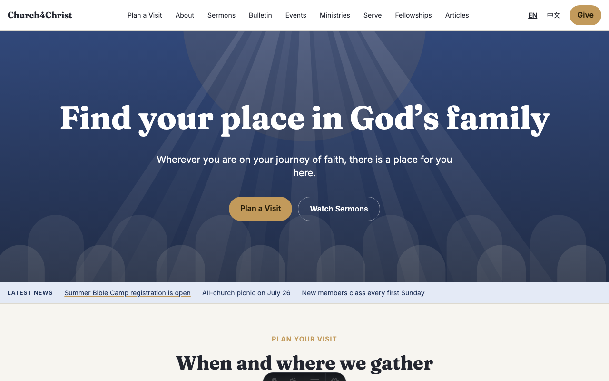
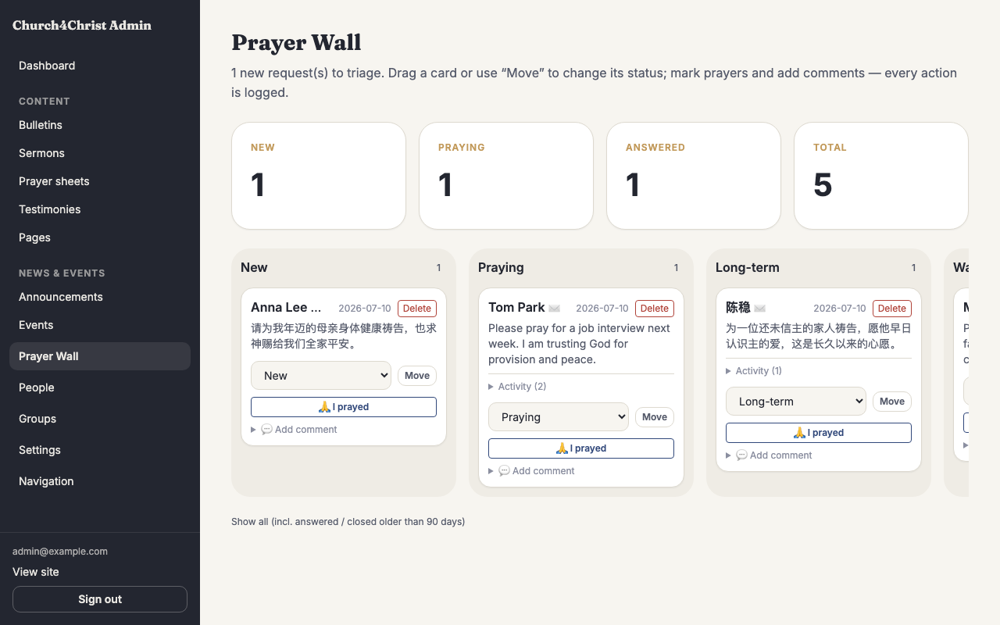
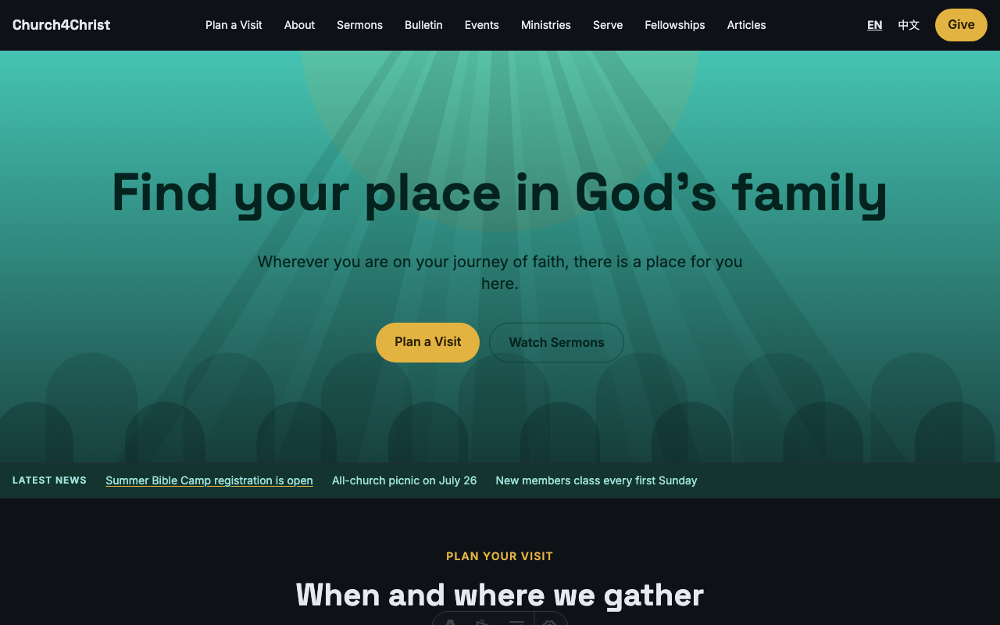
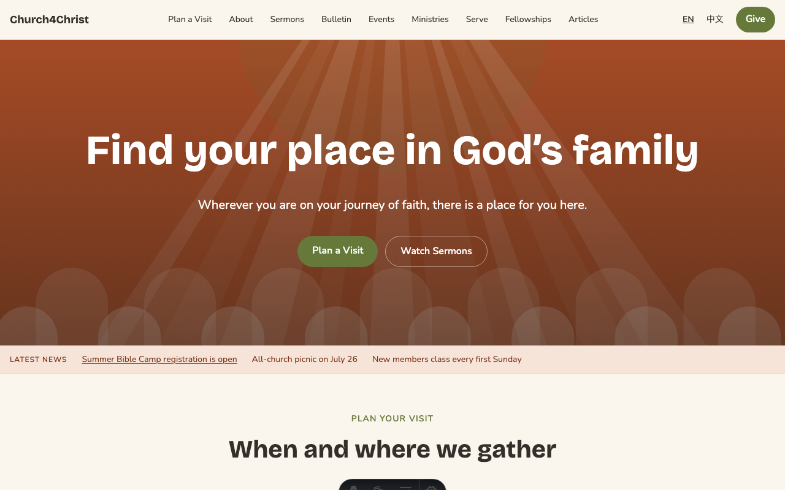
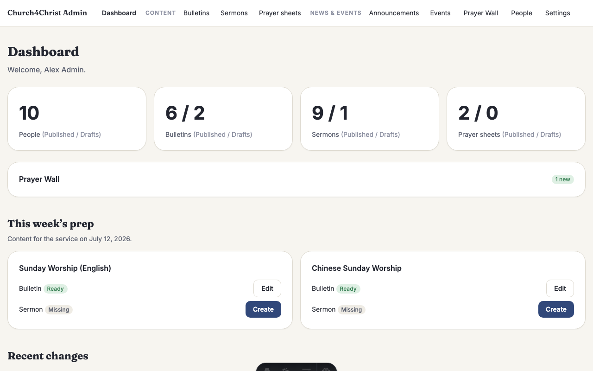
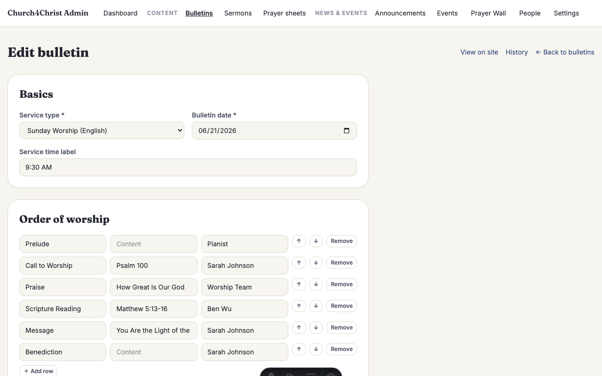
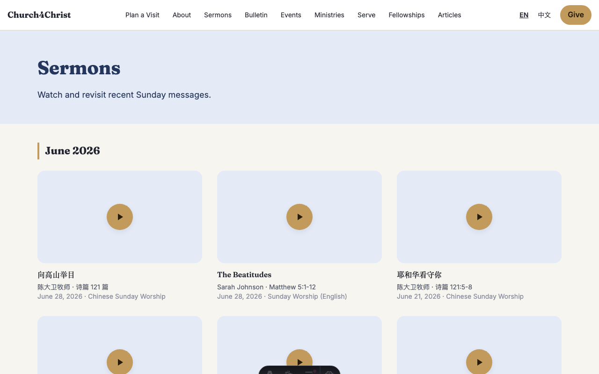
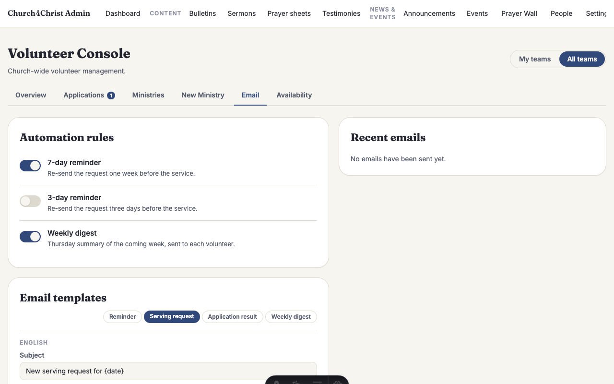

# Church4Christ

**A complete church website your team can actually run — for $0/month.**

Church4Christ is a full church website and admin system: a bilingual public site
(home, sermons, weekly bulletins, events, ministries, staff, articles, a prayer
form) plus a private area where your staff and volunteers update content, care for
prayer requests, and schedule people to serve. It runs on a free hosting plan, loads
fast anywhere in the world, and is yours to keep — the site and the code both.

|  |  |  |
|---|---|---|
|  |  |  |
|  |  |  |

Two languages out of the box (English and Chinese), three ready-made looks, and no
monthly bill. The rest of this page explains why that is possible and how to try it.

---

## Why not WordPress, Wix, or a paid service?

Those are good tools. For many churches, though, they mean a monthly bill that never
stops, a site that slows down as you add plugins, and content that lives on someone
else's platform. Church4Christ takes a different path: the whole site is a small,
self-contained project that runs on **Cloudflare's free tier**, so a typical church
site costs **nothing per month** to host.

| | **Church4Christ** | WordPress (self-hosted) | Wix / Squarespace | Custom agency build |
|---|---|---|---|---|
| **Monthly cost** | $0 (free tier) | Hosting + plugins, ongoing | Subscription, ongoing | Build fee + hosting |
| **Speed worldwide** | Fast everywhere (served near the visitor) | Depends on host | Good | Depends on build |
| **You own your data** | Yes, fully | Yes | No — lives on their platform | Usually |
| **You own the code** | Yes — it is all here, open source | Yes | No | Depends on contract |
| **Vendor lock-in** | None | Some (plugins) | High | High (one agency) |
| **Security upkeep** | Almost none — no plugin treadmill | Constant plugin/security updates | Handled for you | Depends on retainer |
| **Bilingual** | Built in (English + Chinese) | Add-on plugin | Add-on / manual | Custom work |
| **Set-up difficulty** | Needs one technical volunteer or an AI assistant, once | Moderate | Easy | You hire it out |
| **Drag-and-drop page builder** | No | Yes (plugins) | Yes | Varies |

**The honest trade-offs.** Church4Christ has **no drag-and-drop page builder** — you
edit content through clear admin forms, not by dragging boxes around a canvas. WordPress's
huge plugin ecosystem can also extend a site in thousands of ready-made directions that
this project simply does not try to match. And the
**initial setup** (creating the free account, deploying once, entering your church's
details) needs someone comfortable with a few commands **or** an AI assistant to do it
for you. After that, the day-to-day — writing bulletins, adding sermons, scheduling
volunteers — is ordinary form-filling that any staff member can do.

What you get in return: **no monthly bill, no plugin updates to babysit, no vendor who
can raise your price or shut you down, and a site that stays fast** as it grows.

---

## Build it with an AI assistant

You do not have to be a developer to run this project. This repository is written to be
**read by an AI coding assistant** — tools like [Claude Code](https://www.claude.com/product/claude-code)
or Codex. Every feature has a plain-English guide in [`docs/features/`](docs/features/),
and the code is covered by **over 470 automated tests**, so an assistant can make changes
with confidence and you can tell whether they worked.

The idea: open this project with an AI assistant, describe what you want in normal
language, and let it do the editing. Some real examples you could paste in:

> "Read `docs/features/public-site-and-themes.md`, then change our primary color to
> royal blue and show me the home page."

> "Add a Spanish (`es`) locale following `docs/i18n.md`."

> "Set up my church's name, address, and service times in the seed data, then deploy
> following `docs/deploy.md`."

Maintenance works the same way. Need to fix a typo across the site, add a new ministry,
or change the weekly digest wording? Describe it in a sentence and let the assistant
handle the details — keeping a site running becomes about as hard as sending a chat
message.

---

## Our mission

**To be the simplest, fastest, and cheapest way for a church or nonprofit to run a real
website** — one that is easy to maintain, especially with an AI assistant helping. No
subscription, no lock-in, no compromise on speed or ownership. A small congregation
should be able to stand up a professional bilingual site and keep it running for years
without a line item in the budget or a developer on call.

---

## What's inside

Every feature has its own plain-English guide. Start with any of these:

| | Feature | What it does |
|---|---|---|
| [](docs/features/public-site-and-themes.md) | **[Public site & themes](docs/features/public-site-and-themes.md)** | Your church's front door — home, sermons, events, staff — in one of three ready-made looks. |
| [](docs/features/cms-admin.md) | **[The admin area](docs/features/cms-admin.md)** | Passwordless sign-in, roles, and a one-click undo on every edit. |
| [](docs/features/bulletins.md) | **[Weekly bulletins](docs/features/bulletins.md)** | Build the Sunday service sheet and schedule it to publish on its own. |
| [](docs/features/sermons.md) | **[Sermon archive](docs/features/sermons.md)** | Paste a YouTube link; get a searchable, fast-loading library of past messages. |
| [](docs/features/prayer-wall.md) | **[Prayer wall](docs/features/prayer-wall.md)** | Receive prayer requests and work them on a simple board, privately. |
| [](docs/features/volunteer-serve.md) | **[Volunteer scheduling](docs/features/volunteer-serve.md)** | Plan a month of serving at a glance; volunteers confirm by email, no login. |
| [](docs/features/i18n.md) | **[Two languages](docs/features/i18n.md)** | Every page in English and Chinese, with one-click Simplified-to-Traditional. |
| [](docs/features/email-automation.md) | **[Email & automation](docs/features/email-automation.md)** | Sign-in links, reminders, and a weekly digest that send themselves. |

---

## Try it in 5 minutes (on your own computer)

You can run the whole site locally — with realistic sample content — before you commit
to anything. You will need [Node.js](https://nodejs.org/) 22 or newer installed.

```bash
# 1. Get the code and install it
git clone https://github.com/leveo/church4christ.git
cd church4christ
npm install

# 2. Create your local settings (safe demo values, already filled in)
cp .dev.vars.example .dev.vars

# 3. Generate types, build the theme colors, create and fill the local database
npm run cf-typegen
npm run tokens
npm run db:migrate:local
npm run db:seed:local

# 4. Start it
npm run dev
```

Open the address it prints (usually `http://localhost:4321`). You will see the full
public site with sample sermons, bulletins, events, and ministries.

**Signing in to the admin area.** There is no password. On the sign-in page, enter
`admin@example.com` and request a link — because local email is set to print instead of
send, the **magic-link URL appears right in your terminal**. Paste it into the browser
and you are in. (For even quicker poking around, `.dev.vars` also sets
`AUTH_DEV_BYPASS_EMAIL=admin@example.com`, which signs you in automatically in local
development — no link needed. Remove that line to test the real sign-in flow.)

---

## Putting it online

When you are ready to publish, [**`docs/deploy.md`**](docs/deploy.md) is a full,
step-by-step walkthrough. In short: create a **free Cloudflare account**, create the
database and storage bucket, paste their IDs into one config file, set one secret, and
run **`npm run deploy`**. You can point your own domain (for example,
`church.yourname.com`) at it in a few more clicks. The guide covers the first-admin
setup and email so a real congregation can start using the site the same day.

---

## What's under the hood

For the curious: Church4Christ is built with **[Astro](https://astro.build/)** rendering
pages on the server, running as a single **Cloudflare Worker**. Data lives in Cloudflare
**D1** (a SQL database) and uploaded images in Cloudflare **R2** (object storage); email
goes out through Cloudflare's email binding. There is **no client-side JavaScript
framework** — pages are plain, fast HTML with a sprinkle of vanilla script — which is a
big part of why the site loads quickly and costs so little to run.

The whole look comes from **design tokens**: a set of color and type values in
`design/` that compile into three ready-made themes (Sanctuary, Harvest, Midnight),
each with a light and a dark mode. And the code is held together by **over 470 automated
tests**, so changes — yours or an AI assistant's — are verifiable, not hopeful. For the
full picture, see [`docs/architecture.md`](docs/architecture.md),
[`docs/design-system.md`](docs/design-system.md), and [`docs/i18n.md`](docs/i18n.md).

---

## License

Church4Christ is free and open-source software under the **[GNU General Public License
v3](LICENSE)** (GPL-3.0). In plain terms: you are free to **use, study, modify, and
share** this software, for your church or anyone else's, at no cost. If you distribute a
modified version, it must **stay open source under the same license** — improvements
come back to the community rather than disappearing into a closed product. Taking this
codebase closed-source or selling it as a proprietary product is **not permitted**. See
[`LICENSE`](LICENSE) for the full text.

---

## Contributing & roadmap

Contributions are welcome — bug reports, translations, new features. Start with
[`CONTRIBUTING.md`](CONTRIBUTING.md) for the dev setup and the project's four rules, and
[`SECURITY.md`](SECURITY.md) if you have found a security issue.

**On the horizon (not built yet):** a Sunday check-in flow and a between-churches "swap
marketplace" for sharing themes and content are ideas we are considering, not promises.
If one matters to your church, open an issue and let's talk.

---

Built with care, and with the help of AI, for churches and nonprofits everywhere.
