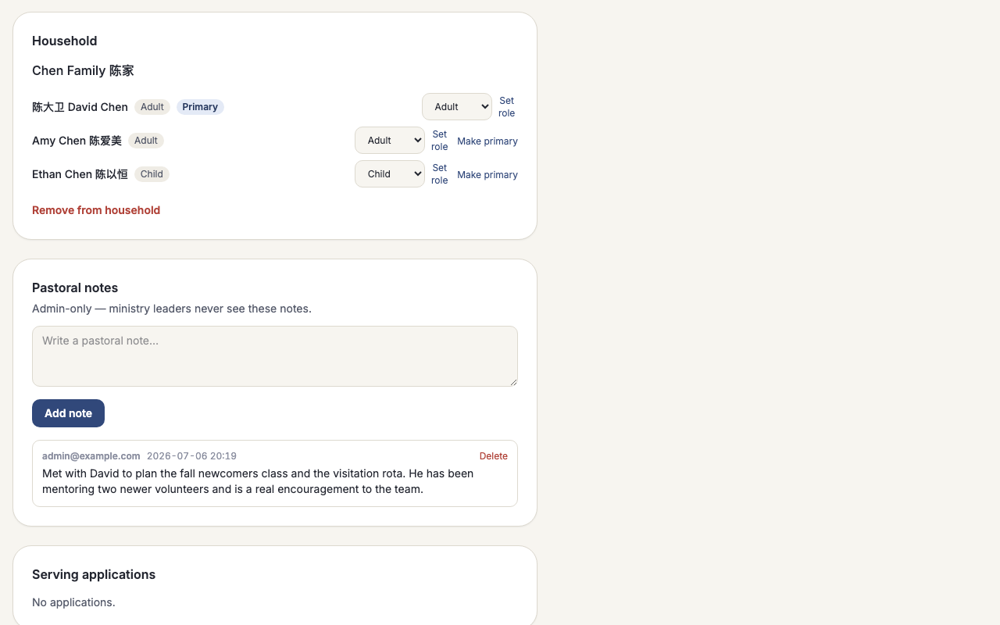

# Church4Christ

**A complete church website your team can actually run — for $0/month.**

Church4Christ is a full church website and admin system: a bilingual public site
(home, sermons, weekly bulletins, events, ministries, staff, articles, a prayer
form) plus a private area where your staff and volunteers update content, care for
prayer requests, schedule people to serve, and manage members and households. It runs on a free hosting plan, loads
fast anywhere in the world, and is yours to keep — the site and the code both.

|  |  |  |
|---|---|---|
|  |  |  |
|  |  |  |

Two languages out of the box (English and Chinese), three ready-made looks, and no
monthly bill. The rest of this page explains why that is possible and how to try it.

---

## Who is this for?

Small and mid-size churches, fellowships, and nonprofits — **especially bilingual and
immigrant congregations** — that want a fast, modern website without a monthly bill or a
professional web team. It fits best if you want to **own your content and your members'
data**, and you either have one technically-comfortable volunteer or are happy to let an
AI assistant do the setup. If you would rather pay for a hands-off, all-in-one church
platform, a mature service like **Planning Center** may suit you better — the
comparison below and [`docs/why-this-stack.md`](docs/why-this-stack.md) are honest about
when to choose which.

## Why not WordPress, Wix, or a service like Planning Center?

Those are good tools. For many churches, though, they mean a monthly bill that never
stops, a site that slows down as you add plugins, and content that lives on someone
else's platform. Church4Christ takes a different path: the whole site is a small,
self-contained project that runs on **Cloudflare's free tier**, so a typical church
site costs **nothing per month** to host.

| | **Church4Christ** | WordPress (self-hosted) | Wix / Squarespace | Church SaaS (e.g. Planning Center) |
|---|---|---|---|---|
| **Monthly cost** | $0 (free tier) | Hosting + plugins, ongoing | Subscription, ongoing | Subscription, per module |
| **Speed worldwide** | Fast everywhere (served near the visitor) | Depends on host | Good | Good |
| **You own your data** | Yes, fully | Yes | No — lives on their platform | No — lives on their platform |
| **You own the code** | Yes — it is all here, open source | Yes | No | No |
| **Vendor lock-in** | None | Some (plugins) | High | High |
| **Security upkeep** | Almost none — no plugin treadmill | Constant plugin/security updates | Handled for you | Handled for you |
| **Bilingual** | Built in (English + Chinese) | Add-on plugin | Add-on / manual | Limited |
| **Public website + CMS + volunteers** | All in one, free | Website only (add plugins) | Website only | Strong on management; website often separate |
| **Set-up difficulty** | Needs one technical volunteer or an AI assistant, once | Moderate | Easy | Easy |
| **Drag-and-drop page builder** | Yes, for your own pages (optional) | Yes (plugins) | Yes | Varies |

**The honest trade-offs.** The built-in pages — home, sermons, bulletins, and the rest —
are still shaped by the theme, not something you drag around; the drag-and-drop canvas is
for your own custom pages only, and its blocks are simpler than a WordPress page-builder
plugin's. WordPress's huge plugin ecosystem can also extend a site in thousands of
ready-made directions that this project simply does not try to match. Mature church
platforms like **Planning
Center** are genuinely excellent at internal church management (giving, check-ins,
membership) and ask nothing technical of you — this project is **not trying to out-feature
them**; it trades their polish and hands-off convenience for **$0 cost, full control, and
a unified public site**. And the **initial setup** (creating the free account, deploying
once, entering your church's details) needs someone comfortable with a few commands **or**
an AI assistant to do it for you. After that, the day-to-day — writing bulletins, adding
sermons, scheduling volunteers — is ordinary form-filling that any staff member can do.

What you get in return: **no monthly bill, no plugin updates to babysit, no vendor who
can raise your price or shut you down, and a site that stays fast** as it grows. The full
reasoning — including why Cloudflare instead of a server on AWS/Azure/GCP, and why this
particular tech stack — is in [**`docs/why-this-stack.md`**](docs/why-this-stack.md).

---

## Build it with an AI assistant

You do not have to be a developer to run this project. This repository is written to be
**read by an AI coding assistant** — tools like [Claude Code](https://www.claude.com/product/claude-code)
or Codex. Every feature has a plain-English guide in [`docs/features/`](docs/features/),
and the code is covered by **over 900 automated tests**, so an assistant can make changes
with confidence and you can tell whether they worked.

The idea: open this project with an AI assistant, describe what you want in normal
language, and let it do the editing. Some real examples you could paste in:

> "Read `docs/features/public-site-and-themes.md`, then change our primary color to
> royal blue and show me the home page."

> "Add a Spanish (`es`) locale following `docs/i18n.md`."

> "Set up my church's name, address, and service times in the seed data, then deploy
> following `docs/deploy.md`."

Maintenance works the same way. Need to fix a typo across the site, add a new ministry,
or change the weekly digest wording? Describe it in a sentence and let the assistant
handle the details — keeping a site running becomes about as hard as sending a chat
message.

---

## Our mission

**To be the simplest, fastest, and cheapest way for a church or nonprofit to run a real
website** — one that is easy to maintain, especially with an AI assistant helping. No
subscription, no lock-in, no compromise on speed or ownership. A small congregation
should be able to stand up a professional bilingual site and keep it running for years
without a line item in the budget or a developer on call.

---

## What's inside

Every feature has its own plain-English guide. Start with any of these:

| | Feature | What it does |
|---|---|---|
| [](docs/features/public-site-and-themes.md) | **[Public site & themes](docs/features/public-site-and-themes.md)** | Your church's front door — home, sermons, events, staff — in one of three ready-made looks. |
| [](docs/features/cms-admin.md) | **[The admin area](docs/features/cms-admin.md)** | Passwordless sign-in, roles, and a one-click undo on every edit. |
| [](docs/features/bulletins.md) | **[Weekly bulletins](docs/features/bulletins.md)** | Build the Sunday service sheet and schedule it to publish on its own. |
| [](docs/features/sermons.md) | **[Sermon archive](docs/features/sermons.md)** | Paste a YouTube link; get a searchable, fast-loading library of past messages. |
| [](docs/features/prayer-wall.md) | **[Prayer wall](docs/features/prayer-wall.md)** | Receive prayer requests and work them on a simple board, privately. |
| [](docs/features/volunteer-serve.md) | **[Volunteer scheduling](docs/features/volunteer-serve.md)** | Plan a month of serving at a glance; volunteers confirm by email, no login. |
| [](docs/features/people-households.md) | **[People & households](docs/features/people-households.md)** | Give everyone a profile — families, membership status, private pastoral notes, and a board that connects members to serving. |
| [](docs/features/children-checkin.md) | **[Children's check-in](docs/features/children-checkin.md)** | A touch-friendly kiosk where parents check kids in and out with a pickup code, plus weekly attendance charts. |
| [](docs/features/page-builder.md) | **[Page builder](docs/features/page-builder.md)** | Drag and drop your own custom pages together — bilingual, always on-theme, and published pages load with zero JavaScript. Optional; switching it off never breaks a page you already built. |
| [](docs/features/giving.md) | **[Giving](docs/features/giving.md)** | Receive card gifts online through Stripe, record checks and cash by hand, and let every family see its own giving history. |
| [](docs/features/registration.md) | **[Registration](docs/features/registration.md)** | Put events online for sign-up — free or paid through Stripe — with your own questions and a roster you can export. |
| [](docs/features/member-portal.md) | **[Member portal](docs/features/member-portal.md)** | A signed-in home for members — household, groups, events, serving, calendar, and the prayer wall, all in one place. |
| [](docs/features/i18n.md) | **[Two languages](docs/features/i18n.md)** | Every page in English and Chinese, with one-click Simplified-to-Traditional. |
| [](docs/features/email-automation.md) | **[Email & automation](docs/features/email-automation.md)** | Sign-in links, reminders, and a weekly digest that send themselves. |
| [](docs/features/modules.md) | **[Modules](docs/features/modules.md)** | Switch off the features you don't use; nothing is deleted, flip back anytime. |

**Pick your modules.** Every capability above is a **module** you can switch off from one
panel in Settings — bulletins, sermons, the prayer wall, volunteer scheduling, and more.
New installations write every module setting explicitly from the setup selection; the Full
Church demo selects all 16. On older installations only, missing module rows retain the
legacy default-on behavior. A church that wants only service times and sermons can hide the
rest in a click: the module's pages, links, and emails disappear together, and nothing is
deleted. See [**`docs/features/modules.md`**](docs/features/modules.md).

<!-- capabilities:start -->
| Key | English | 中文 | Required database |
|---|---|---|---|
| `bulletins` | Bulletins | 周报 | Either |
| `sermons` | Sermons | 讲道 | Either |
| `prayer-sheets` | Prayer Sheets | 祷告单 | Either |
| `prayer-wall` | Prayer Wall | 祷告墙 | Either |
| `events` | Events | 活动 | Either |
| `serve` | Volunteer Scheduling | 服事排班 | Either |
| `gifts` | Spiritual Gifts | 恩赐探索 | Either |
| `testimonies` | Testimonies | 见证 | Either |
| `articles` | Articles | 文章 | Either |
| `fellowships` | Fellowships | 团契 | Either |
| `people` | People & Households | 会友与家庭 | Either |
| `children` | Children Check-in | 儿童报到 | Either |
| `page-builder` | Page Builder | 页面编辑器 | Either |
| `portal` | Member Portal | 会友平台 | Supabase |
| `giving` | Giving | 奉献 | Supabase |
| `registration` | Registration | 活动报名 | Supabase |
<!-- capabilities:end -->

---

## Try it in 5 minutes (on your own computer)

You can run the whole site locally — with realistic sample content — before you commit
to anything. You will need [Node.js](https://nodejs.org/) 22 or newer installed. The guided
setup asks which initial feature set you want and chooses D1 or Supabase from that choice.

```bash
# 1. Get the code and install it
git clone https://github.com/leveo/church4christ.git
cd church4christ
npm install

# 2. Choose features, create the database, and bootstrap the first admin
npm run setup

# 3. For D1, start it (always follow the exact handoff setup prints)
npm run dev
```

For local Supabase, the handoff instead exports
`CLOUDFLARE_HYPERDRIVE_LOCAL_CONNECTION_STRING_HYPERDRIVE` in the host shell before
`npm run dev`; that connection URL must not go in `.dev.vars`.

Open the address it prints (usually `http://localhost:4321`). If you chose demo data during
setup, you will see sample sermons, bulletins, events, ministries, and local demo images.
The media step copies the generated image pack from `seed/media/` into local R2 and updates
the configured database records that refer to those objects. It is safe to run again after
reseeding the database. Without demo data, setup leaves a clean installation for your own
content.

**Signing in to the admin area.** There is no password. On the sign-in page, enter the
first-admin email from your setup answers, repeated in the setup handoff, and request a
link. Because local email is set to print instead of send, the **magic-link URL appears
right in your terminal**. Paste it into the browser and you are in. (For quicker local
testing, setup writes that same address as `AUTH_DEV_BYPASS_EMAIL` in `.dev.vars`, which
signs you in automatically. Remove that line to test the real sign-in flow.)

Setup offers **Website** (8 focused publishing modules), **Website + Community** (all 13
D1-compatible modules), and **Full Church** (all 16 modules). Portal, Giving, and
Registration select Supabase automatically; D1-compatible selections choose D1 unless you
explicitly override the backend. Account requirements depend on Local versus Deploy mode,
as detailed below. For automation, pass all answers with `--yes`; add `--json` for one
machine-readable result. For a human-readable noninteractive run, use the same complete
flags with `npm run setup -- ... --yes` and omit `--json`. To keep stdout strictly JSON
through npm, use the silent form:

```bash
npm run --silent setup -- --mode local --preset website --site-slug my-church \
  --church-name "My Church" --locale en --admin-email admin@example.com \
  --admin-name "First Admin" --app-origin http://localhost:4321 \
  --email-from admin@example.com --demo-data --yes --json
```

---

## Putting it online

New to this? Start with [**`docs/cloudflare-setup.md`**](docs/cloudflare-setup.md) — a
plain-language guide that explains what Cloudflare is, why hosting is free, and the two
ways to get online (including letting an AI assistant do it for you). When you want the
exact commands, [**`docs/deploy.md`**](docs/deploy.md) is the full step-by-step
walkthrough.

Start with `npm run setup`, choose **Deploy**, and answer the feature and church questions.
It creates or imports the required resources, writes the generated configuration, applies
migrations, records all 16 module settings, and bootstraps the first admin. It then hands
off to `npm run deploy`. Run `npm run doctor` whenever you want a readiness report.

**Choosing your database.** The 13 D1-compatible modules exclude **Member Portal**,
**Giving**, and **Registration**, which require Postgres. Account requirements follow the
mode: local D1 needs no external account; deployed D1 needs a Cloudflare account; local
Supabase needs a Supabase account or compatible local Postgres database; deployed Supabase
needs both Cloudflare and Supabase. There is no automated D1↔Supabase content migration yet,
so choose the production database before entering real content. See
[**`docs/supabase-setup.md`**](docs/supabase-setup.md).

---

## What's under the hood

For the curious: Church4Christ is built with **[Astro](https://astro.build/)** rendering
pages on the server, running as a single **Cloudflare Worker**. Data lives in Cloudflare
**D1** (a SQL database) and uploaded images in Cloudflare **R2** (object storage); email
goes out through Cloudflare's email binding. Visitor-facing pages ship **no client-side
JavaScript framework** — they are plain, fast HTML with a sprinkle of vanilla script —
which is a big part of why the site loads quickly and costs so little to run. (The one
exception lives behind the staff login: the drag-and-drop page builder is a small React
editor that only your team ever downloads; the pages it publishes are still plain HTML.)

The whole look comes from **design tokens**: a set of color and type values in
`design/` that compile into three ready-made themes (Sanctuary, Harvest, Midnight),
each with a light and a dark mode. And the code is held together by **over 1,000 automated
tests**, so changes — yours or an AI assistant's — are verifiable, not hopeful.

**Why these choices?** Why Cloudflare instead of a rented server on AWS, Azure, or GCP;
why Astro + Tailwind + TypeScript with no heavy framework; and when a mature service like
Planning Center is the better call — all of that is laid out honestly in
[**`docs/why-this-stack.md`**](docs/why-this-stack.md). For the technical picture, see
[`docs/architecture.md`](docs/architecture.md),
[`docs/design-system.md`](docs/design-system.md), and [`docs/i18n.md`](docs/i18n.md).

---

## License

Church4Christ is free and open-source software under the **[GNU General Public License
v3](LICENSE)** (GPL-3.0). In plain terms: you are free to **use, study, modify, and
share** this software, for your church or anyone else's, at no cost. If you distribute a
modified version, it must **stay open source under the same license** — improvements
come back to the community rather than disappearing into a closed product. Taking this
codebase closed-source or selling it as a proprietary product is **not permitted**. See
[`LICENSE`](LICENSE) for the full text.

---

## Contributing & roadmap

Contributions are welcome — bug reports, translations, new features. Start with
[`CONTRIBUTING.md`](CONTRIBUTING.md) for the dev setup and the project's four rules, and
[`SECURITY.md`](SECURITY.md) if you have found a security issue.

**On the horizon (not built yet):** a Sunday check-in flow and a between-churches "swap
marketplace" for sharing themes and content are ideas we are considering, not promises.
If one matters to your church, open an issue and let's talk.

---

Built with care, and with the help of AI, for churches and nonprofits everywhere.
