# Church4Christ

**An open-source bilingual church website and church-management foundation for
customized implementations.**

Church4Christ combines a bilingual public site with an admin system for content,
prayer care, volunteer scheduling, people, and households. Optional modules add a
member portal and other church-management workflows. The project aims to lower the
startup and ongoing maintenance cost of a customized implementation while keeping the
code and deployment configuration available to its operators.

Church4Christ is **pre-1.0** software, not a turnkey managed service. Local evaluation
is free, and some deployments can fit within provider free allowances, but production
hosting, email, databases, domains, backups, and other services may charge based on
configuration and usage. See [Deployment profiles and costs](#deployment-profiles-and-costs)
before choosing a production setup.

|  |  |  |
|---|---|---|
| 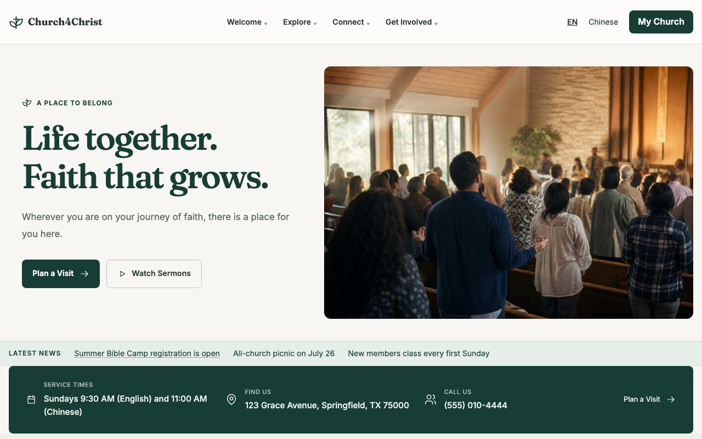 | 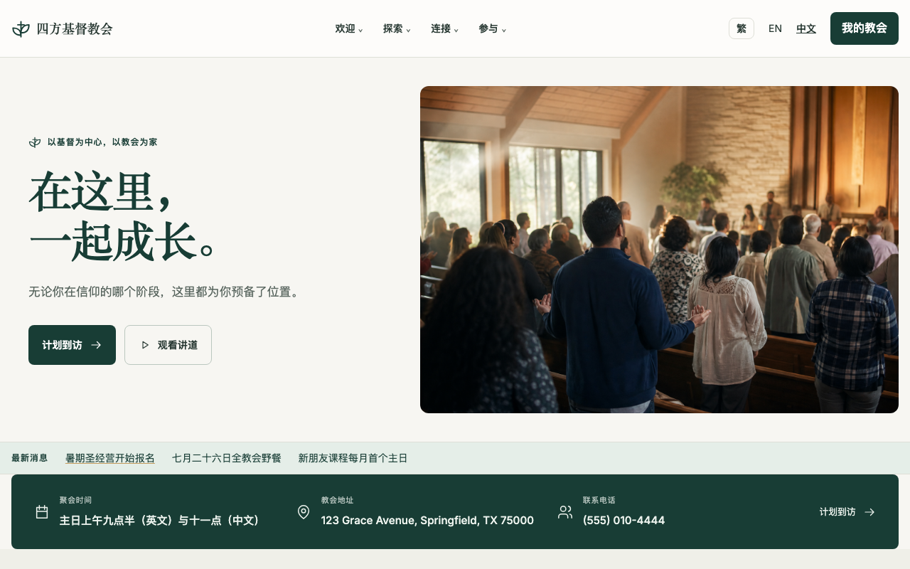 | 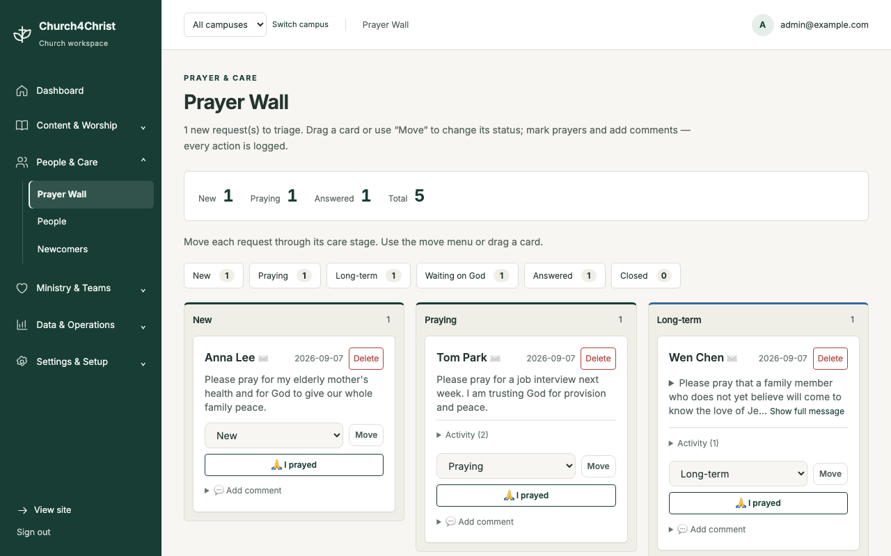 |
| 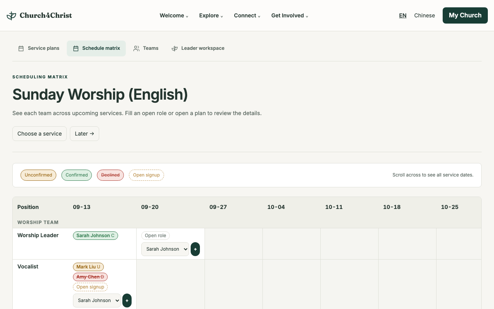 | 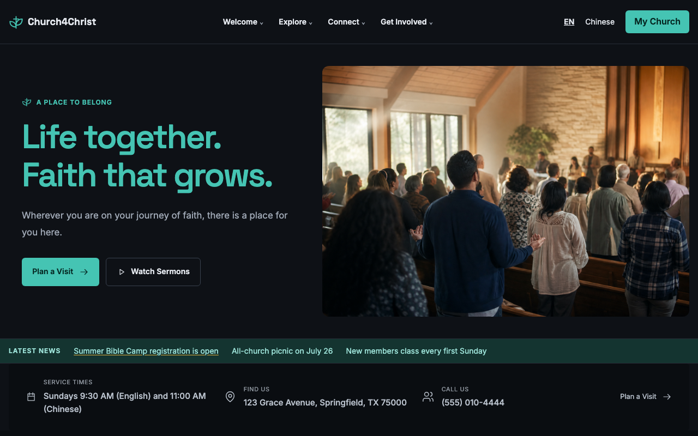 | 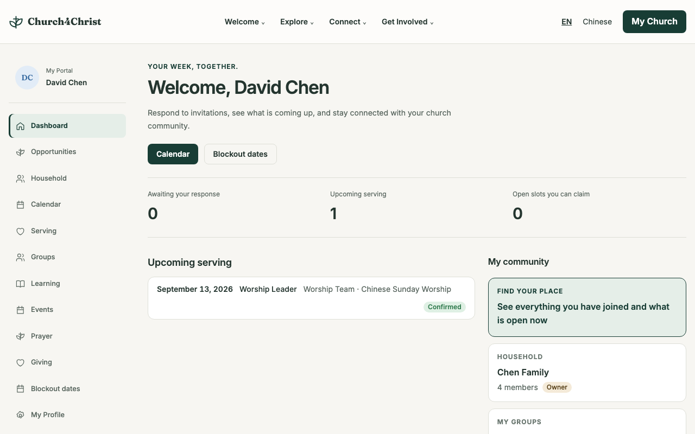 |

Two languages are included out of the box (English and Chinese), along with three
ready-made looks and a modular starting point for further customization.

---

## Who is this for?

Church4Christ is intended for small and mid-size churches, fellowships, and nonprofits —
especially bilingual and immigrant congregations — that need a public website and a
customizable church-management base. It fits best when a technically comfortable staff
member, volunteer, or implementation partner can own deployment and maintenance. A
managed platform may be a better fit when the organization prefers vendor-operated setup,
support, upgrades, and operational responsibility over source-level customization.

## How does this approach compare?

Different product categories serve different needs, and provider terms vary. This table
compares operating models rather than promising universal prices, portability, or data
rights.

| | **Church4Christ** | **Self-managed plugin CMS** | **Hosted site builder** | **Managed church platform** |
|---|---|---|---|---|
| **Primary fit** | Customized bilingual website plus modular church workflows | Extensible content website assembled from plugins | Provider-managed public website | Provider-managed church workflows |
| **Cost model** | Infrastructure and service usage; some profiles may fit free allowances | Hosting, extensions, and maintenance | Subscription and add-ons | Subscription, often by tier or module |
| **Customization** | Source-level changes and optional modules | Themes, plugins, and source changes where available | Provider-supported templates and extensions | Provider-supported configuration and integrations |
| **Operations** | Your team or implementation partner deploys, updates, monitors, and backs up | Your team or host manages core and plugin upkeep | Provider manages most platform operations | Provider manages most platform operations |
| **Portability** | Code and database access support migration, but migration is manual | Depends on hosting, plugins, and formats | Depends on provider exports and terms | Depends on provider exports, APIs, and terms |
| **Bilingual starting point** | English and Chinese included | Depends on selected extensions | Depends on the service and plan | Depends on the service and plan |

**The trade-offs.** Church4Christ is optimized for Cloudflare Workers and its bindings;
moving to another hosting stack is possible source work, not a supported one-click path.
There is also no automated D1-to-Supabase content migration. The built-in pages are shaped
by themes, while drag-and-drop editing applies only to custom pages. The project is
pre-1.0, so adopters should expect implementation work and evolving interfaces.

Operating the project also means maintaining it. Your technical owner remains responsible
for dependency updates, security review and configuration, monitoring, backups and restore
testing, and deploying fixes. The architecture reduces some infrastructure work, but it
does not remove security or operational upkeep. See
[**`docs/why-this-stack.md`**](docs/why-this-stack.md) for the design rationale.

---

## Build it with an AI assistant

You do not have to make every change by hand. This repository is organized so an AI coding
assistant can follow the plain-English guides in [`docs/features/`](docs/features/) and
work against extensive automated test coverage. That can lower customization and
maintenance effort, but a maintainer must still review the changes, run the relevant
tests, and deploy them deliberately.

The idea: open this project with an AI assistant, describe what you want in normal
language, and let it do the editing. Some real examples you could paste in:

> "Read `docs/features/public-site-and-themes.md`, then change our primary color to
> royal blue and show me the home page."

> "Add a Spanish (`es`) locale following `docs/i18n.md`."

> "Set up my church's name, address, and service times in the seed data, then deploy
> following `docs/deploy.md`."

The same workflow can help with maintenance: describe a change, inspect the proposed
diff, test it locally, and deploy only after the result has been reviewed. AI assistance
does not replace security decisions, backups, production testing, or operational ownership.

---

## Our mission

**To lower the cost and effort of starting a customized church-management system and
bilingual website.** Church4Christ provides a tested, modular foundation that a church or
implementation partner can adapt instead of starting from zero. It does not promise a
zero-subscription or zero-budget production service: infrastructure, email, database,
domain, support, and maintenance choices determine the real operating cost.

---

## What's inside

Every feature has its own plain-English guide. Start with any of these:

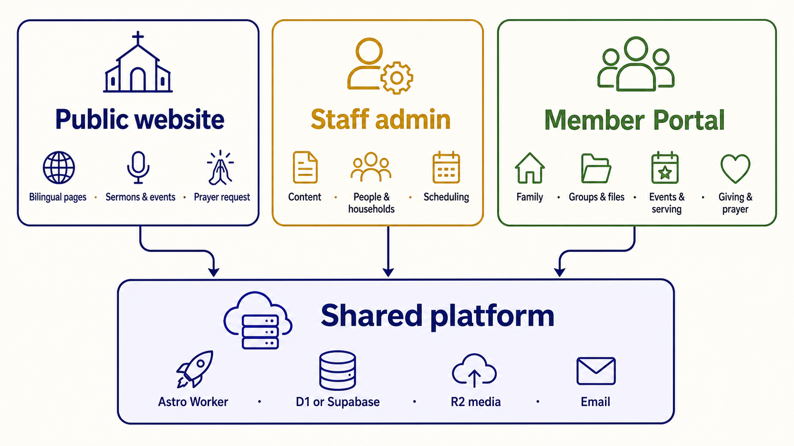

| | Feature | What it does |
|---|---|---|
| [](docs/features/public-site-and-themes.md) | **[Public site & themes](docs/features/public-site-and-themes.md)** | Your church's front door — home, sermons, events, staff — in one of three ready-made looks. |
| [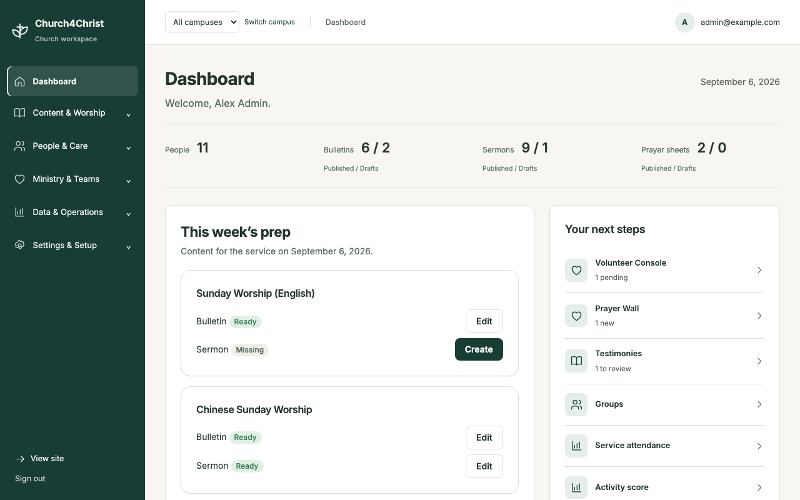](docs/features/cms-admin.md) | **[The admin area](docs/features/cms-admin.md)** | Passwordless sign-in, roles, and one-click restore for supported versioned editorial content. |
| [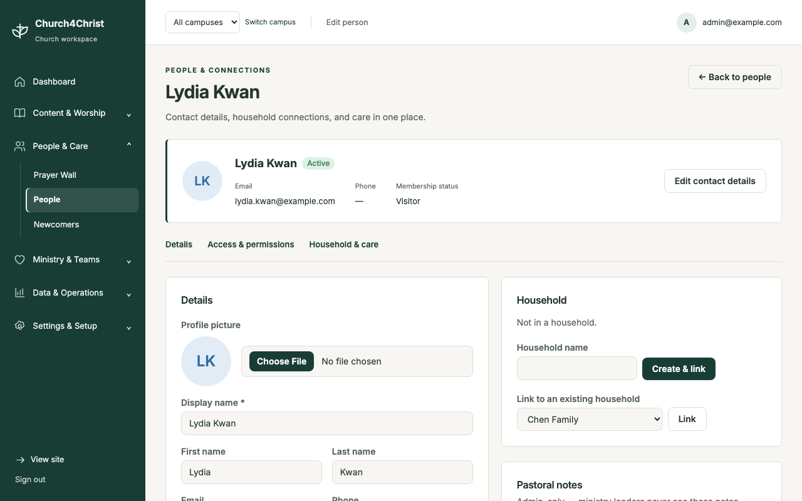](docs/features/admin-permissions.md) | **[Admin permissions](docs/features/admin-permissions.md)** | Grant each admin only the areas they need — prayer wall and the member directory come free, the rest by choice. |
| [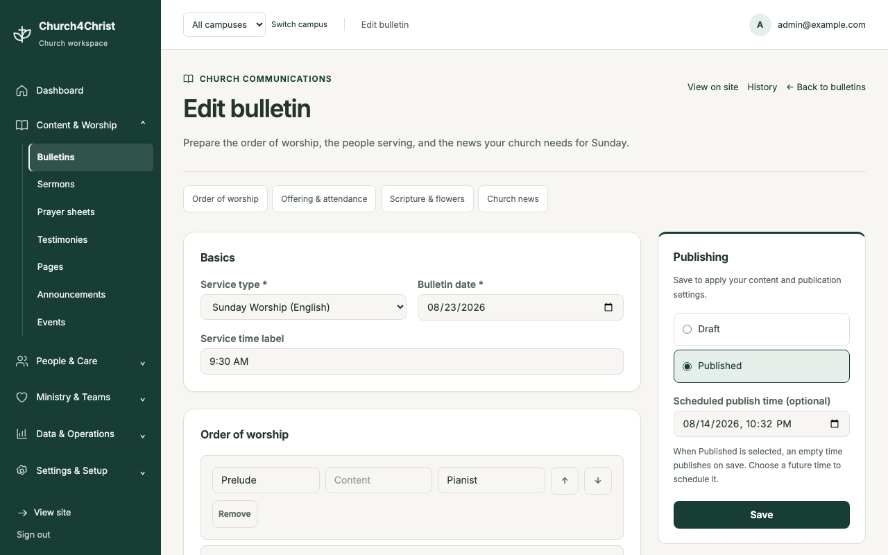](docs/features/bulletins.md) | **[Weekly bulletins](docs/features/bulletins.md)** | Build the Sunday service sheet and schedule it to publish on its own. |
| [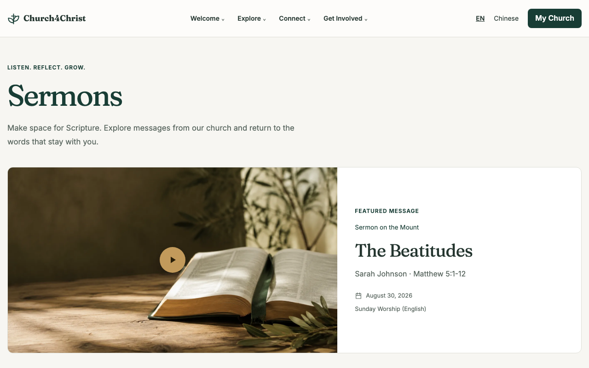](docs/features/sermons.md) | **[Sermon archive](docs/features/sermons.md)** | Paste a YouTube link; get a searchable, fast-loading library of past messages. |
| [](docs/features/prayer-wall.md) | **[Prayer wall](docs/features/prayer-wall.md)** | Receive prayer requests and work them on a simple board, privately. |
| [](docs/features/volunteer-serve.md) | **[Volunteer scheduling](docs/features/volunteer-serve.md)** | Plan a month of serving at a glance; volunteers confirm by email, no login. |
| [](docs/features/people-households.md) | **[People & households](docs/features/people-households.md)** | Give everyone a profile — families, membership status, private pastoral notes, and a board that connects members to serving. |
| [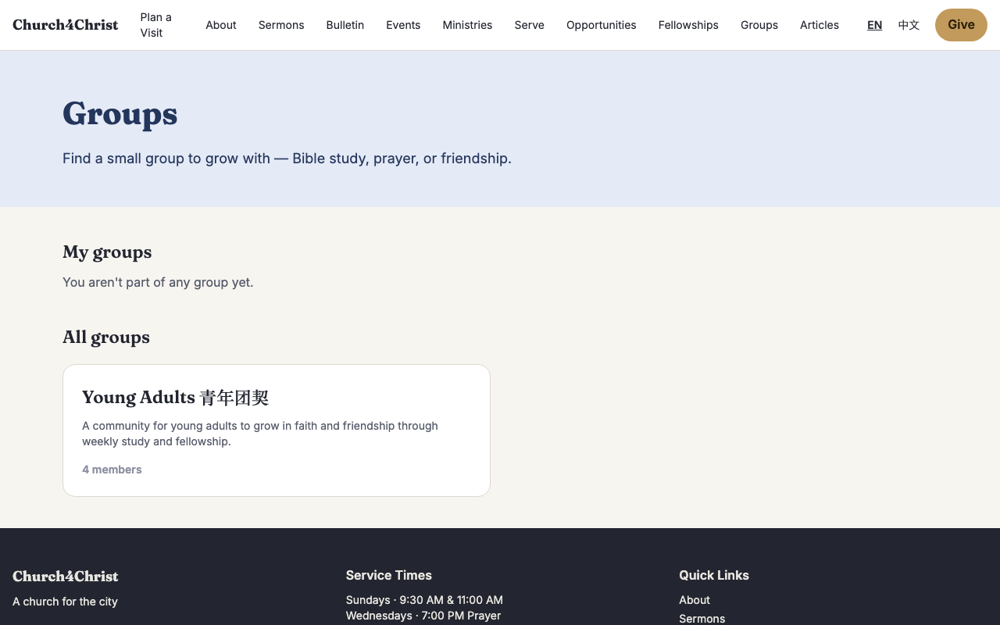](docs/features/groups.md) | **[Groups](docs/features/groups.md)** | Small groups with a public directory, join requests, routine and special events, and email-link attendance tracking. |
| [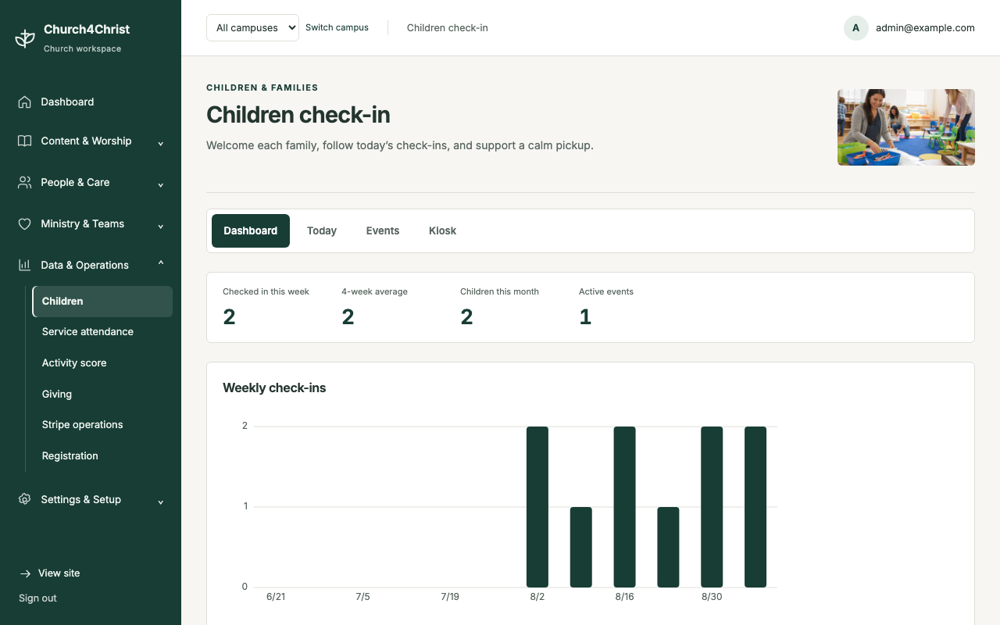](docs/features/children-checkin.md) | **[Children's check-in](docs/features/children-checkin.md)** | A touch-friendly kiosk where parents check kids in and out with a pickup code, plus weekly attendance charts. |
|  | **[Service attendance](docs/features/service-attendance.md)** | Record adult service totals, derive optional child totals from check-ins, correct history, and download aggregate CSV reports without adult identities. |
|  | **[Newcomer follow-up](docs/features/newcomers.md)** | Receive consented public cards, triage a staff queue, and hand exact matches into People without leaking notes or answers. |
| [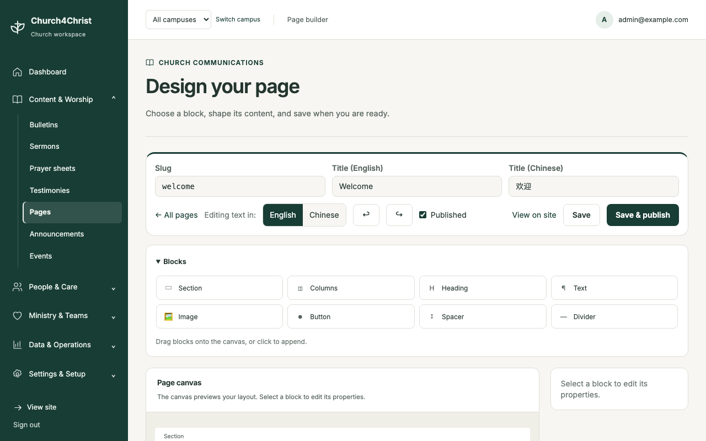](docs/features/page-builder.md) | **[Page builder](docs/features/page-builder.md)** | Drag and drop your own custom pages together — bilingual, always on-theme, and published pages load with zero JavaScript. Optional; switching it off never breaks a page you already built. |
| [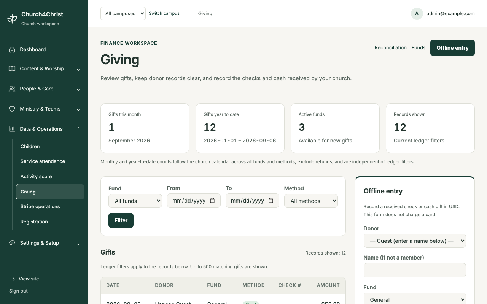](docs/features/giving.md) | **[Giving](docs/features/giving.md)** | Implemented: record checks and cash in an offline ledger. Preview/test-only: Stripe online checkout. |
| [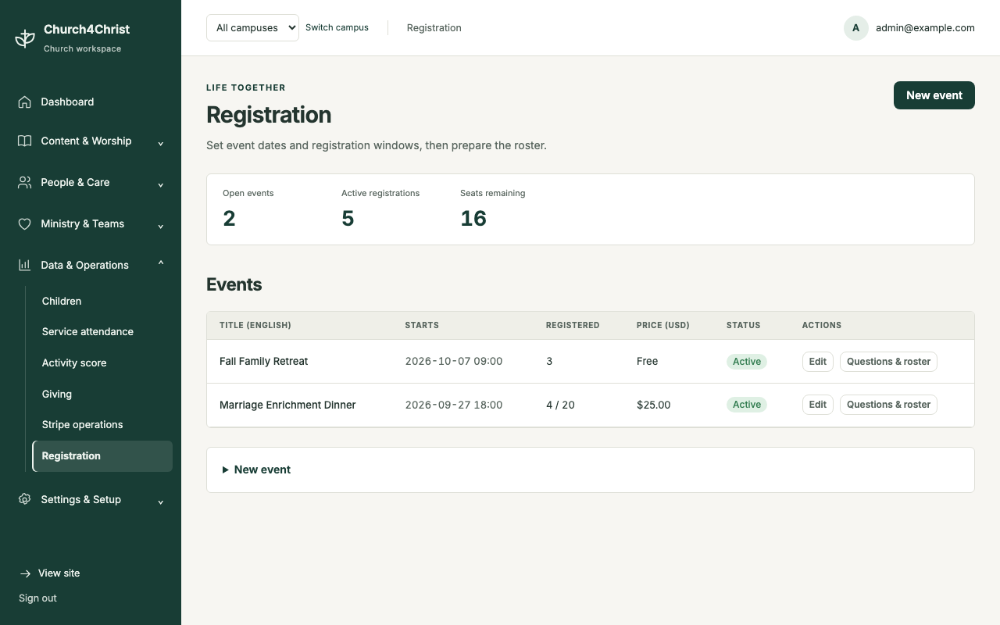](docs/features/registration.md) | **[Registration](docs/features/registration.md)** | Implemented: free event sign-up, custom questions, and roster export. Preview/test-only: paid Stripe checkout. |
| [](docs/features/member-portal.md) | **[Member portal](docs/features/member-portal.md)** | A signed-in home for members — household profiles, groups, events, serving, calendar, giving, and a scoped prayer wall. |
| [](docs/features/i18n.md) | **[Two languages](docs/features/i18n.md)** | Every page in English and Chinese, with one-click Simplified-to-Traditional. |
| [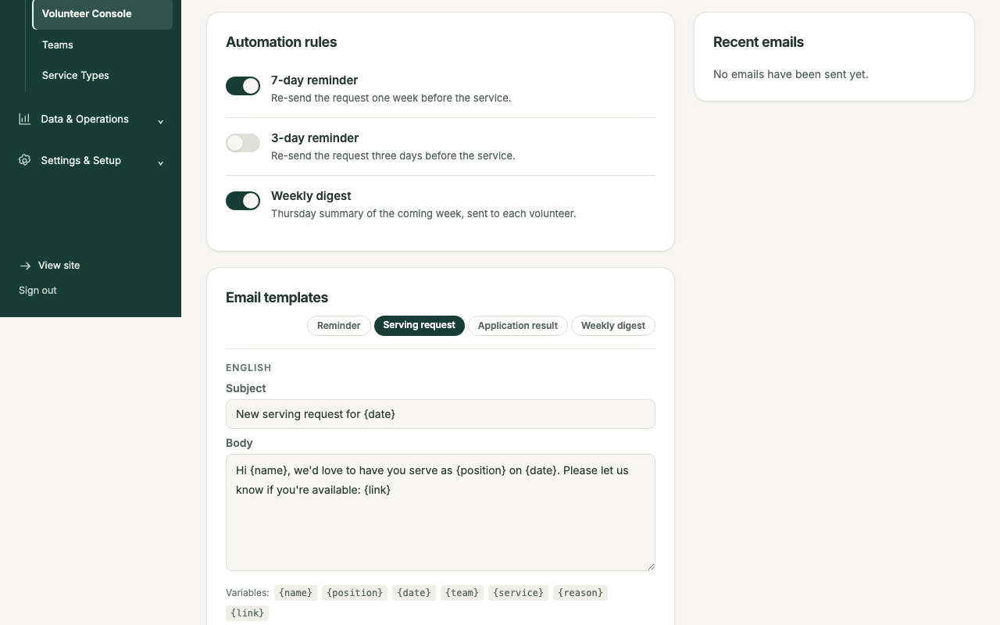](docs/features/email-automation.md) | **[Email & automation](docs/features/email-automation.md)** | Sign-in links, reminders, and digests, with local logging and a paid-capable production configuration. |
| [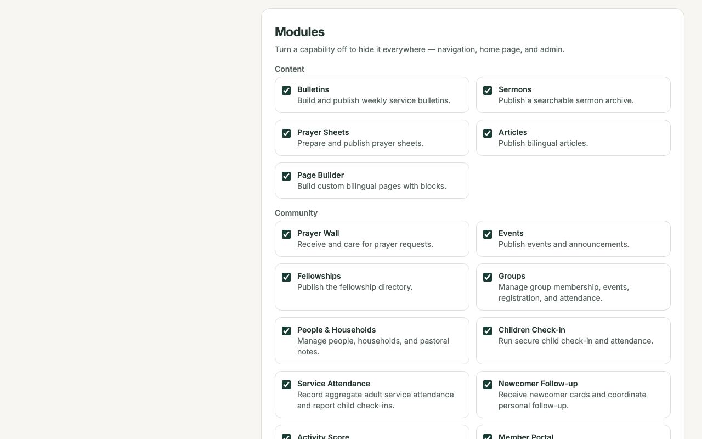](docs/features/modules.md) | **[Modules](docs/features/modules.md)** | Switch off the features you don't use; nothing is deleted, flip back anytime. |

**Pick your modules.** Most optional domain capabilities are **modules** you can switch
off from one panel in Settings — bulletins, sermons, the prayer wall, volunteer scheduling,
and more. New installations write every module setting explicitly from the setup selection;
the Full Church demo selects all 19. On older installations only, missing module rows retain
the legacy default-on behavior. A church that wants only service times and sermons can hide
the rest in a click: the module's pages, links, and emails disappear together, and nothing
is deleted. See [**`docs/features/modules.md`**](docs/features/modules.md).

<!-- capabilities:start -->
| Key | English | 中文 | Required database |
|---|---|---|---|
| `bulletins` | Bulletins | 周报 | Either |
| `sermons` | Sermons | 讲道 | Either |
| `prayer-sheets` | Prayer Sheets | 祷告单 | Either |
| `prayer-wall` | Prayer Wall | 祷告墙 | Either |
| `events` | Events | 活动 | Either |
| `serve` | Volunteer Scheduling | 服事排班 | Either |
| `gifts` | Spiritual Gifts | 恩赐探索 | Either |
| `testimonies` | Testimonies | 见证 | Either |
| `articles` | Articles | 文章 | Either |
| `fellowships` | Fellowships | 团契 | Either |
| `groups` | Groups | 小组 | Either |
| `people` | People & Households | 会友与家庭 | Either |
| `children` | Children Check-in | 儿童报到 | Either |
| `attendance` | Service Attendance | 崇拜出席 | Either |
| `newcomers` | Newcomer Follow-up | 新朋友跟进 | Either |
| `page-builder` | Page Builder | 页面编辑器 | Either |
| `portal` | Member Portal | 会友平台 | Supabase |
| `giving` | Giving | 奉献 | Supabase |
| `registration` | Registration | 活动报名 | Supabase |
<!-- capabilities:end -->

### A home for your members

The optional **Member Portal** turns the records your church already maintains into a
useful signed-in experience. Members can update household details, see their giving,
join or manage groups, register for events, review serving commitments, subscribe to a
personal calendar, and share prayers with their church, a group, an event, or only
themselves. Household owners can manage their family's details and view household giving;
group and event leaders can moderate the prayers in their care. It uses the same
passwordless sign-in links as the rest of Church4Christ — no new account or password to
remember.


The portal requires the optional **Supabase (Postgres)** backend because it adds member
relationships, protected group files, and scoped prayer moderation. Churches using the
default D1 backend simply do not see the portal controls or routes. Learn more in
[**`docs/features/member-portal.md`**](docs/features/member-portal.md).

---

## Try it in 5 minutes (on your own computer)

You can run the whole site locally — with realistic sample content — before you commit
to anything. You will need [Node.js](https://nodejs.org/) 22.22.1 or newer installed. The guided
setup asks which initial feature set you want and chooses D1 or Supabase from that choice.

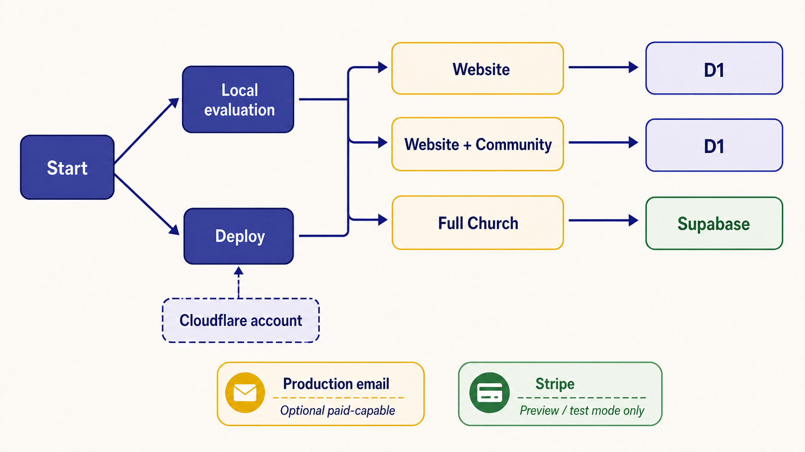

```bash
# 1. Get the code and install it
git clone https://github.com/leveo/church4christ.git
cd church4christ
npm ci

# 2. Choose features, create the database, and bootstrap the first admin
npm run setup

# 3. For D1, start it (always follow the exact handoff setup prints)
npm run dev
```

If you install with `npm ci --ignore-scripts`, run `npm run tokens` manually before
`npm run setup` or `npm run dev`.

For local Supabase, the handoff instead exports
`CLOUDFLARE_HYPERDRIVE_LOCAL_CONNECTION_STRING_HYPERDRIVE` in the host shell before
`npm run dev`; that connection URL must not go in `.dev.vars`.

Open the address it prints (usually `http://localhost:4321`). If you chose demo data during
setup, you will see sample sermons, bulletins, events, ministries, and local demo images.
The media step copies the generated image pack from `seed/media/` into local R2 and updates
the configured database records that refer to those objects. It is safe to run again after
reseeding the database. Without demo data, setup leaves a clean installation for your own
content.

**Signing in to the admin area.** There is no password. On the sign-in page, enter the
first-admin email from your setup answers, repeated in the setup handoff, and request a
link. Because local email is set to print instead of send, the **magic-link URL appears
right in your terminal**. Paste it into the browser and you are in. (For quicker local
testing, setup writes that same address as `AUTH_DEV_BYPASS_EMAIL` in `.dev.vars`, which
signs you in automatically. Remove that line to test the real sign-in flow.)

Setup offers **Website** (8 focused publishing modules), **Website + Community** (all 16
D1-compatible modules), and **Full Church** (all 19 modules). Portal, Giving, and
Registration select Supabase automatically; D1-compatible selections choose D1 unless you
explicitly override the backend. Account requirements depend on Local versus Deploy mode,
as detailed below. For automation, pass all answers with `--yes`; add `--json` for one
machine-readable result. For a human-readable noninteractive run, use the same complete
flags with `npm run setup -- ... --yes` and omit `--json`. To keep stdout strictly JSON
through npm, use the silent form:

```bash
npm run --silent setup -- --mode local --preset website --site-slug my-church \
  --church-name "My Church" --locale en --admin-email admin@example.com \
  --admin-name "First Admin" --app-origin http://localhost:4321 \
  --email-from admin@example.com --demo-data --yes --json
```

---

## Deployment profiles and costs

These are planning profiles, not price guarantees. Pricing below is current as of
**August 2026**, is subject to change, and should be confirmed on the linked official
pricing pages before deployment.

| Profile | Included scope | Cost and readiness notes |
|---|---|---|
| **Local evaluation** | Website or community modules with local D1; full modules with compatible local Postgres | No hosted-service charge is required for local D1 evaluation. You still provide the computer, development time, and any optional external services. |
| **D1 website/community** | Cloudflare Worker, D1, and R2 for up to 16 D1-compatible modules | A modest deployment can fit within Cloudflare free allowances. Traffic, storage, operations beyond allowances, a domain, and other services can cost money; check [Workers pricing](https://developers.cloudflare.com/workers/platform/pricing/). Production email is separate. |
| **Production email** | Transactional sign-in links, reminders, requests, and digests to arbitrary recipients | The repository supports a paid-capable Cloudflare email configuration. Arbitrary-recipient sending requires Workers Paid, currently a minimum **$5/month** including **3,000 emails**, then **$0.35 per 1,000 emails**. These amounts are subject to change; check [Cloudflare Email Service pricing](https://developers.cloudflare.com/email-service/platform/pricing/). |
| **Supabase/full modules** | Cloudflare deployment plus Supabase/Postgres for all 19 modules, including Member Portal, Giving, and Registration | Cloudflare costs still apply, and the selected [Supabase plan](https://supabase.com/pricing) may add subscription or usage charges. As of August 2026, Supabase Free has no automatic daily backups, and low-activity Free projects may be [automatically paused](https://supabase.com/docs/guides/platform/free-project-pausing) based on activity over a seven-day period. For production, take regular off-site database dumps and perform restore drills, or select a paid plan whose [backup options](https://supabase.com/docs/guides/platform/backups) meet your continuity requirements. Pricing and service policies are subject to change. Stripe payment paths remain Preview/test-only in this repository. |

Provider free allowances can be useful for evaluation or modest deployments, but they are
not a promise that a production service will remain free. Budget for technical ownership,
dependency and security maintenance, monitoring, backups, restore testing, and future
usage growth as well as the services listed above.

---

## Putting it online

New to this? Start with [**`docs/cloudflare-setup.md`**](docs/cloudflare-setup.md) — a
plain-language guide that explains what Cloudflare is, its cost model, and the two
ways to get online (including letting an AI assistant do it for you). When you want the
exact commands, [**`docs/deploy.md`**](docs/deploy.md) is the full step-by-step
walkthrough.

Start with `npm run setup`, choose **Deploy**, and answer the feature and church questions.
It creates or imports the required resources, writes the generated configuration, applies
migrations, records all 19 module settings, and bootstraps the first admin. It then hands
off to `npm run deploy`. Run `npm run doctor` whenever you want a readiness report.
Deployment is intentionally manual: repository automation tests changes but does not
publish them or migrate production data for you.

**First deployment and upgrades are different operations.** Guided setup provisions or
imports resources and bootstraps a reviewed installation. It is not an unattended one-click
upgrade for a site that already holds church data. Existing operators should start with the
[upgrade runbook](docs/upgrade.md), back up the database, R2 media, configuration, and secrets
inventory, rehearse in staging, and review the [`Unreleased` changelog](CHANGELOG.md) before
applying forward migrations. Maintainers preparing a future pre-1.0 checkpoint should follow
the [release process](docs/release-process.md).

**Choosing your database.** The 16 D1-compatible modules exclude **Member Portal**,
**Giving**, and **Registration**, which require Postgres. Account requirements follow the
mode: local D1 needs no external account; deployed D1 needs a Cloudflare account; local
Supabase needs a Supabase account or compatible local Postgres database; deployed Supabase
needs both Cloudflare and Supabase. There is no automated D1↔Supabase content migration yet,
so choose the production database before entering real content. See
[**`docs/supabase-setup.md`**](docs/supabase-setup.md).

**Stripe payment paths are Preview/test-only.** The Giving offline ledger and free
Registration flow are implemented, but online gifts and paid registrations must not be
treated as production payment features. Giving and Registration are Supabase-only; D1 does
not support those modules. When setup asks for either module, import only an `sk_test_…`
key and `whsec_…` signing secret with the one-shot
`CHURCH_SETUP_STRIPE_SECRET_KEY` and `CHURCH_SETUP_STRIPE_WEBHOOK_SECRET` environment
variables. Setup stores the runtime secrets automatically and rejects live keys. Signed live
events are rejected with `400 live_mode_disabled` before storage, while the
Supabase-backed Worker runs durable recovery every five minutes. See the Supabase guide
for the exact command.

---

## What's under the hood

For the curious: Church4Christ is built with **[Astro](https://astro.build/)** rendering
pages on the server, running as a single **Cloudflare Worker**. Application data lives in
the selected backend — Cloudflare **D1** or **Supabase/Postgres** — and uploaded media lives
in Cloudflare **R2** (object storage); email goes out through Cloudflare's email binding.
Visitor-facing pages ship **no client-side JavaScript framework** — they are plain, fast
HTML with a sprinkle of vanilla script —
which is a big part of why the site loads quickly and costs so little to run. (The one
exception lives behind the staff login: the drag-and-drop page builder is a small React
editor that only your team ever downloads; the pages it publishes are still plain HTML.)

The whole look comes from **[design tokens](design/README.md)**: a set of color and type
values that compile into three ready-made themes (Sanctuary, Harvest, Midnight),
each with a light and a dark mode. The project has **extensive automated coverage** across
its core workflows so maintainers can verify changes before deployment.

**Why these choices?** The reasons for the Cloudflare-optimized deployment, the
Astro + Tailwind + TypeScript stack, and the cases where a managed platform may be the
better operating model are laid out in
[**`docs/why-this-stack.md`**](docs/why-this-stack.md). For the technical picture, see
[`docs/architecture.md`](docs/architecture.md),
[`docs/design-system.md`](docs/design-system.md), and [`docs/i18n.md`](docs/i18n.md).

---

## License

Church4Christ is free and open-source software under the **[GNU General Public License
v3](LICENSE)** (GPL-3.0). You may use and study it, modify it privately, share copies, and
charge for copies, custom development, hosting, support, or other commercial services.

If you distribute a covered modified version, the GPL's conditions apply: recipients must
receive the applicable GPL freedoms, and corresponding source must be made available under
the GPL as the license requires. Private modifications do not have to be published. Merely
running a modified version as a network service, without distributing a copy, does not by
itself trigger an AGPL-style source-sharing obligation under GPLv3.

[`LICENSE`](LICENSE) is authoritative. This summary is provided for orientation and is
not legal advice.

---

## Contributing & roadmap

Contributions are welcome — bug reports, translations, new features. Start with
[`CONTRIBUTING.md`](CONTRIBUTING.md) for the dev setup and the project's five rules, and
[`SECURITY.md`](SECURITY.md) if you have found a security issue.

**On the horizon (not built yet):** a between-churches "swap marketplace" for sharing
themes and content is an idea we are considering, not a promise. If it matters to your
church, open an issue and let's talk.

---

Built with care, and with the help of AI, for churches and nonprofits everywhere.
