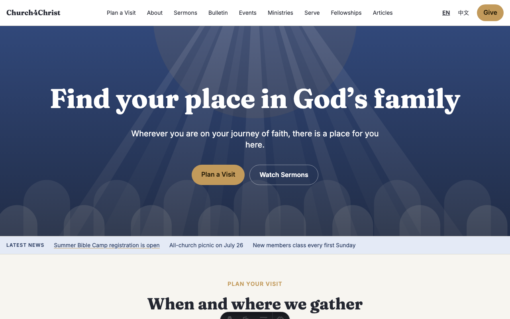
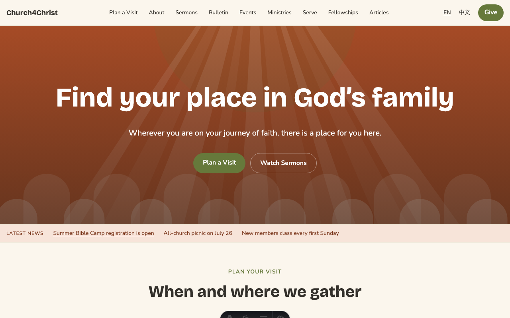
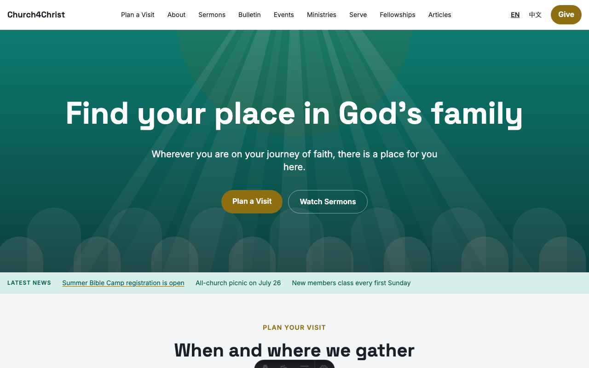
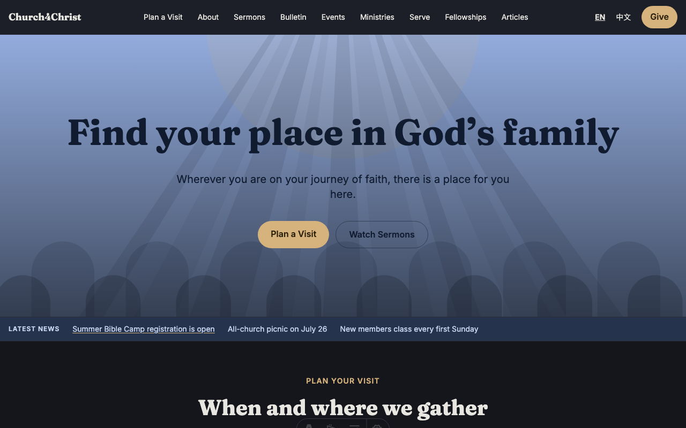
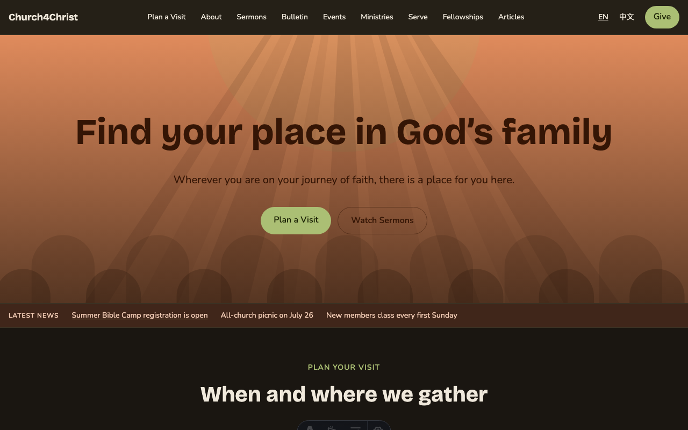
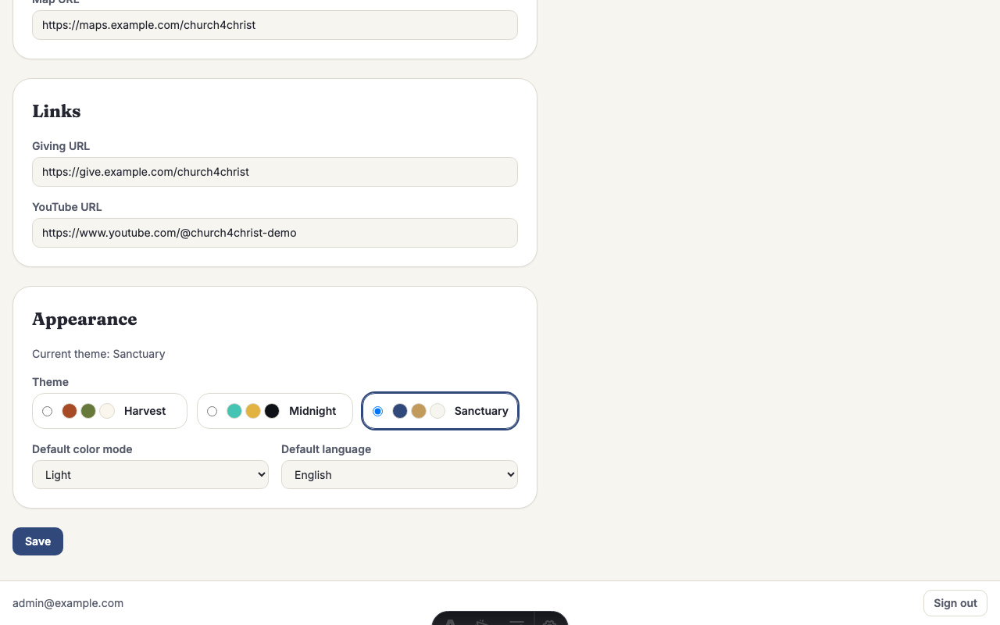

# Design files and themes

This directory is the source of truth for Church4Christ's design tokens. Use this
guide when changing an existing look, adding a theme or font, or extending the
semantic color vocabulary. For the architecture behind the system, see
[the design-system guide](../docs/design-system.md).

## Start here

The repository ships three themes, each with light and dark palettes:

| Sanctuary | Harvest | Midnight |
|---|---|---|
|  |  |  |
|  |  |  |

An administrator chooses the site theme and its default color mode in Settings:



For a small change, edit the appropriate file in `themes/`, run `npm run tokens`,
and inspect the public and admin sites in both modes. Do not edit the generated CSS
or TypeScript files; generation will replace those changes.

## Source of truth

| File | Responsibility |
|---|---|
| `foundation.json` | Theme-independent typography scale, leading, tracking, container widths, z-index layers, and motion values |
| `themes/*.json` | Per-theme metadata, fonts, radii, shadows, and complete light and dark semantic palettes |
| `../scripts/build-tokens.mjs` | Contrast validation and generation of CSS variables and theme-picker metadata |
| `../src/styles/base.css` | Tailwind `@theme` mappings and shared styles that consume the generated variables |
| `../src/lib/theme.ts` | Runtime theme allowlist, application fallback theme, and intrinsic mode fallbacks |

`foundation.json` has no spacing group. Spacing used by components is not currently a
foundation-token category. Themes must not override any foundation value.

The generated outputs are `../src/styles/tokens.generated.css` and
`../src/lib/themeMeta.generated.ts`. Both are git-ignored and begin with a do-not-edit
notice. Always change the JSON sources or generator, then regenerate.

## Theme schema and semantic colors

Every theme file contains:

- `version`, `name`, `label`, and `defaultMode`;
- `fonts` for display, body, and monospace text;
- `radius` and `shadow` scales; and
- `modes.light` and `modes.dark`, each with the same semantic color keys.

Semantic names describe a job rather than a hue. They fall into a few useful groups:

- surfaces and text: `surface*`, `ink*`;
- brand and actions: `primary*`, `accent*`, and their `on-*` foregrounds;
- status: `success`, `warn`, `danger`, `info`, and related foreground or soft roles;
- chrome: borders, focus ring, header, footer, and scrim.

An `on-*` token is a foreground intended for its matching background. For example,
`on-primary` is text or an icon on `primary`, while `on-primary-soft` is the foreground
for `primary-soft`. Do not assume that `ink`, `on-primary`, or another readable color can
be swapped between backgrounds. The builder checks the declared foreground/background
pairs at 4.5:1 in every theme and mode. When adding or changing a pair, treat both values
as one design decision.

## Modify an existing theme

1. Edit the theme JSON in `themes/`.
2. Make the corresponding change in both `modes.light` and `modes.dark`. Keep every
   existing semantic key in both palettes.
3. Run `npm run tokens`.
4. If generation reports a pair below 4.5:1, adjust the named foreground or background
   and rerun the command until it passes.
5. Run `npm run dev`, then view representative public and admin pages in both light and
   dark mode. Check text, controls, focus states, status messages, header, and footer.
6. Run the remaining checks in [Generate and verify](#generate-and-verify).

The visitor mode stored in local storage as `c4c-mode` overrides the saved site default.
If the page does not show the mode you expect, use the mode toggle or clear that key before
judging the `theme.default_mode` setting.

## Create a new theme

1. Copy a complete existing file to `themes/<name>.json`. Use a lowercase, stable name,
   and make the filename stem exactly match `name`.
2. Set `version`, `name`, `label`, and `defaultMode`; update `fonts`, `radius`, `shadow`,
   and both palettes. Preserve every key from the source theme in both modes. The current
   generator does not prove that one palette has all the keys of another.
3. Add the name to `THEMES` and its intrinsic light/dark fallback to
   `THEME_DEFAULT_MODE` in `../src/lib/theme.ts`. Without the allowlist entry, admin form
   validation rejects the name and runtime resolution falls back to the application
   default even though generated CSS exists.
4. Add `admin.settings.themeName.<name>` to both `../src/i18n/en.ts` and
   `../src/i18n/zh.ts`. The JSON `label` is copied into generated metadata, but the admin
   picker displays these translated strings instead. Picker order follows the sorted
   source filenames read by the generator, not the order of `THEMES`.
5. If the theme uses a new webfont, complete every step in [Add a font](#add-a-font).
   A JSON `fontsource` value is metadata; it does not install or load a font.
6. Extend the token tests in `../test/tokens.test.ts`, the generated metadata tests in
   `../test/themeMeta.test.ts`, and the runtime allowlist/default-mode coverage in
   `../test/theme.test.ts`. Keep test theme arrays and their order assertions explicit.
7. Add exactly two adjacent rows to the theme matrix in `../scripts/screenshots.mjs`: one
   home-page capture for light mode and one for dark mode. Capture both and add them to
   the documentation matrix in the intended order.
8. Update every public theme count, list, and matrix for the added choice, including
   `../README.md`, `README.md` (this guide), `../docs/design-system.md` wherever
   applicable, and `../docs/features/public-site-and-themes.md`. Do this whether or not
   the app default changes.
9. Run the focused theme/token tests, then the full verification sequence below.

Adding a choice is not the same as changing the application's shipped default. Only when
changing the app default should you also change `THEME_DEFAULT`, default-theme settings
fallbacks, seed rows, default-expectation tests, and wording that identifies the default.

## Add a font

1. Install and commit the appropriate Fontsource package, for example:

   ```bash
   npm install @fontsource-variable/fraunces
   ```

2. Set the theme's `family`, `fallback`, and `fontsource` metadata. Reuse a currently
   loaded family where possible.
3. Add the package import to all three font-loading layouts:
   `../src/layouts/Base.astro`, `../src/layouts/Admin.astro`, and
   `../src/layouts/Kiosk.astro`.
4. Regenerate, build, and visually check English and Chinese text for fallback behavior,
   missing weights, layout shifts, and clipping.

The Kiosk layout imports the shared fonts and token CSS, but it deliberately performs no
theme/database lookup and currently puts no `data-theme` or `data-mode` on `<html>`. A font
import there keeps the loading set consistent; it does not make Kiosk a valid check of
runtime theme activation.

## Add a semantic token

1. Add the new key to every theme's light and dark palette. For a foreground/background
   family, add both roles and name their relationship clearly.
2. Map the generated custom property inside `@theme inline` in
   `../src/styles/base.css` so a Tailwind utility can resolve it at runtime.
3. If the token is a readable foreground on a defined background, add that pair to
   `CONTRAST_PAIRS` in `../scripts/build-tokens.mjs`. Decorative backgrounds or borders
   do not need an invented text pairing.
4. Extend `../test/tokens.test.ts` to prove generation and contrast behavior, and update
   any component or runtime tests that consume the new role.
5. Run token generation, the token linter, focused tests, and the full suite.

## Generate and verify

Run these from the repository root after a design-source change:

```bash
npm run tokens
npm run tokens:check
npx vitest run --project node test/tokens.test.ts test/themeMeta.test.ts
npm test
npm run check
npm run build
```

Use the development server for visual review:

```bash
npm run dev
```

With the seeded dev server already running, the screenshot harness can capture only the
two rows you are reviewing. For example:

```bash
node scripts/screenshots.mjs --only home-harvest-light.png,home-harvest-dark.png
```

Replace those output names with the two rows for a new theme. `--only` filters the table;
it does not change the order in which matching rows run.

## Common problems

| Symptom | Cause and fix |
|---|---|
| A regenerated file loses a manual fix | `tokens.generated.css` and `themeMeta.generated.ts` are outputs. Make the change in JSON, `base.css`, or the generator instead. |
| CSS exists, but the new theme cannot be saved or activated | Add the theme to the runtime `THEMES` allowlist and `THEME_DEFAULT_MODE`. Generated CSS alone is insufficient. |
| The picker shows a missing-key-looking label | Add `admin.settings.themeName.<name>` in both English and Chinese. The JSON `label` is metadata, not the translated picker label. |
| The declared font falls back or looks unchanged | Install the Fontsource package and import it in Base, Admin, and Kiosk. JSON `fontsource` metadata does not load code. |
| A missing color key reaches generated output without a clear error | The builder checks available contrast pairs but does not currently validate exact palette-key equality. Copy a complete theme, preserve all keys in both modes, and cover additions in tests. |
| A custom property exists but its utility has no effect | Add its matching `@theme inline` mapping in `src/styles/base.css`; generation and Tailwind exposure are separate steps. |
| Default-mode behavior seems contradictory | Keep three layers distinct: JSON `defaultMode` selects the unqualified generated palette and picker swatches; `THEME_DEFAULT_MODE` is the intrinsic runtime fallback; the saved `theme.default_mode` setting is the site's chosen default. On Base and Admin, visitor `c4c-mode` then overrides that default. |
| Screenshots appear in an unexpected order | The harness preserves `PAGES` source order even when `--only` arguments are listed differently. Keep each theme's two rows adjacent in the intended documentation order. |
| `tokens:check` rejects an intentional literal | Prefer a semantic token. Use same-line `/* tokens-ok */` only for a narrow, reviewed case that truly cannot consume token CSS; do not use it as a blanket escape hatch. |
| Kiosk does not reflect the selected theme | Kiosk loads shared CSS and fonts but does not currently activate a theme with HTML attributes or a database lookup. Verify runtime theme switching on public and admin pages. |

## Related documentation

- [Design-system architecture](../docs/design-system.md)
- [Public site and themes](../docs/features/public-site-and-themes.md)
- [Project architecture](../docs/architecture.md)
- [Internationalization](../docs/i18n.md)
