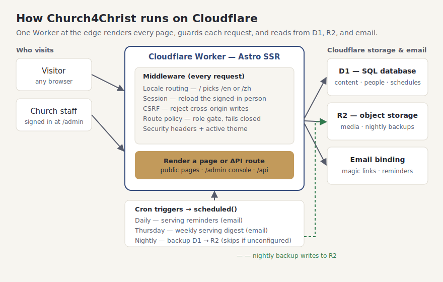

# Architecture

Church4Christ is a single **Astro** application rendered on the server and deployed as
one **Cloudflare Worker**. There is no separate backend service and no client-side
JavaScript framework: every page is server-rendered HTML, and the Worker talks directly
to Cloudflare's data services. This keeps the moving parts few, the hosting free, and
the whole thing fast worldwide because the Worker runs close to each visitor.

## The request path

1. **A browser requests a page.** Cloudflare routes it to the Worker at the edge
   location nearest the visitor.
2. **Middleware runs first** (`src/middleware.ts`), on every request, in this order:
   - **Locale** — a bare `/` is content-negotiated from `Accept-Language` and redirected
     to `/en/…` or `/zh/…`; otherwise the locale is read from the leading path segment.
   - **Active theme** — the site's theme name is loaded from settings (cached per isolate)
     so the page renders in the right colors; a fresh/empty database falls back to the
     default theme rather than erroring.
   - **CSRF** — any non-`GET`/`HEAD`/`OPTIONS` request is rejected unless its `Origin`
     (or `Sec-Fetch-Site`) proves it is same-origin.
   - **Session** — the session cookie (a signed JWT) is verified and the person row is
     **reloaded from the database every request**, so a deactivation or a
     "sign out everywhere" takes effect on the very next page load.
   - **Route policy** — `src/lib/routePolicy.ts` classifies the path and enforces the
     required role. It **fails closed**: an unknown `/admin/*` path is denied, not
     allowed. Anonymous users hitting a protected page are redirected to sign in;
     signed-in users without the right role get a 403.
   - **Security headers** are applied to every response (`src/lib/securityHeaders.ts`).
3. **Astro renders** the matched page or API route (`src/pages/**`), reading data through
   the helpers in `src/lib/`.
4. **The response goes back** through the Worker to the browser, with `Cache-Control:
   no-store` on any page rendered for a signed-in user (public assets and media set their
   own caching).

## The pieces

| Layer | What it is | Where |
|---|---|---|
| **Worker entry** | `fetch` (Astro handler) + `scheduled` (cron dispatch) | `src/worker.ts` |
| **Middleware** | Auth, CSRF, route policy, locale, theme, headers | `src/middleware.ts` |
| **Pages & API** | Public site under `[locale]/`, admin under `/admin`, JSON under `/api` | `src/pages/**` |
| **Data helpers** | One module per domain (admin, plans, prayer, email, …) | `src/lib/*Db.ts` |
| **Database (D1)** | Content, people, schedules, revisions, logs | binding `DB` |
| **Object storage (R2)** | Uploaded media (`uploads/`) and nightly backups (`backups/`) | binding `MEDIA` |
| **Email** | Transactional mail through one choke point | binding `EMAIL` |

## Data: Cloudflare D1

All structured data lives in **D1**, Cloudflare's SQLite-backed database, reached through
the `DB` binding. Schema changes are ordinary SQL migration files under `migrations/`,
applied with `wrangler d1 migrations apply`. Translatable content uses companion `*_i18n`
tables joined with a `COALESCE` fallback to the default language (see
[`docs/i18n.md`](i18n.md)), so adding a language never changes a table's shape.

Editable content (bulletins, sermons, announcements, events, prayer sheets) is written
with a **full-snapshot revision** in the same `db.batch`, which is what powers the
one-click "restore an earlier version" throughout the admin area.

## The database seam: D1 or Postgres

Every data-access helper talks to an **`AppDb`** interface rather than to D1 directly
(`src/lib/appDb.ts`). `AppDb` is deliberately shaped like Cloudflare's D1 binding —
`prepare(...).bind(...).first/all/run` plus `batch(...)` — so the **D1 binding satisfies it
structurally, with no adapter and no copy** (a compile-time check in `appDb.ts` fails
`astro check` if a future D1 type bump ever breaks that). That one seam lets the whole app
run on either of two databases:

- **Cloudflare D1** (the default) — the `DB` binding *is* the `AppDb`. This is the
  zero-setup, free path the rest of these docs assume.
- **Postgres / Supabase** — `PgAdapter` (`src/lib/pgAdapter.ts`) implements the same
  interface over the `postgres.js` driver, reached through the Cloudflare **Hyperdrive**
  binding. It rewrites D1/SQLite `?` placeholders to Postgres `$n` on the way to the driver
  and runs a `batch` as one real transaction.

**Which backend runs** is the `DB_BACKEND` var: `getBackend` (`src/lib/dbProvider.ts`) reads
it and returns `'supabase'` only for the exact string `supabase`, and `'d1'` for everything
else (including unset). `openDb` then returns a **per-request** `{ db, backend, end }` — on
D1 a zero-copy passthrough whose `end()` is a no-op; on Postgres a fresh postgres.js client
over Hyperdrive (Workers sockets are request-scoped, so the client is never cached across
requests) whose `end()` drains it after the response. The middleware opens this once per
request and hands the page `locals.db` and `locals.dbBackend` (`src/middleware.ts`); the
`scheduled` handler opens its own for the cron jobs that touch data.

**Two modules require Postgres.** `giving` and `registration` are marked
`requiresBackend: 'supabase'` in `src/lib/modules.ts`, and `getEnabledModules` force-disables
any such module on a mismatched backend — so both stay off on D1 even when their settings row
says on. They need Stripe, subscriptions, and checkout state that SQLite-scale D1 is not the
right home for; see [`docs/supabase-setup.md`](supabase-setup.md) and
[`docs/features/giving.md`](features/giving.md).

## Media & backups: Cloudflare R2

Uploaded images live in **R2** under the `uploads/` prefix and are served back only
through the `/media/[...key]` route, which is structurally incapable of reaching anything
outside `uploads/` — so the `backups/` prefix (where the nightly database dump lands) is
never publicly reachable. Uploads are restricted to a small allowlist of image types
(no SVG) with a size cap; see [`SECURITY.md`](../SECURITY.md).

Local demo media uses the same path as real uploads. The generated image pack in
`seed/media/` contains WebP hero, event, ministry-cover, and profile-avatar images plus a
manifest of their content-addressed `uploads/...` keys. `npm run db:seed-media:local`
verifies those keys from the file bytes, writes the objects to local R2, registers them in
the `media` table, and refreshes the local D1 references. Because keys are content based,
the command is idempotent and can be rerun after `npm run db:seed:local`.

## Scheduled work: cron triggers

The Worker's `scheduled` handler (`src/worker.ts`) dispatches three cron triggers
declared in `wrangler.jsonc` (the two files are kept in sync by hand):

| Cron | When | Job |
|---|---|---|
| `0 13 * * *` | Daily | Serving reminders to unconfirmed volunteers |
| `0 14 * * 4` | Thursday | Weekly serving digest email |
| `0 9 * * *` | Nightly | Back up D1 → `backups/YYYY-MM-DD.sql` in R2 |

The backup **skips gracefully** (logs a line, no error) when its account/database/token
config is absent, so the demo deploy runs all its crons without backups configured. See
`src/lib/backup.ts` and [`docs/deploy.md`](deploy.md) for enabling it.

## Design & internationalization

- **Design tokens** (`design/*.json`) compile into CSS variables and three themes — see
  [`docs/design-system.md`](design-system.md).
- **Two languages** (English + Chinese) share one codebase — see [`docs/i18n.md`](i18n.md).

## Testing

The system is covered by **over 900 automated tests**. Unit and integration tests run in
the Cloudflare Workers test pool (`vitest`), end-to-end tests run against the actual built
Worker (`vitest.e2e.config.ts`), and `scripts/smoke.sh` boots the production build and
checks routing, i18n, the health probe, and the security headers over HTTP. A separate `pg`
project and `vitest.e2e.pg.config.ts` run the same kind of coverage for **Giving** and
**Registration** against a real Postgres database — self-skipped when no `DATABASE_URL` is
set, so the default D1 suite never depends on Postgres being available. See
[`CONTRIBUTING.md`](../CONTRIBUTING.md) for how to run each suite.
