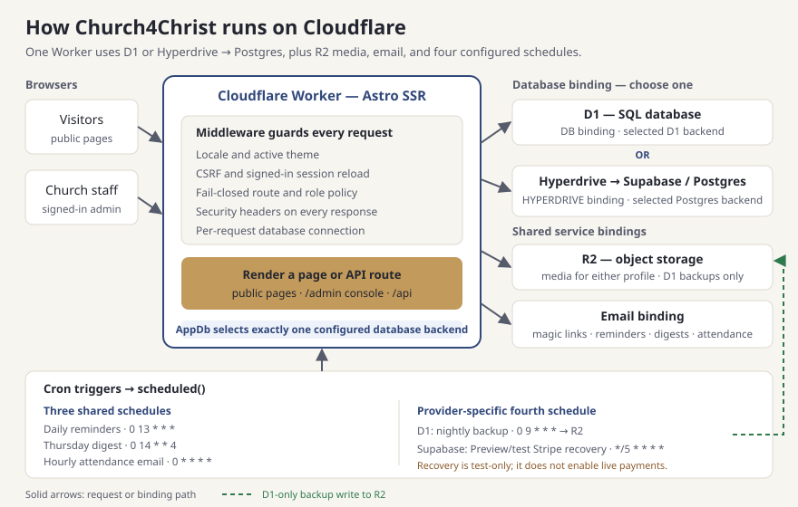

# Architecture

Church4Christ is a single **Astro** application rendered on the server and deployed as
one **Cloudflare Worker**. There is no separate application backend service. Public pages
render server-side HTML and do not ship a client framework; the authenticated admin page
builder is one deliberate client-only React exception. The Worker uses Cloudflare bindings
for D1 or Hyperdrive-to-Postgres, R2, Email, and scheduled work. This is a compact
architecture, but its deployment integration is Cloudflare-specific.

## The request path

1. **A browser requests a page.** Cloudflare routes it to the Worker at the edge
   location nearest the visitor.
2. **Middleware runs first** (`src/middleware.ts`), on every request, in this order:
   - **Locale** — a bare `/` is content-negotiated from `Accept-Language` and redirected
     to `/en/…` or `/zh/…`; otherwise the locale is read from the leading path segment.
   - **Active theme** — the site's theme name is loaded from settings (cached per isolate)
     so the page renders in the right colors; a fresh/empty database falls back to the
     default theme rather than erroring.
   - **CSRF** — any non-`GET`/`HEAD`/`OPTIONS` request is rejected unless its `Origin`
     (or `Sec-Fetch-Site`) proves it is same-origin.
   - **Session** — the session cookie (a signed JWT) is verified and the person row is
     **reloaded from the database every request**, so a deactivation or a
     "sign out everywhere" takes effect on the very next page load.
   - **Route policy** — `src/lib/routePolicy.ts` classifies the path and enforces the
     required role. It **fails closed**: an unknown `/admin/*` path is denied, not
     allowed. Anonymous users hitting a protected page are redirected to sign in;
     signed-in users without the right role get a 403.
   - **Security headers** are applied to every response (`src/lib/securityHeaders.ts`).
3. **Astro renders** the matched page or API route (`src/pages/**`), reading data through
   the helpers in `src/lib/`.
4. **The response goes back** through the Worker to the browser, with `Cache-Control:
   no-store` on any page rendered for a signed-in user (public assets and media set their
   own caching).

These controls are security layers, not a guarantee. Optional Cloudflare Access can add
defense in depth around `/admin`, but it does not replace application review, dependency
updates, secret handling, backups, or monitoring.

## The pieces

| Layer | What it is | Where |
|---|---|---|
| **Worker entry** | `fetch` (Astro handler) + `scheduled` (cron dispatch) | `src/worker.ts` |
| **Middleware** | Auth, CSRF, route policy, locale, theme, headers | `src/middleware.ts` |
| **Pages & API** | Public site under `[locale]/`, admin under `/admin`, JSON under `/api` | `src/pages/**` |
| **Data helpers** | One module per domain (admin, plans, prayer, email, …) | `src/lib/*Db.ts` |
| **Database** | D1 or Supabase Postgres content, people, schedules, check-ins, revisions, logs | binding `DB` or `HYPERDRIVE` |
| **Object storage (R2)** | Uploaded media (`uploads/`) and, on the D1 profile only, nightly backups (`backups/`) | binding `MEDIA` |
| **Email** | Transactional mail through one choke point | binding `EMAIL` |

## Data: D1 or Supabase

Structured data lives in **D1** or **Supabase Postgres**, selected during setup. D1 is
reached through the `DB` binding; Supabase is reached through Hyperdrive. Schema changes
are SQL migration files under `migrations/` and `migrations-supabase/`. The application has
no automated D1↔Postgres data migration; changing backends requires a planned manual
export, transformation/migration, validation, and cutover. Translatable content uses
companion `*_i18n`
tables joined with a `COALESCE` fallback to the default language (see
[`docs/i18n.md`](i18n.md)), so adding a language never changes a table's shape.

Editable content (bulletins, sermons, announcements, events, prayer sheets) is written
with a **full-snapshot revision** in the same `db.batch`, which is what powers the
one-click "restore an earlier version" throughout the admin area.

Service Attendance follows a deliberately aggregate data boundary: it stores one adult
count per service type and date, never an adult roster or identity. Optional child totals
are calculated from historical Children's check-ins through date-effective links. Groups'
per-person attendance remains a separate data model and authorization surface. See
[`docs/features/service-attendance.md`](features/service-attendance.md).

## The database seam: D1 or Postgres

Every data-access helper talks to an **`AppDb`** interface rather than to D1 directly
(`src/lib/appDb.ts`). `AppDb` is deliberately shaped like Cloudflare's D1 binding —
`prepare(...).bind(...).first/all/run` plus `batch(...)` — so the **D1 binding satisfies it
structurally, with no adapter and no copy** (a compile-time check in `appDb.ts` fails
`astro check` if a future D1 type bump ever breaks that). That one seam lets the whole app
run on either of two databases:

- **Cloudflare D1** (the default) — the `DB` binding *is* the `AppDb`. Local D1 needs no
  external database account; deployed D1 uses the allowances and limits of the selected
  Cloudflare plan.
- **Postgres / Supabase** — `PgAdapter` (`src/lib/pgAdapter.ts`) implements the same
  interface over the `postgres.js` driver, reached through the Cloudflare **Hyperdrive**
  binding. It rewrites D1/SQLite `?` placeholders to Postgres `$n` on the way to the driver
  and runs a `batch` as one real transaction.

<!-- capabilities:start -->
| Key | English | 中文 | Required database |
|---|---|---|---|
| `bulletins` | Bulletins | 周报 | Either |
| `sermons` | Sermons | 讲道 | Either |
| `prayer-sheets` | Prayer Sheets | 祷告单 | Either |
| `prayer-wall` | Prayer Wall | 祷告墙 | Either |
| `events` | Events | 活动 | Either |
| `serve` | Volunteer Scheduling | 服事排班 | Either |
| `gifts` | Spiritual Gifts | 恩赐探索 | Either |
| `testimonies` | Testimonies | 见证 | Either |
| `articles` | Articles | 文章 | Either |
| `fellowships` | Fellowships | 团契 | Either |
| `groups` | Groups | 小组 | Either |
| `people` | People & Households | 会友与家庭 | Either |
| `children` | Children Check-in | 儿童报到 | Either |
| `attendance` | Service Attendance | 崇拜出席 | Either |
| `newcomers` | Newcomer Follow-up | 新朋友跟进 | Either |
| `page-builder` | Page Builder | 页面编辑器 | Either |
| `portal` | Member Portal | 会友平台 | Supabase |
| `giving` | Giving | 奉献 | Supabase |
| `registration` | Registration | 活动报名 | Supabase |
<!-- capabilities:end -->

**Which backend runs** is the `DB_BACKEND` var: `getBackend` (`src/lib/dbProvider.ts`) reads
it and defaults only an unset/empty value to D1. The exact values `d1` and `supabase`
select their respective providers; any unknown non-empty value throws instead of silently
selecting a provider. `openDb` then returns a **per-request** `{ db, backend, end }` — on
D1 a zero-copy passthrough whose `end()` is a no-op; on Postgres a fresh postgres.js client
over Hyperdrive (Workers sockets are request-scoped, so the client is never cached across
requests) whose `end()` drains it after the response. The middleware opens this once per
request and hands the page `locals.db` and `locals.dbBackend` (`src/middleware.ts`); the
`scheduled` handler opens its own for the cron jobs that touch data.

**Three modules require Postgres.** `portal`, `giving`, and `registration` are marked
`requiresBackend: 'supabase'` in `src/lib/modules.ts`, and `getEnabledModules` force-disables
any such module on a mismatched backend — so all three stay off on D1 even when their
settings row says on. See [`docs/supabase-setup.md`](supabase-setup.md) and
[`docs/features/giving.md`](features/giving.md).

## Portability and operations

The code, SQL migrations, Markdown, and media formats provide useful control over the
application and its data. They do not remove switching work: deployment configuration,
bindings, scheduled jobs, email delivery, database behavior, and provider APIs would need
replacement or adaptation away from Cloudflare. D1↔Postgres moves are manual; keep current
exports and rehearse the migration or restore process before relying on it.

Managed services also do not remove application operations. A production owner still
needs a plan for dependency and security updates, scoped credentials, database and media
backups, restore drills, logs and alerting, capacity/plan limits, and incident response.

## Media & backups: Cloudflare R2

Uploaded images live in **R2** under the `uploads/` prefix and are served back only
through the `/media/[...key]` route, whose key validation restricts requests to `uploads/`.
The D1 backup job writes to the separate `backups/` prefix, which that route does not
serve. Uploads are restricted to a small allowlist of image types (no SVG) with a size cap;
see [`SECURITY.md`](../SECURITY.md). These are defense-in-depth controls, not a substitute
for private-bucket configuration, access review, or restore testing.

Local demo media uses the same path as real uploads. The generated image pack in
`seed/media/` contains WebP hero, event, ministry-cover, and profile-avatar images plus a
manifest of their content-addressed `uploads/...` keys. `npm run db:seed-media:local`
verifies those keys from the file bytes, writes the objects to local R2, registers them in
the `media` table, and refreshes the local D1 references. Because keys are content based,
the command is idempotent and can be rerun after `npm run db:seed:local`.

## Scheduled work: cron triggers

The Worker's `scheduled` handler (`src/worker.ts`) recognizes five schedule branches.
Generated configuration enables exactly four for either provider: three shared jobs plus
the provider-specific D1 backup or Supabase Stripe recovery job.

| Cron | Configuration | Job |
|---|---|---|
| `0 13 * * *` | D1 and Supabase | Daily serving reminders; skips when Serve is disabled |
| `0 14 * * 4` | D1 and Supabase | Weekly serving digest; skips when Serve is disabled |
| `0 * * * *` | D1 and Supabase | Hourly group-attendance tracking email; skips when Groups is disabled |
| `0 9 * * *` | D1 only | Export D1 → `backups/YYYY-MM-DD.sql` in R2 |
| `*/5 * * * *` | Supabase only | Preview/test-only Stripe webhook inbox and Checkout recovery; processing honors enabled Giving and Registration modules |

The backup **skips gracefully** (logs a line, no error) when its account/database/token
config is absent, so the demo deploy runs all its crons without backups configured. See
`src/lib/backup.ts` and [`docs/deploy.md`](deploy.md) for enabling it.

## Design & internationalization

- **Design tokens** (`design/*.json`) compile into CSS variables and three themes — see
  [`docs/design-system.md`](design-system.md).
- **Two languages** (English + Chinese) share one codebase — see [`docs/i18n.md`](i18n.md).

## Testing

The system has **extensive automated coverage across unit, Worker/D1, Postgres, and
end-to-end workflows**. The default `npm test` configuration separates three projects:
pure Node tests for filesystem, setup, and generation logic; Workers tests running in
workerd with a live D1 binding; and `test/pg/**` tests running in Node against Postgres.
Database-dependent `pg` suites self-skip when `DATABASE_URL` is unset, while their
database-independent logic still runs.

The built-Worker suites are separate. `npm run test:e2e` exercises the D1 build;
`npm run test:e2e:pg` uses `vitest.e2e.pg.config.ts` for the Supabase-backed smoke path and
**requires** `DATABASE_URL` (it fails before running if the variable is absent).
`scripts/smoke.sh` also boots the production build and checks routing, i18n, the health
probe, and security headers over HTTP. See [`CONTRIBUTING.md`](../CONTRIBUTING.md) for the
commands and the warning about using a disposable Postgres database.
