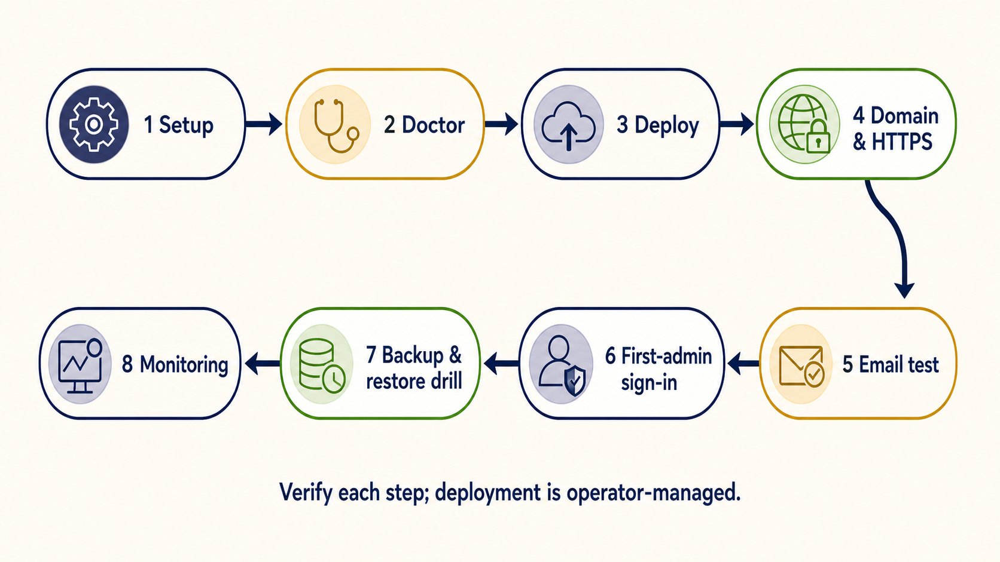

# Deploying to Cloudflare

This is the full, from-scratch walkthrough to put Church4Christ online on Cloudflare's
platform, with your own domain. The base Worker, D1, and R2 resources can start within free
allowances; production email and usage beyond plan limits can require a paid plan. It takes
most people under an hour the first time. If you would rather have an AI assistant do it,
hand it this file (see the README's "Build it with an AI assistant").

> **Not sure what any of this means?** Read [`cloudflare-setup.md`](./cloudflare-setup.md)
> first — it explains, in plain language, what Cloudflare is, what it costs, and the two
> ways to set it up. Then come back here for the exact commands.

> **Cost (August 2026 snapshot; subject to change).** Workers, D1, and R2 have free
> allowances, but a production deployment is not guaranteed to remain free. Sending email
> to arbitrary recipients currently requires Workers Paid. Check the official
> [Email Service pricing](https://developers.cloudflare.com/email-service/platform/pricing/)
> and [Workers pricing](https://developers.cloudflare.com/workers/platform/pricing/).

> **Choose the setup path before you deploy.** For the recommended guided path, stay on
> this page and run `npm run setup`; it selects D1 for Website / Website + Community and
> Supabase for Full Church or any custom selection with Member Portal, Giving, or
> Registration. The manual reference has an explicit [database fork](#manual-database-fork):
> D1 uses the numbered D1 steps, while Supabase creates only R2 here, completes the
> database steps in [`supabase-setup.md`](./supabase-setup.md), and resumes at email setup.
> There is no automated D1↔Supabase content migration yet.

## Recommended: guided setup

After installing Node.js 22.22.1 or newer and running `npm ci`, run the guided installer
first:

```bash
npm run setup
```

Choose **Deploy**, then Website (8 modules), Website + Community (all 18 D1-compatible
modules), Full Church (all 21), or a custom feature list. Setup selects the database,
creates or imports D1/R2/Hyperdrive resources, writes generated configuration, applies
migrations, stores explicit module settings, and bootstraps the first admin. It prints the
next command, normally `npm run deploy`. Verify readiness at any time with:

```bash
npm run doctor
```

Doctor reports configuration and resource readiness that the installer can inspect. It
does not prove production email delivery, successful sign-in, route behavior, scheduled-job
execution, or backup recovery; verify those outcomes with the go-live checklist below.

Deploying D1 requires a Cloudflare account. Deploying Supabase requires Cloudflare and
Supabase. When a deploy setup must create or recover a Hyperdrive configuration, it refuses
to put the connection URL in Wrangler's child-process arguments unless you explicitly add
`--allow-hyperdrive-secret-in-argv` after reviewing that exposure. Importing an existing
Hyperdrive does not require that consent.

## First deployment versus an upgrade

This walkthrough provisions a new installation. Once an environment contains church data,
uploaded media, custom code, or production configuration, treat the next deployment as an
upgrade: review [`CHANGELOG.md`](../CHANGELOG.md), take verified database and R2 backups,
rehearse the target revision in staging, apply only forward migrations, and test recovery.
Follow the dedicated [`upgrade.md`](./upgrade.md) runbook rather than rerunning setup as an
unreviewed one-click update. Setup can change resources, configuration, schema, module rows,
and administrator state; it does not replace an operator-approved upgrade plan.

## Manual reference and troubleshooting

The remaining commands explain the underlying Cloudflare operations for troubleshooting
or maintaining an installation created by guided setup. They are not a replacement for
setup's module initialization and first-admin bootstrap on a new installation.

## Before you start

You need:

- **[Node.js](https://nodejs.org/) 22.22.1 or newer** and the project installed locally
  with `npm ci`. The Cloudflare CLI, `wrangler`, comes with it.
- A **free Cloudflare account** — sign up at [dash.cloudflare.com](https://dash.cloudflare.com/sign-up).
- Optionally, a **domain** you want the site to live on (for example `church.yourname.com`).

Authenticate the CLI once:

```bash
npx wrangler login
```

### Manual database fork

- **D1:** continue with step 1 below.
- **Supabase:** do **not** create a D1 database or run the D1 migration in steps 1–4.
  Create only the shared media bucket:

  ```bash
  npx wrangler r2 bucket create church4christ-media
  ```

  Then complete sections 2–5 of [`supabase-setup.md`](./supabase-setup.md#2-create-the-supabase-project)
  for the project, Hyperdrive configuration, Postgres migrations, and session secret.
  Return to this page at [step 5, Set up email](#5-set-up-email), then continue through
  deploy, domain, sign-in, and the go-live checklist. Skip the D1-only backup step 9.

## 1. Create the database (D1) and media bucket (R2) — D1 path only

```bash
npx wrangler d1 create church4christ-db
npx wrangler r2 bucket create church4christ-media
```

The `d1 create` command prints a **`database_id`** — copy it, you need it next.

## 2. Fill in `wrangler.jsonc`

Open `wrangler.jsonc` and:

- Paste your `database_id` in place of `YOUR_D1_DATABASE_ID`.
- Set `vars.APP_ORIGIN` and `vars.EMAIL_FROM` to your own domain (see steps 5 and 6). The
  defaults point at the project's demo domain — change them.
- Leave the `name`, bindings (`DB`, `MEDIA`, `EMAIL`), and cron triggers as they are unless
  you have a reason to rename.

The placeholder IDs and the domain in this file are **safe to commit** — they are not
secrets. (Secrets are set separately in step 4 and never go in this file.)

### Learning module and shared credential key ring

Learning works on D1 or Supabase/PostgreSQL and depends on the `people` capability for the
live Person-to-provider identity chain. The Website + Community and Full Church presets enable
it; Website does not. Custom setup must select both People and Learning. Turning Learning off
makes learner/admin/API routes return 404 and skips provider work without deleting the saved
graph. Provider configuration is still operator work: setup and doctor verify schema/catalog
state, not a real OAuth grant, notification delivery, provider round trip, or restore.

Before authorizing either provider, create an AES-256-GCM key and store a canonical compact JSON
key ring as the `LEARNING_CREDENTIAL_KEYS` Worker secret. `LEARNING_CREDENTIAL_KEYS` rotation is
add-first; the old key remains present until no envelope references it:

```text
{"currentVersion":1,"keys":{"1":"<canonical base64 for exactly 32 random bytes>"}}
```

Generate the random bytes through the church's approved secret manager or cryptographic tooling;
do not paste a real key into a shell command, Git, tickets, logs, fixtures, or screenshots. Store
the complete JSON value through the interactive prompt:

```bash
npx wrangler secret put LEARNING_CREDENTIAL_KEYS
```

For key rotation, add a new version/key while retaining every old key, set `currentVersion` to the
new version, and deploy the expanded ring. New or refreshed envelopes use the current version.
Reconnect or successfully refresh each provider connection as needed and let Google/Canvas cleanup
tasks finish. OAuth-state expiration does not delete or re-encrypt a stored envelope. Starting a
replacement OAuth flow for the same connection supersedes its pending state under the current key;
successfully completing the flow deletes that state.

Use these read-only inventories before and after rotation. They expose only key versions and
counts, not encrypted values:

```sql
SELECT key_version, COUNT(*) AS envelope_count
FROM learning_provider_credentials
GROUP BY key_version ORDER BY key_version;

SELECT key_version, COUNT(*) AS envelope_count
FROM learning_google_oauth_states
GROUP BY key_version ORDER BY key_version;

SELECT key_version, COUNT(*) AS envelope_count
FROM learning_canvas_oauth_states
GROUP BY key_version ORDER BY key_version;

SELECT key_version, COUNT(*) AS envelope_count
FROM learning_canvas_cleanup_tasks
GROUP BY key_version ORDER BY key_version;
```

For an abandoned state that will not be superseded, take a backup, obtain change approval, and
delete only the reviewed connection row after confirming that it is expired and unclaimed. Use a
bound `:connection_id` and `:old_key_version`; never substitute untrusted text or run a blanket
delete. D1 uses these guarded statements:

```sql
DELETE FROM learning_google_oauth_states
WHERE connection_id = :connection_id AND key_version = :old_key_version
  AND claim_marker IS NULL AND datetime(expires_at) <= datetime('now');

DELETE FROM learning_canvas_oauth_states
WHERE connection_id = :connection_id AND key_version = :old_key_version
  AND claim_marker IS NULL AND datetime(expires_at) <= datetime('now');
```

On PostgreSQL, use the same exact connection/key predicates and `claim_marker IS NULL`, replacing
the final time predicate with `expires_at::timestamptz <= CURRENT_TIMESTAMP`. Verify that exactly
one approved row was affected. Do not delete a current, unexpired, or claimed OAuth state.

Verify that no credential, OAuth-state, or cleanup envelope still references the old
`key_version`; **do not remove an old key** before that inventory reaches zero and a rollback window
has passed. Removing a referenced key fails closed and can prevent refresh or cleanup; there is no
bulk automatic re-encryption command in 1.1.0.

### Google Classroom OAuth and optional Pub/Sub

In the Google Cloud project that will own the integration, enable the Google Classroom API and
configure an OAuth consent screen with the church's reviewed name, support contact, authorized
domain, privacy policy, and only the scopes below. Create a Web application OAuth client with the
canonical `APP_ORIGIN` callback (replace the example host; do not add alternates):

```text
https://church.example.org/admin/learning/google/callback
```

Store both OAuth values only through Worker secrets:

```bash
npx wrangler secret put GOOGLE_CLASSROOM_CLIENT_ID
npx wrangler secret put GOOGLE_CLASSROOM_CLIENT_SECRET
```

The implementation requests exactly these scopes; review Google's consent/verification rules for
the selected deployment and do not grant broader write, Drive, profile-email, or domain-wide
delegation access:

```text
https://www.googleapis.com/auth/classroom.courses.readonly
https://www.googleapis.com/auth/classroom.coursework.students.readonly
https://www.googleapis.com/auth/classroom.courseworkmaterials.readonly
https://www.googleapis.com/auth/classroom.push-notifications
https://www.googleapis.com/auth/classroom.rosters.readonly
```

Domain-wide delegation is not supported for Google Classroom notification registrations; the
authorizing administrator/teacher must retain the OAuth grant and access to each mapped course.
For scheduled/manual polling only, leave all three Pub/Sub identifiers below absent. To enable
notifications, create one Pub/Sub topic and grant
`classroom-notifications@system.gserviceaccount.com` permission to publish to it. Create a push
subscription for that topic with this exact HTTPS endpoint:

```text
https://church.example.org/api/learning/google/pubsub
```

Enable authenticated push. Attach a user-managed service account in the same Google Cloud project,
set the OIDC audience to that exact endpoint URL, and grant the Pub/Sub service agent the documented
permission to mint OIDC tokens for that service account. Church4Christ verifies the Google issuer,
RS256 signature, exact audience, service-account email, verified-email claim, token lifetime, and
exact subscription name. Set all three non-secret identifiers together in Worker vars (or the
equivalent reviewed environment configuration); partial configuration fails closed:

```text
GOOGLE_CLASSROOM_PUBSUB_TOPIC=projects/<project>/topics/<topic>
GOOGLE_PUBSUB_SERVICE_ACCOUNT_EMAIL=<push-identity>@<project>.iam.gserviceaccount.com
GOOGLE_PUBSUB_SUBSCRIPTION_NAME=projects/<project>/subscriptions/<subscription>
```

See Google's official [Classroom push-notification guide](https://developers.google.com/workspace/classroom/best-practices/push-notifications),
[OAuth scope catalog](https://developers.google.com/identity/protocols/oauth2/scopes), and
[authenticated Pub/Sub push guide](https://cloud.google.com/pubsub/docs/authenticate-push-subscriptions).
Classroom registrations last one week; the `:15` maintenance pass renews registrations nearing
expiry and cleans replaced registrations. Notifications only schedule authoritative reconciliation.
On disconnect, the local connection and its credential are disabled from active use, and live
registration rows are removed. The encrypted row in `learning_provider_credentials` remains
available only so the durable
`0022_learning_google_cleanup_saga.sql` path can call `registrations.delete()` and revoke the
Google refresh token with bounded retry. Successful finalization deletes the encrypted credential
and cleanup tasks. Google OAuth states and notification receipts are not removed by disconnect;
they remain subject to the documented retention policy and reviewed key-rotation procedure. Do not
delete a pending cleanup row or old credential key just to hide an error.

### Canvas OAuth and signed Live Events

Canvas is disabled until all three Canvas bindings are configured with `wrangler secret put`:
`CANVAS_OAUTH_CLIENT_ID`, `CANVAS_OAUTH_CLIENT_SECRET`, and `CANVAS_ALLOWED_ORIGINS`.
The allowlist value is non-secret configuration encoded as a JSON array of one to sixteen
exact public HTTPS origins, for example `["https://canvas.example.org"]`; it is kept out of
tracked configuration so no real institution URL is committed. The Worker rejects private,
loopback, local-only, duplicate, non-canonical, and unlisted origins before any OAuth secret or
provider token is sent. A Canvas connection's origin is immutable; moving to another Canvas
instance requires a new pending connection and a new OAuth authorization.

Create the Canvas developer key with this exact OAuth redirect URI (replace the host with the
canonical `APP_ORIGIN` host):

```text
https://church.example.org/admin/learning/canvas/callback
```

Grant only the API scopes the adapter calls. Canvas scope templates are literal; in particular,
the single-course read is `:id`, while course-child endpoints use `:course_id`:

```text
url:GET|/api/v1/courses
url:GET|/api/v1/courses/:id
url:GET|/api/v1/courses/:course_id/enrollments
url:GET|/api/v1/courses/:course_id/modules
url:GET|/api/v1/courses/:course_id/modules/:module_id/items
url:GET|/api/v1/courses/:course_id/modules/:module_id/items/:id
url:GET|/api/v1/courses/:course_id/pages/:url_or_id
url:GET|/api/v1/files/:id
url:GET|/api/v1/courses/:course_id/assignments
url:GET|/api/v1/courses/:course_id/quizzes
url:GET|/api/v1/courses/:course_id/assignments/:assignment_id/submissions
```

For Canvas Live Events, configure the HTTPS delivery URL as
`https://church.example.org/api/learning/canvas/live-events`. Church4Christ accepts only signed compact
JWT requests verified as `RS256` against Instructure's fixed JWKS URL,
`https://8axpcl50e4.execute-api.us-east-1.amazonaws.com/main/jwks`. Map a course before enabling
its events: Church4Christ reads `root_account_id` from Canvas's authoritative
`GET /api/v1/courses/:id` response and persists it as the account binding. There is deliberately
no administrator-entered root-account field, and a later course whose authoritative root differs
is rejected. Configure Live Events in that same Canvas root account; do not proxy the delivery URL
or substitute another JWKS endpoint.

Canvas OAuth/provider requests use a single ten-second deadline covering both response headers
and the entire response body; the Live Events reconciliation pass has a 25-second parent deadline.
Disconnect first commits a local disable, deletes the active credential envelope and Canvas private
state, and moves the encrypted token envelope into forward migration
`0024_learning_canvas_cleanup_saga.sql`. A Canvas outage therefore cannot keep a connection active.
This local disable is committed before the bounded cleanup retry, so provider downtime cannot
reactivate the connection.
The twice-hourly Learning maintenance pass retries at most one encrypted Canvas revocation task,
refreshing an expired access token when safe and persisting the rotated envelope before revoke. If
a prior revoke succeeded but local task deletion crashed, a later Canvas `400`/`401` is followed by
one bounded retained-refresh attempt. Only an exact bounded HTTP `400` JSON response whose `error`
is `invalid_grant` completes the task; `401` responses such as `invalid_client`, transport failures,
timeouts, and `5xx` responses retain it for retry after operator configuration is corrected.

For D1 Free budgeting, the worst Canvas cleanup pass uses at most six database queries and three
provider requests. It shares the `15,45 * * * *` invocation with the existing bounded Google
Classroom pass, whose covered worst case is 43 database queries and 18 provider requests; the
combined ceilings are therefore 49 D1 queries and 21 provider requests. Canvas admin disconnect is
also bounded (at most 13 application queries and three provider requests), and Canvas Live
Events reconciliation still caps normalized provider pages at 23. The new omitted-module-items
phase consumes one Canvas request per normalized page; the existing two-request resource-detail
case remains the worst case, so 23 pages use at most 46 Canvas requests before the reserved JWKS,
refresh, and course reads. Enrollment records are collected across bounded remote pages before one
coherent tuple per Canvas user is emitted; cached output pages consume the same page/item/byte
budgets but no additional Canvas subrequests. Keep these constants and their budget tests in sync
when adding endpoints.

Manual sync is an authenticated Learning-admin action. Scheduled sync scans one fair active mapped
course; `:45` reconciliation runs that bounded sync. Authenticated Google Pub/Sub or Canvas Live
Events notifications deduplicate and acknowledge promptly, then schedule the same authoritative
reconciliation through `ctx.waitUntil`; a notification payload is never treated as the snapshot.
At `:15`, the separate bounded maintenance half handles one Canvas disconnect cleanup and Google
registration cleanup/renewal. Transient provider `429`/`5xx` results use at most two attempts with
bounded backoff; permanent auth or permission failures require reconnect and preserve the last
complete snapshot.

Cloudflare D1 Free permits 50 queries per Worker invocation.
Workers Free permits 50 external subrequests per invocation as of this release. The reconciliation
planner reserves cold middleware, route/receipt, identity, credential-refresh, and finalization
work. Google reserves 12 D1 queries per attempt and Canvas 14; the two-attempt invocation tests
remain at or below 50. The 47 Google pages plus three reserved provider/JWKS/refresh requests and
23 Canvas normalized pages plus reserved Live Events JWK/refresh/course reads are provider-library
internal hard maxima; a Canvas page may cost two provider requests. Every production sync
trigger—manual, scheduled, Google Pub/Sub, and Canvas Live Events—uses the lower orchestration caps
of 21 Google pages or 10 Canvas pages per attempt. Do not raise page, item, byte, elapsed-time,
retry, query, or subrequest constants without rerunning boundary tests against current
[D1 limits](https://developers.cloudflare.com/d1/platform/limits/) and
[Workers limits](https://developers.cloudflare.com/workers/platform/limits/).

## 3. Create the database tables

Apply the migrations to your new remote database:

```bash
npm run db:migrate:remote
```

This creates every table. It does **not** load the demo content — a real deployment starts
empty, and you add your church's content through the admin area.

The local `npm run db:seed-media:local` command is only for the developer demo. Production
media starts empty too; admins can upload the homepage hero, event images, ministry covers,
and profile pictures through the admin area or profile pages after the site is live.

### D1 capacity for People CSV imports

The People admin's CSV importer is atomic on both D1 and PostgreSQL: it reparses and
preflights the selected file on the server, then commits every person, household, and
membership together or commits nothing. Do **not** work around a D1 limit by splitting one
request into chunks; the importer intentionally never makes partial commits.

D1 Free currently allows 50 queries per Worker invocation. The largest accepted CSV (200
data rows and up to 100 households) can require about 500 batch statements — up to 200
person inserts, 100 household inserts, and 200 membership inserts — plus the preflight
scans of existing emails and household names. Large D1 imports therefore require a
plan/runtime with a paid-capable per-invocation limit; if the deployment cannot accommodate
the complete preflight and atomic batch, reduce the CSV before retrying. Cloudflare prices
and limits change, so treat the current
[Cloudflare D1 limits](https://developers.cloudflare.com/d1/platform/limits/) as
authoritative rather than relying on this snapshot.

Saved mapping profiles use forward migration `0012_people_import_mappings.sql`. Profiles
store expected headers and mapping configuration, never uploaded source rows or sample
values. The mapping workflow keeps the same 200-row atomic import boundary, so a D1
deployment that needs large mapped imports must be paid-capable for the required
per-invocation query volume. Smaller imports can fit lower limits; verify the current
Cloudflare limits for the deployed plan instead of assuming profile storage changes the
atomic commit cost.

Aggregate Service Attendance uses forward migration `0013_service_attendance.sql` on both
backends. Apply it before enabling the `attendance` module or deploying
`/admin/attendance`; it creates the adult aggregate, effective Children-event links, and
link-state tables. See [`features/service-attendance.md`](./features/service-attendance.md)
for the privacy, access, and report limits.

Activity Score uses forward migration `0016_activity_score.sql` on both backends. Apply it
before enabling `activity-score` or deploying `/admin/activity-score`; it stores the
church-wide model while scores remain live calculations. See
[`features/activity-score.md`](./features/activity-score.md).

After the Learning schema is present, apply `0026_activity_score_learning.sql` on both
backends before exposing Learning as an Activity Score source. It preserves the existing
model and adds Learning disabled with weight zero; grades and provider content are not copied.

For Learning 1.1.0, the portable forward sequence is identical on both backends and must remain
in this exact numeric order:

1. `0017_learning.sql` — provider-neutral connections, programs, courses, identities,
   enrollments, metadata snapshots/events, and bounded sync runs.
2. `0018_learning_sync_leases.sql` — crash-recovery and finalization leases.
3. `0019_learning_sync_policy_fingerprint.sql` — URL-policy fingerprint on each run.
4. `0020_learning_google.sql` — Google OAuth, registration, and receipt metadata.
5. `0021_learning_google_receipt_lifecycle.sql` — reclaimable Pub/Sub receipt lifecycle.
6. `0022_learning_google_cleanup_saga.sql` — durable registration/disconnect cleanup.
7. `0023_learning_canvas.sql` — Canvas OAuth, account binding, Live Events receipts.
8. `0024_learning_canvas_cleanup_saga.sql` — durable encrypted token-revocation cleanup.
9. `0025_learning_sync_schedule.sql` — fair scheduled-attempt timestamp/index.
10. `0026_activity_score_learning.sql` — default-disabled Learning engagement dimension.

Never load the Genesis fixture in production. It is a local fictional snapshot, has no provider
credential or network dependency, and all of its Canvas/provider launch URLs use `.example.test`.

## 4. Set the session secret

Sessions are signed with `SESSION_SECRET`. Generate a strong random value (32+ bytes) and
store it as a Cloudflare **secret** — never in `wrangler.jsonc` or `vars`:

```bash
# Generate a value:
node -e "console.log(require('crypto').randomBytes(32).toString('base64'))"

# Store it (paste the value when prompted):
npx wrangler secret put SESSION_SECRET
npx wrangler secret put NEWCOMER_RATE_LIMIT_SECRET
```

Rotate this secret if it is ever exposed; changing it signs everyone out. See
[`SECURITY.md`](../SECURITY.md).

## 5. Set up email

Church4Christ sends transactional email (sign-in magic links, scheduling requests, the
weekly digest) through the Cloudflare **Email** binding declared in `wrangler.jsonc`
(`send_email`). Before any remote send, put the sender domain on Cloudflare DNS and
[onboard it for Email Sending](https://developers.cloudflare.com/email-service/get-started/send-emails/)
in the Cloudflare dashboard. The `allowed_sender_addresses` binding option restricts which
From addresses the Worker may use, and `EMAIL_FROM` selects the application's From address;
neither setting onboards or verifies the sending domain. See the official
[send-binding configuration](https://developers.cloudflare.com/email-service/configuration/send-bindings/).

Then choose the path that matches what you are doing:

- **Local development only:** guided Local setup writes `EMAIL_DEV_LOG=1` to `.dev.vars`.
  Messages, including magic links, print in the `npm run dev` terminal and are not sent.
  Do not add this setting to deployed `wrangler.jsonc` configuration.
- **Controlled deployed testing:** after onboarding the sending domain, verify a
  destination address in your Cloudflare account and send only to that address. Cloudflare
  currently does not charge for sends to verified destinations.
- **Production recipients:** after onboarding the sending domain, sending to arbitrary
  addresses currently requires the **Workers Paid** plan. Set
  `allowed_sender_addresses` and `EMAIL_FROM` to an address on that onboarded domain.

These plan rules are an **August 2026 snapshot** and are subject to change. Confirm them on
the official [Email Service pricing](https://developers.cloudflare.com/email-service/platform/pricing/)
and [Workers pricing](https://developers.cloudflare.com/workers/platform/pricing/) pages.

## 6. Deploy

```bash
npm run deploy
```

This builds the site and pushes the Worker. It prints a `*.workers.dev` URL you can open
right away to confirm it is live.

## 7. Point your own domain at it

Using `church.yunfei-song.com` as the example:

1. Make sure the domain (`yunfei-song.com`) is on your Cloudflare account (add it as a site
   if it is not).
2. In the dashboard, go to **Workers & Pages → church4christ → Settings → Domains & Routes
   → Add → Custom domain**, and enter `church.yunfei-song.com`. Cloudflare creates the DNS
   record and certificate for you.
3. Update `vars.APP_ORIGIN` to `https://church.yunfei-song.com` and `vars.EMAIL_FROM` to
   an address on that domain, then `npm run deploy` again so the running Worker knows its own
   origin (this matters for CSRF checks and absolute links).

## 8. Sign in as the first admin

`npm run setup` creates or promotes the first administrator through the same validated,
idempotent bootstrap path on both databases. Use the email you supplied to setup; do not
insert an admin with ad-hoc SQL. Open `https://church.yunfei-song.com/en/signin`, enter that
email, and request a link.
The magic link is delivered by email. For a local run only, `EMAIL_DEV_LOG=1` prints it in
the `npm run dev` terminal instead. Click it and you are in as an admin. From there, set
your church's name, address, service times, and theme in **Settings**, and start adding
content.

## 9. (Optional, D1 only) Enable nightly backups

The nightly D1 → R2 backup is off until you configure it. To turn it on:

1. Uncomment and fill `vars.CF_ACCOUNT_ID` and `vars.D1_DATABASE_ID` in `wrangler.jsonc`.
2. Create a **scoped** Cloudflare API token with permission to export that one D1 database,
   and store it as a secret:

   ```bash
   npx wrangler secret put D1_EXPORT_TOKEN
   ```

3. `npm run deploy`. Each night the Worker writes `backups/YYYY-MM-DD.sql` into your R2
   bucket (reachable only by you — never through the public `/media` route). If any of the
   three values is missing, the backup logs a line and skips, so nothing breaks.

The backup file contains **member data** (names, emails, phone numbers). Keep the export
token scoped to the minimum and treat the bucket as private — see [`SECURITY.md`](../SECURITY.md).

## 10. (Optional) Put Cloudflare Access in front of `/admin`

For an extra layer, you can require Cloudflare **Access** (Zero Trust) sign-in before anyone
can even reach `/admin`, on top of the app's own magic-link auth. This is defense in depth
and entirely optional; it does not replace application security, dependency maintenance,
backups, or monitoring. Configure it in the Cloudflare Zero Trust dashboard as a
self-hosted application covering the `/admin*` path.



## Go-live checklist

Before announcing the site, collect evidence for every item that applies to the modules
you enabled:

- **Health:** request `https://your-domain/healthz` and confirm a `200` response with
  `{"ok":true}`.
- **First administrator:** request the first admin's magic link from the deployed sign-in
  page, receive it through the production email path, open it, and confirm the admin home
  loads.
- **Production email:** send a representative transactional message to an allowed real
  recipient and confirm delivery rather than relying on the local terminal email log.
- **Routes:** open the enabled public and admin routes that the launch depends on using the
  final domain; confirm disabled modules do not appear as enabled navigation.
- **Schedules:** confirm the deployed cron triggers match the selected database and
  enabled modules, then inspect a real invocation or controlled test in Worker logs.
- **Backup artifact:** record the location and timestamp of a recent D1 export or Supabase
  backup, plus the separate plan for uploaded R2 media.
- **Restore drill:** restore that artifact into a non-production environment and verify
  representative records and media references before depending on it for recovery.
- **Monitoring:** configure a named owner and notifications for Worker, email, scheduled
  job, and backup failures, then confirm a test notification reaches that owner.

## Keeping it running

- **Redeploy reviewed application-only changes** with `npm run deploy`. For a source upgrade,
  use [`upgrade.md`](./upgrade.md): inspect operator impact, back up state, rehearse in staging,
  apply the selected backend's forward migrations, deploy, and verify.
- **Deployment is intentionally manual.** This public repo's CI builds and tests every
  change but never deploys — so no Cloudflare credentials ever live in a public repo. If
  you want push-to-deploy, keep a **private** copy of the repo and add a deploy step there
  with a scoped `CLOUDFLARE_API_TOKEN` secret; your keys stay off the public internet.
- **Update dependencies** periodically and run `npm audit` (see [`SECURITY.md`](../SECURITY.md)).
- **Monitor and recover:** review Worker and email failures, verify scheduled backups, keep
  an off-site copy where appropriate, and rehearse restores before an incident.
- **Never commit** `.dev.vars` or any secret — verify before every commit.
Before opening a new installation to the public, visit `/admin/onboarding` as a real
administrator and resolve the shared checklist. A super administrator acknowledges manual
checks only after verification. Run `npm run doctor -- --strict` from the reviewed deployment
checkout; bindings alone do not prove routes, jobs, backups, or restores.
