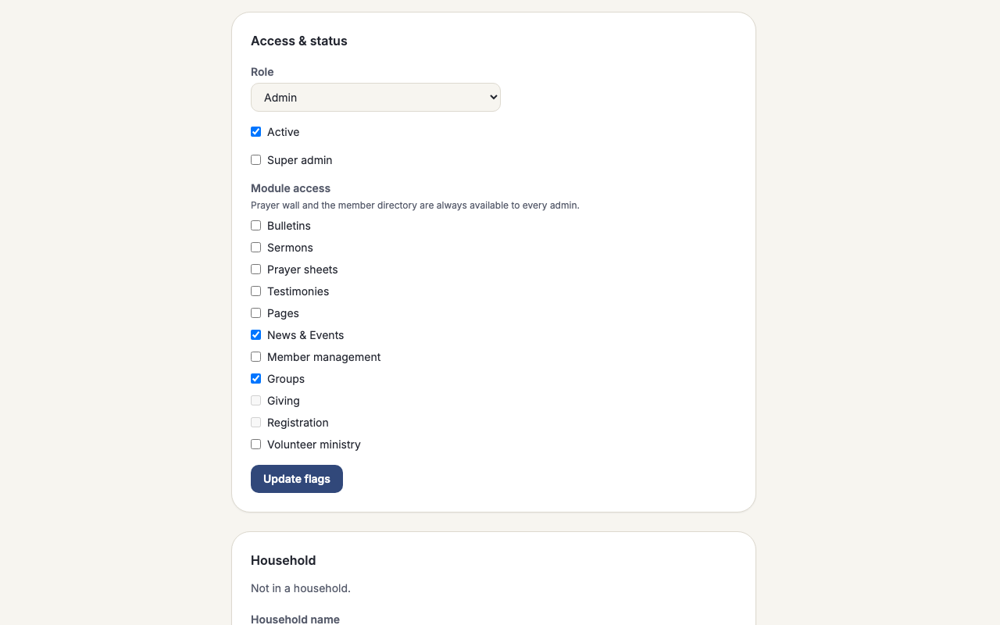

# Admin permissions (give each admin exactly what they need)

## What it does

Most churches have more than one person helping run the site, and not everyone should be
able to touch everything. A volunteer who edits the bulletin doesn't need to see giving
records; someone who manages small groups doesn't need to be able to delete a member.
**Admin permissions** let one trusted person hand out exactly the right slice of the admin
area to each helper, instead of an all-or-nothing "admin" switch.

There are two kinds of admin now:

- **Super admins** can see and do everything in the admin area, including deciding what
  everyone else can access. This is the closest match to how "admin" used to work.
- **Limited admins** start with almost nothing — just the dashboard, the prayer wall board,
  and the member directory (names, contact info, and basic profiles) — and a super admin
  grants them access to whichever other parts of the site they actually need to help with:
  bulletins, sermons, prayer sheets, testimonies, pages, news & events, member management,
  groups, children's check-in, giving, registration, or volunteer ministry.

Existing churches don't lose anything when this feature arrives: every admin account you
already had becomes a **super admin** automatically, so nobody is locked out. From there,
your church's lead admin can start handing out narrower access to new helpers as you bring
them on.

One more safety net: the site will never let you remove the **last** super admin, whether
by demoting them, deactivating them, or deleting them. If an action would leave the church
with zero super admins, it is blocked with a plain message — **"At least one super admin
must remain."** — so nobody can accidentally lock the whole team out of the admin area.

## How your team uses it

**Making someone a limited admin.** Open **Members**, find the person, and set their role
to **Admin** if it isn't already (only a super admin can change roles). Once someone's role
is Admin, their person page gains an **Access & status** panel with a **Module access**
checklist — one checkbox per area they can be granted. Check the boxes for what this person
should be able to do, and click **Update flags**. The change takes effect on their very next
page load.

The same panel has a **Super admin** checkbox. Checking it gives that person full access and
lets them manage other admins' permissions too — use it sparingly, for the people who
genuinely need to run the whole admin area.

**What a limited admin's portal looks like.** A limited admin who signs in only sees the
sidebar sections and dashboard cards for what they've been granted, plus the dashboard
itself, the prayer wall, and the member directory, which are always there. Nothing else
appears — there is no "Sermons" link teasing a page they can't open. If they somehow land on
a page they don't have access to (a bookmarked link, for example), the site politely refuses
rather than showing them anything.

**The giving example.** Say you grant a bookkeeper the **Giving** area. Two things open up
for them: the **Giving** admin console in the sidebar (funds, checkout records, check/cash
entry), and — on every member's profile page — a **Giving history** panel showing that
household's gifts and their total for the year. That panel deliberately shows the same
household-level numbers a member sees on their own **My giving** page, not a more detailed
breakdown — an admin with the Giving grant sees exactly what the giving family itself would
see, just from the admin side. Note that **Giving** and **Registration** only work at all on
a church that uses the optional Supabase database (see [Modules](modules.md)); on the
default Cloudflare D1 setup, those two checkboxes are greyed out because there is nothing to
grant access to yet.

**What can't be granted.** **Settings** and **Navigation** always stay super-admin-only —
they control things like the church's modules, theme, and site structure, which are
decisions for whoever is running the whole admin area, not something to hand out piecemeal.

## How it fits together

Whether someone can reach a page in the admin area now depends on three things, checked in
order. First, is the underlying **module** even turned on for this church (see
[Modules](modules.md)) — if not, the page doesn't exist for anyone, super admins included.
Second, does this person's **role** allow admin pages at all. Third, if they're a limited
admin, have they been **granted** this particular area. A super admin skips that third
check entirely; a limited admin needs the grant. Nothing here changes what a module toggle
already does — permissions decide *who* on your team can reach a module that's switched on,
not whether the module exists.

## For developers

- **Storage:** migration `migrations/0007_admin_permissions.sql` (mirrored in
  `migrations-supabase/0006_admin_permissions.sql`) adds two columns to `people`:
  `super_admin INTEGER NOT NULL DEFAULT 0` and `admin_areas TEXT NOT NULL DEFAULT ''` (a
  comma-separated list of area keys, not JSON). The migration backfills
  `super_admin = 1` for every row with `role = 'admin'` at the time it runs, so upgrading an
  existing install never drops access.
- **Area registry:** `src/lib/adminAreas.ts` is the pure, tested source of truth.
  `GRANTABLE_AREAS` lists the 12 grantable keys: `bulletins`, `sermons`, `prayer-sheets`,
  `testimonies`, `pages`, `events`, `people`, `groups`, `children`, `giving`, `registration`,
  `serve`.
  `AdminAreaKey` extends that with three keys that are never grantable: `prayer-wall` and
  `people-basic` (in `ALWAYS_AREAS` — free for every admin) and `settings` (covers both
  `/admin/settings` and `/admin/navigation`; `hasAreaAccess` hard-fails it for anyone who
  isn't a super admin). `adminAreaForPath` classifies an admin route by longest matching
  prefix — note `/admin/people` itself maps to `people-basic` (reachable by every admin,
  read-mostly), while the `people` grant instead gates the mutating actions inside that page
  (save, delete, household edits, notes, invite); `/admin/ministries`, `/admin/teams`,
  `/admin/service-types`, `/admin/reports`, `/admin/availability`, and `/admin/applications`
  all resolve to `serve`. An unrecognized `/admin/...` path resolves to no area and fails
  closed to super admins only. `hasAreaAccess(user, area)` is the single predicate every
  enforcement point calls.
- **SessionUser:** `src/lib/currentUser.ts` reads `super_admin`/`admin_areas` alongside the
  rest of the person row and sets `isSuperAdmin: boolean` and `adminAreas: string[]` on
  `SessionUser` (`src/lib/types.ts`) — both are hard-`false`/`[]` for any non-admin role, even
  if the columns hold stray data.
- **Enforcement points (defense in depth):**
  - `src/middleware.ts` is the primary choke point, and the ordering of its early returns is
    deliberate and worth internalizing: a module switched off returns **404** before a
    session is even loaded (everyone, including super admins, is affected identically); an
    insufficient **role** (per `routePolicy`) returns **403**; and finally, only for a
    limited admin (`isAdmin && !isSuperAdmin`) on an `/admin/**` path, a missing **area
    grant** returns **403**. Because Giving and Registration carry `requiresBackend:
    'supabase'` in `src/lib/modules.ts`, they're forced off on a D1 backend regardless of any
    grant — so on D1 those pages 404 for a limited admin the same way they 404 for a super
    admin; the area check for them is only ever reached on Supabase.
  - In-page guards re-check `hasAreaAccess` (or `isSuperAdmin` directly, for the two
    ungrantable areas) as defense in depth and to cover surfaces the `/admin/**` middleware
    gate doesn't reach: `src/pages/admin/revisions/[entity]/[id].astro` (maps each revision
    entity to its owning area), `src/pages/[locale]/profile/[id].astro`,
    `src/pages/[locale]/groups/[id].astro` and `.../manage.astro` (composed with the
    per-group `is_admin` membership check, which this feature does not change),
    `src/pages/[locale]/serve/teams/[id].astro` and `.../serve/plans/[id].astro` (composed
    with team-leader access), `src/pages/[locale]/p/[slug].astro` (custom-page draft
    preview), and explicit `isSuperAdmin` checks in `src/pages/admin/settings/index.astro`
    and `src/pages/admin/navigation/index.astro`.
  - `src/layouts/Admin.astro` (sidebar) and `src/pages/admin/index.astro` (dashboard) filter
    their nav sections and cards through the same `hasAreaAccess` predicate so a limited
    admin never sees a link to a page they can't open.
- **Person page UI:** `src/pages/admin/people/[id].astro`. The "Access & status" panel
  (`t('admin.person.flagsTitle')`) renders a form only for a super-admin *viewer*; a
  non-super viewer gets a read-only summary instead. Within that form, the `super_admin`
  checkbox and the `Module access` fieldset (`t('admin.person.areasTitle')`, iterating
  `GRANTABLE_AREAS`) render only when the **target** person's `role === 'admin'`. The
  Giving/Registration checkboxes are individually `disabled` (not hidden) when
  `Astro.locals.dbBackend !== 'supabase'`.
- **Last-super-admin guard:** `isLastSuperAdmin` and the write paths in `src/lib/adminDb.ts`
  (`setPersonFlags`, `softDeletePerson`) throw `Error('last_super_admin')` before a change
  would leave zero active super admins; the person page catches that and re-renders with
  `t('admin.person.lastSuperErr')`. A `WHERE`-clause backstop on the same UPDATEs makes a
  raced concurrent demotion a silent no-op rather than a real violation, so the guard holds
  even under concurrent requests, not just in the pre-check.
- **Giving history panel:** the same person page fetches `listHouseholdGifts` /
  `householdYearTotals` (household-scoped, current-calendar-year total) only when the viewer
  has both the `giving` module (Supabase-only) and the `giving` area grant — so the query
  never runs on D1 and never runs for an ungranted admin. It intentionally mirrors
  `/my/giving`'s household-aggregate shape rather than exposing a finer per-gift breakdown.
- **Seed/demo data:** `seed/dev-seed.sql` sets `admin@example.com` (id 1) as the super admin
  and adds `lydia.kwan@example.com` (id 11, `zh` locale) as a limited admin with
  `admin_areas = 'groups,events'`.
- **Tests:** `test/adminAreas.test.ts` (registry, `adminAreaForPath`, `hasAreaAccess`),
  `test/adminDb.permissions.test.ts` (`setPersonFlags`, `softDeletePerson`, the
  last-super-admin guard), `test/middlewareAuth.test.ts` and `test/routePolicy.test.ts`
  (the 403 ordering), `test/adminOverview.test.ts` (dashboard filtering); end-to-end coverage
  in `test/e2e/admin-permissions.e2e.test.ts`.
