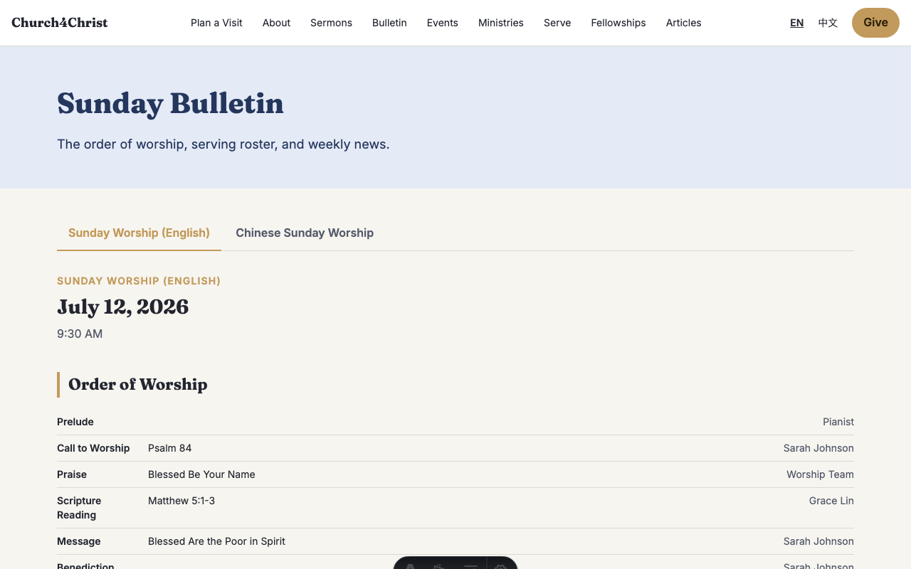
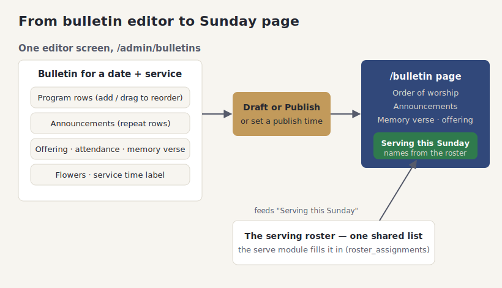

# Weekly bulletins

## What it does

A bulletin is the weekly service sheet your congregation follows on Sunday: the order of
worship, announcements, the memory verse, the offering and attendance from last week, who
brought the flowers, and the service time. This feature lets your team build that sheet in
the admin area and have it appear on the website automatically.

Each bulletin is tied to a **date** and a **service type** (for example, the 9:30 English
worship or the 11:00 Chinese worship), not to a language. That means one bulletin can carry
both languages, and two services on the same Sunday each get their own sheet.

You can save a bulletin as a **draft** while you are still working on it, and set a
**publish time** so it goes live on its own — handy for preparing next Sunday's sheet on
Wednesday and letting it appear Saturday night. When it publishes, the page also shows who
is scheduled to serve that Sunday, pulled straight from the volunteer scheduler.

## How your team uses it

**The editor.** Open the bulletins section, pick a date and service, and fill in the sheet.
The order of worship is a list of rows you can add to and drag to reorder; announcements
work the same way. Offering, attendance, memory verse, flowers, and the service-time label
each have their own field.

**Draft, or schedule to publish.** While you are drafting, the bulletin stays hidden from
the public. Set it to **published** to make it live now, or fill in a publish time to have
it appear later on its own. You never have to remember to flip a switch at the right moment.

**How it appears on the site.** Visitors find bulletins under the bulletin page, newest
first, and can open any past week. The published sheet shows the full order of worship,
announcements, the memory verse, and — near the bottom — a **Serving This Sunday** list.

That serving list is not typed into the bulletin. It comes from the same roster the
volunteer module fills in (see [Volunteer & serve](volunteer-serve.md)), so once a leader
schedules people, their names show up on the bulletin with no extra work — and if the
schedule changes, the bulletin follows.

**Two services on one Sunday.** Because a bulletin is tied to a service type as well as a date,
two services on the same morning each get their own sheet — the 9:30 English worship and the
11:00 Chinese worship, for instance, with their own order of worship and their own serving
roster. Neither one has to compromise to fit the other.

**Past weeks stay available.** Every published bulletin is kept, so the bulletin page doubles as
an archive. Someone who missed a Sunday can pull up that week's sheet, read the announcements,
and see the memory verse whenever they like.

**Good to know:**

- Announcements added to a bulletin belong to that week's sheet. The rotating news ticker on the
  home page is separate (see [The public website](public-site-and-themes.md)).
- Setting a publish time is the easy way to prepare a bulletin midweek and let it appear on its
  own — no need to be at your computer Saturday night.
- If you edit a published bulletin, the change is live immediately, and the previous version is
  saved in its history in case you need to undo it.

## How it fits together

The diagram shows the one editor screen on the left, the draft/publish choice in the
middle, and the public page on the right — with the serving roster flowing in from the
volunteer scheduler.

## For developers

- **Editing & saving:** `src/lib/adminDb.ts` (bulletin upsert writes the row, its
  announcement child rows, and a full-snapshot revision in one `db.batch`) and
  `src/pages/admin/bulletins/index.astro` + `[id].astro`.
- **Public view:** `src/pages/[locale]/bulletin/index.astro` + `[date].astro` render
  `src/components/BulletinView.astro`.
- **Serving roster:** `src/lib/publicDb.ts` reads confirmed assignments from
  `roster_assignments` for the plan matching that service type + date — the same table the
  serve module writes.
- **Scheduling:** the `publish_at` column plus a `status` of `draft`/`published` gate
  visibility; program and offering/attendance are stored as JSON columns.
- **Tests:** `test/adminDb.content.test.ts`, `test/adminDb.revisions.test.ts`,
  `test/publicDb.test.ts`.
