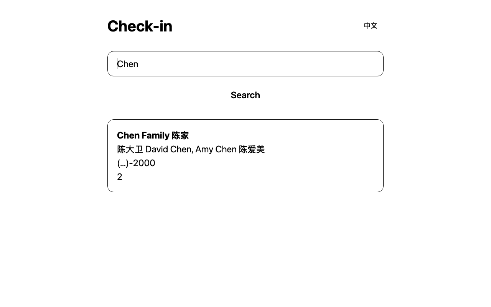
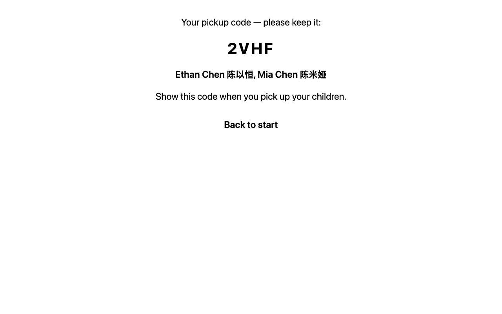
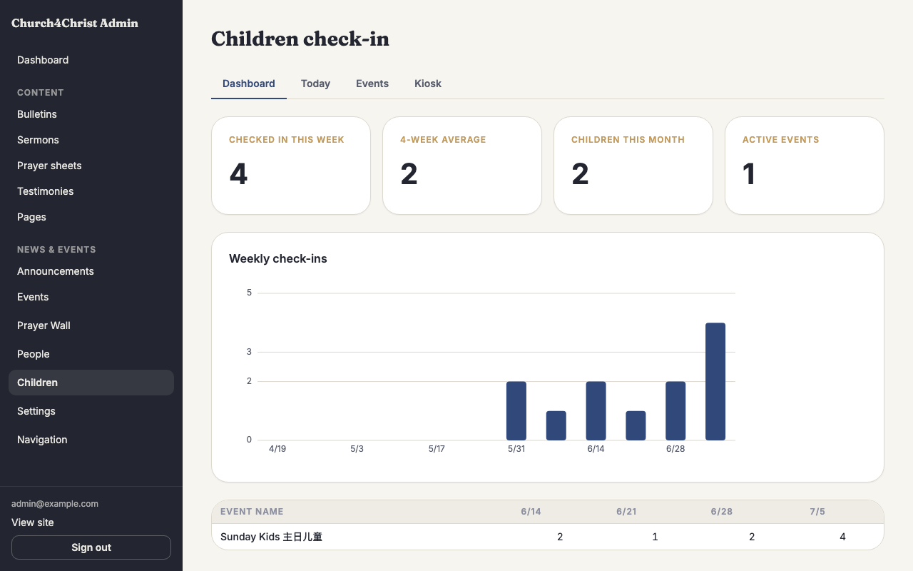
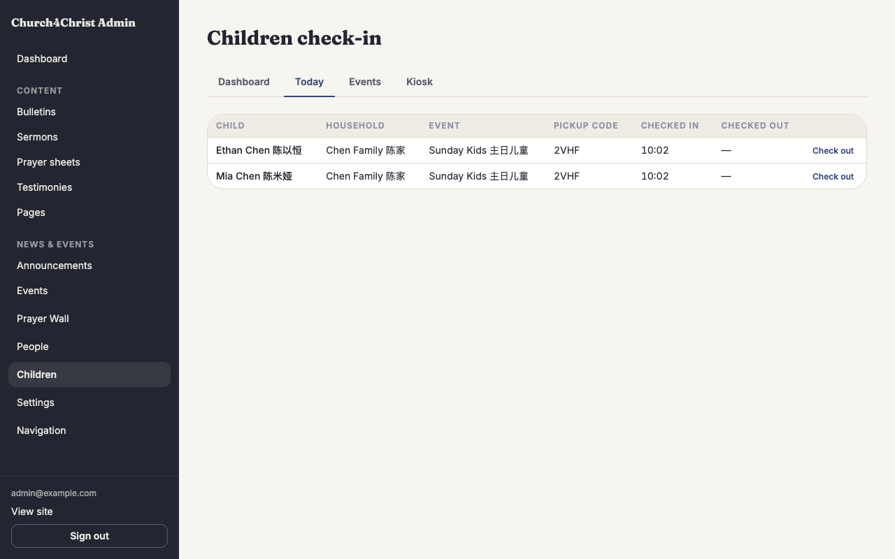
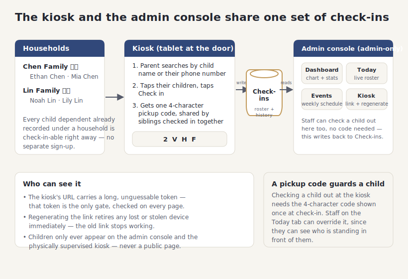

# Children's check-in

## What it does

A touch-friendly **kiosk** — meant for a tablet at the check-in table — where a parent
finds their family, checks their kids in for the morning, and walks away with a printed
or on-screen **pickup code**. No badges to print, no clipboard, and no separate
registration step: every child already recorded under a household in People is
check-in-able the moment this feature is turned on.

Behind the kiosk sits a small **admin console** at `/admin/children`, so your children's
ministry team can see who is in the room right now, glance back at attendance over the
last few months, and manage which events the kiosk offers.

It adds two things on top of the household records your site already had:

- **A self-serve kiosk.** A parent searches by their child's name or their own phone
  number, taps who they are dropping off, and gets a 4-character code that guards
  pickup. Siblings checked in together share one code. The kiosk works in English or
  Chinese with a single tap, and needs no parent account or sign-in — the tablet itself
  is the trusted device.
- **A staff console with real numbers.** A live roster of everyone checked in today, a
  12-week attendance chart, and simple event management (add a class, retire one,
  see who came each week) — all without leaving the browser.

## How your team uses it

**Checking a family in.** At the kiosk, a parent types a child's name — or, if it is
faster, their own phone number — and taps their household when it appears. They tap
each child being dropped off and press **Check in**. The kiosk hands back one code
(shared by any siblings checked in together) and a reminder to keep it for pickup.

**Picking a child up.** Later, the same household screen on the kiosk shows who is
still checked in. Entering the code checks a child out. If a parent has lost the code,
a staff member can check that child out from the **Today** tab in the admin console
instead — no code needed there, since staff can see who is standing in front of them.

**Running the room, as an admin.** The **Dashboard** tab shows this week's count, a
4-week average, how many different children came this month, and a 12-week bar chart
of attendance so a trend (or a dip) is easy to spot. The **Today** tab is the live
roster — every check-in today, its pickup code, and check-in/check-out times, with a
one-click staff checkout.

**Managing events.** The **Events** tab is where you add a class or service (a name,
and optionally which weekday it runs — leave the weekday blank for something offered
every day). Deactivating an event takes it off the kiosk without touching its history;
past check-ins stay exactly as they were.

**Setting up the kiosk device.** The **Kiosk** tab shows the tablet's URL and a copy
button. If a tablet is lost or a device is retired, **regenerating** the link
immediately shuts out the old one — the new URL is the only way in from then on.

## How it fits together

Every child already living under a household in People can walk up to the kiosk and
check in — there is nothing separate to register. The kiosk and the admin console both
read and write the same check-ins: the kiosk checks a child in (and lets a parent check
them out with the code), while the admin console watches the room live, charts
attendance, and lets staff override a checkout. A long, unguessable token in the kiosk's
own URL is the only thing gating it — no parent sign-in — and regenerating that token
is how a lost or stolen device gets cut off.

## For developers

- **Schema:** migration `migrations/0006_children_checkin.sql` adds `checkin_events`
  (name, optional `weekday` 0–6 where NULL means every day, `active`) and `checkins`
  (one row per child per event per day: `child_name` and `security_code` are snapshotted
  at check-in so history survives a rename, a unique index on
  `(event_id, household_member_id, checkin_date)` makes a repeat check-in idempotent).
  Children are the same `household_members` rows (`role = 'child'`) introduced by the
  People module — nothing new to create per child.
- **Data library:** `src/lib/checkinDb.ts` — `searchHouseholds` (name-substring mode
  under 4 digits, phone-digit mode at 4+, matching either the household phone or an
  adult member's own phone; only households with at least one child ever match),
  `checkInChildren` (validates member ids belong to the household, reuses an existing
  code for the same household+event+day or generates a fresh one via
  `generateSecurityCode`, and silently swallows a duplicate insert so a re-submit is a
  no-op), `checkOutChild` (parent path, requires the code), `staffCheckOut` (admin path,
  no code), `todayRoster`, and `weeklyStats` (a zero-filled 12-week series plus a
  per-event breakdown for the admin dashboard).
- **Kiosk token:** `src/lib/kioskToken.ts` — a 32-character random hex value stored as
  a single settings row (`children.kiosk_token`); `ensureKioskToken` creates one on
  first use, `regenerateKioskToken` replaces it. The token is the entire gate: the kiosk
  pages in `src/pages/kiosk/[token]/` compare `Astro.params.token` against the stored
  value and 404 on any mismatch, with no session involved.
- **Weekday convention:** `0 = Sunday` everywhere — the SQL `CHECK`, the kiosk's
  `getUTCDay()` weekday lookup, and the `admin.children.weekday.*` i18n keys all agree.
- **Module gating:** module key `children` (`src/lib/modules.ts`) owns public prefix
  `/kiosk` and admin prefix `/admin/children`; `/admin/children` is additionally in
  `routePolicy.ts`'s `ADMIN_ONLY` list, so only admins reach the console even with the
  module on. Turning the module off 404s both the kiosk and the admin console. See
  [Modules](modules.md).
- **Admin console:** `src/pages/admin/children/index.astro` is a single page with four
  `?tab=` views (dashboard/today/events/kiosk), mirroring the same-page-POST +
  303-redirect pattern used elsewhere in admin. The weekly chart is a hand-rolled inline
  SVG bar chart (`src/components/admin/children/WeeklyCheckinChart.astro`, token colors
  only) with a screen-reader-only table mirroring the same data.
- **Tests:** `test/checkinDb.test.ts` (search modes, check-in/check-out, roster, weekly
  stats, security code generation) and `test/kioskToken.test.ts` (token creation,
  idempotency, regeneration); end-to-end coverage in `test/e2e/children.e2e.test.ts`
  (a bad token 404s, the full kiosk search-to-pickup-code flow, admin-only access to the
  console, and the module-off 404 for both surfaces).
