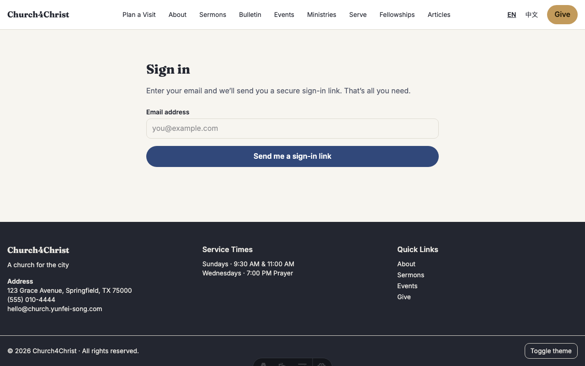
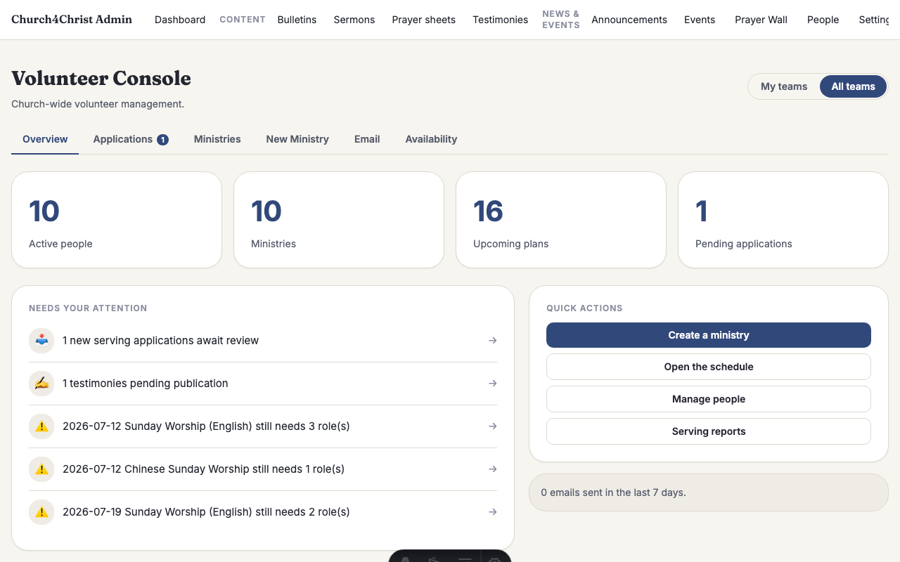
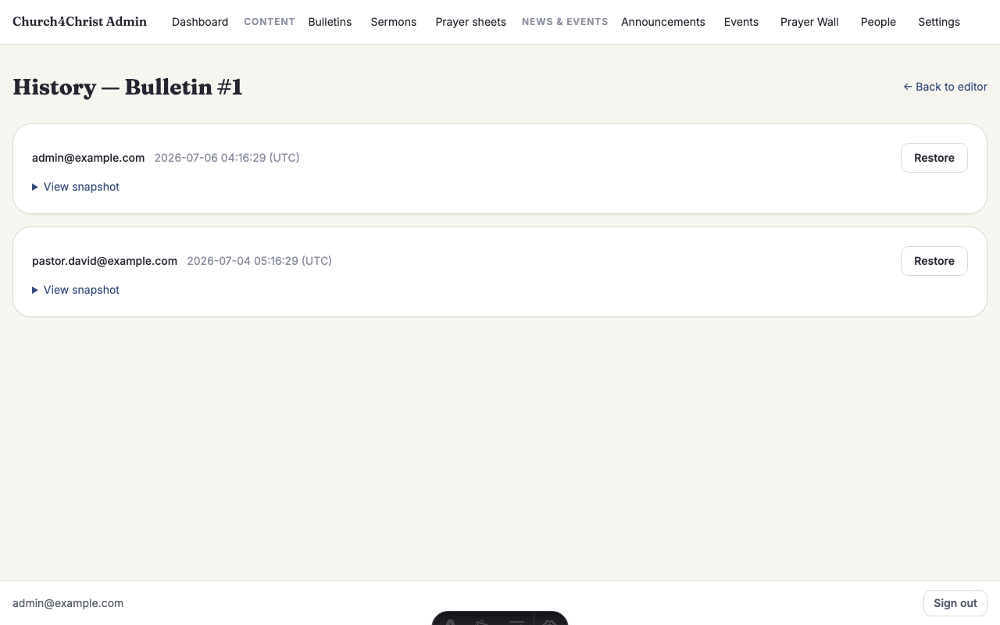
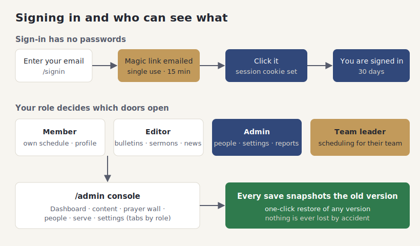

# The admin area

## What it does

The admin area is the private side of the site — the place your staff and volunteers
go to update content, review prayer requests, schedule people to serve, and manage
who can do what. Everyone reaches it at `/admin` after signing in.

There are no passwords to remember or reset. You type your email, we send you a link,
you click it, and you are in. That link works once and expires quickly, so there is no
password to leak, forget, or share. This is called **magic-link sign-in**.

What you can see and change depends on your **role**. A member can see their own serving
schedule; an editor can update bulletins, sermons, and news; an admin can do everything,
including managing people and settings. On top of that, a **team leader** gets scheduling
tools just for their own team. And because every save keeps a copy of the previous
version, a wrong edit is never permanent — you can restore the old one with one click.

## How your team uses it

**Signing in.** Go to the sign-in page and enter your email. You will get a message with
a link. Open it and you are signed in for the next 30 days on that device.

**The dashboard.** After signing in, `/admin` opens on a dashboard: recent activity, a
"needs attention" list (unanswered prayer requests, unconfirmed volunteers), and quick
links to every section you are allowed to use.

**Roles, in plain terms:**

- **Member** — sees their own profile and serving schedule.
- **Editor** — everything a member can do, plus editing bulletins, sermons, announcements,
  events, and prayer sheets.
- **Admin** — everything, plus managing people, roles, service types, reports, and settings.
- **Team leader** — a member who also leads a team; they get scheduling tools scoped to
  that team, even without the editor or admin role.

The console only shows the tabs your role is allowed to open, so nobody has to hunt past
buttons that would just say "not allowed."

**The safety net.** Every time you save a bulletin, sermon, announcement, event, or prayer
sheet, the previous version is tucked away in its history. If someone deletes a paragraph
or fat-fingers a date, open the item's revision history and restore an earlier version.

**Good to know:**

- Signing out (or an admin deactivating an account) ends access everywhere, on every device, the
  next time a page is loaded — handy when someone leaves a role or loses a laptop.
- The sign-in link is single-use and short-lived, so it is safe even if it lingers in an inbox;
  the link that a scanner in your mail app "peeks" at is not the same click that logs you in.
- Volunteers never need the admin area for their own schedule — that lives under their personal
  pages — so most people only ever sign in, glance at their serving, and leave.
- Settings has a **Modules** panel where an admin can switch off any feature the church does not
  use — the pages and links vanish but nothing is deleted (see [Modules](modules.md)).
- Settings also lets admins upload or remove the homepage hero image. Events, ministry
  covers, and profile pictures use the same R2-backed media pipeline, so local demo images
  and real uploads behave the same way.
- Managing a person — their household, membership status, serving applications, and private
  pastoral notes — happens on their page in the people directory (see
  [People & households](people-households.md)).

## How it fits together

Sign-in has no passwords, your role decides which doors open, and every save is backed up
by a restorable snapshot. The diagram shows all three.

## For developers

- **Sign-in:** `src/lib/auth.ts` (hash-only tokens, two-step consume, rate limit) and
  `src/pages/[locale]/signin.astro` + `src/pages/auth/[token].astro`. Sessions are jose
  HS256 JWTs in `src/lib/session.ts`; `src/middleware.ts` reloads the person each request
  so a deactivated account locks out immediately.
- **Roles & access:** `src/lib/routePolicy.ts` classifies every path and fails closed for
  unknown `/admin` paths. The `Admin.astro` layout and each admin page enforce the finer
  editor/admin/leader rules.
- **Dashboard:** `src/lib/adminOverviewDb.ts` feeds `src/pages/admin/index.astro`.
- **Revisions:** `src/lib/adminDb.ts` (`snapshot`, `listRevisions`, `getRevision`,
  `restoreRevision`) and `src/pages/admin/revisions/[entity]/[id].astro`.
- **Tests:** `test/auth.test.ts`, `test/authFlow.test.ts`, `test/session.test.ts`,
  `test/routePolicy.test.ts`, `test/middlewareAuth.test.ts`,
  `test/adminDb.revisions.test.ts`; authz redirects and magic-link replay-safety live in
  `test/e2e/`.
