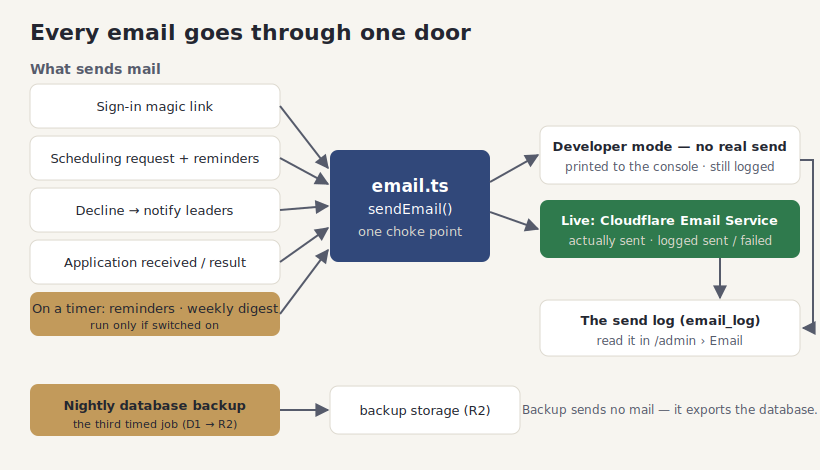

# Email and automation

## What it does

The site sends email so your team does not have to. Some messages go out the moment something
happens — a sign-in link, a scheduling request, a decline notice, an application result — and
others run on a timer, like reminders and the weekly digest. There is also a nightly job that
quietly backs up your data.

Every message, no matter what triggers it, passes through one place in the code. That single
door is deliberate: it means all mail is logged the same way, and a mail problem can never crash
the action that caused it — a failed email is recorded and shrugged off, never thrown at the user.

You stay in control from the admin Email tab. You can turn the automatic reminders and digest on
or off, edit the wording of the templates, and read a log of everything that has been sent. And
while you are developing or testing, the site can print emails to the console instead of sending
them, so you can complete a sign-in from your terminal without wiring up a real mail provider.

## How your team uses it

**The emails that go out:**

- **Sign-in magic link** — sent when someone requests a login link.
- **Scheduling request** — sent to a volunteer when a leader assigns them, with an accept/decline
  link.
- **Decline notice** — sent to a team's leaders when a volunteer declines, so they can find a
  replacement.
- **Application received / result** — leaders are told when someone applies; the applicant is told
  whether they were approved.
- **Reminders** — a nudge to anyone still unconfirmed as their service approaches.
- **Weekly digest** — a Thursday summary of each person's serving for the coming week.

**The Email tab.** From the admin area you manage all of this in one place: toggle which automatic
messages run, edit the templates, and browse the send log.

**Rules (the toggles).** Three switches control the timed messages: the 7-day reminder, the 3-day
reminder, and the weekly digest. Out of the box the 7-day reminder and the digest are on and the
3-day reminder is off — flip any of them to suit your church.

**Templates.** The wording of the reminder, request, application-result, and digest emails is
editable, in both languages, so the messages sound like your church rather than a generic system.

**The send log.** Every attempt is recorded — who it went to, what kind it was, and whether it was
sent, failed, or (in development) just logged. When someone says "I never got the email," this is
where you check.

**Three timed jobs.** Behind the scenes, three jobs run on a schedule: the daily **reminders**, the
weekly **digest**, and — separate from email entirely — a nightly **backup** that exports your
database to storage. The backup sends no mail; it simply keeps a safe copy, and it skips itself
quietly if backups have not been configured.

**Development mode.** When the site is running locally with dev-mode email turned on, messages are
printed to the console (magic link included) and marked as `devlog` in the log, instead of being
sent. That lets a developer test every flow end-to-end with no real mail account.

**Good to know:**

- Emails go out in the reader's own language when the site knows it, and in both languages stacked
  otherwise, so a message is never unreadable to its recipient.
- Automatic mail is best-effort: if a message cannot be sent, the underlying action (signing in,
  declining a slot, saving an application) still succeeds — the failure is only logged.
- If email is not configured at all, the site keeps working; those messages are simply recorded as
  failed rather than crashing anything.

## How it fits together

The diagram shows the triggers on the left, the single choke point in the middle, the dev-log and
live-send branches on the right, and the separate backup cron below.

## For developers

- **The choke point:** `src/lib/email.ts` (`sendEmail`) — builds the MIME message, sends via the
  Cloudflare `send_email` binding, logs to `email_log`, never throws; `EMAIL_DEV_LOG=1` routes to
  the console + a `devlog` row.
- **Touchpoints:** `src/lib/notify.ts` (magic link, scheduling request, decline, application
  received/result) and `src/lib/digest.ts` (`sendReminders`, `sendWeeklyDigest`).
- **Crons:** declared in `wrangler.jsonc` and dispatched in `src/worker.ts` — reminders `0 13 * * *`,
  digest `0 14 * * 4`, backup `0 9 * * *`. The backup itself is `src/lib/backup.ts` (`runBackup`,
  D1 → R2, skips gracefully without `D1_EXPORT_TOKEN`).
- **Rules, templates, log:** `src/lib/emailSettingsDb.ts` (`listRules`, `setRule`, templates,
  `listEmailLog`, `fillTemplate`) behind `src/components/admin/EmailTab.astro`.
- **Tests:** `test/email.test.ts`, `test/notify.test.ts`, `test/digest.test.ts`,
  `test/backup.test.ts`, `test/emailSettings.test.ts`.
