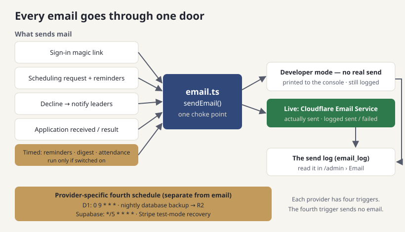

# Email and automation

## Deployment, cost, and availability

> **August 2026 snapshot; verify before deployment.** Cloudflare Email Sending is currently
> beta. `EMAIL_DEV_LOG=1` is local-development output only: messages, including magic links,
> print in the `npm run dev` terminal and are not sent. Do not use it as deployed email.

Before any production send, the sender domain must use Cloudflare DNS and be
[onboarded for Email Sending](https://developers.cloudflare.com/email-service/get-started/send-emails/).
The binding's `allowed_sender_addresses` allowlist limits which From addresses code may use; it
does **not** onboard or verify the domain. See Cloudflare's
[send-binding configuration](https://developers.cloudflare.com/email-service/configuration/send-bindings/).

Sending to arbitrary production recipients currently requires **Workers Paid**. A verified
destination address is free on all plans, but it is a controlled testing path rather than
production recipient coverage. Check the current
[Email Service pricing](https://developers.cloudflare.com/email-service/platform/pricing/) and
[Workers pricing](https://developers.cloudflare.com/workers/platform/pricing/) before rollout.

## What it does

When production email is configured, the site can send transactional messages for sign-in,
scheduling, volunteer responses, attendance links, application results, reminders, and the
weekly digest. There is also a separate nightly job that backs up configured data.

Every send request passes through one place in the code. That single door records each send
attempt consistently and prevents a provider error from crashing a separate database write.
The attempt log does not prove delivery, and a flow that depends on the recipient receiving a
link cannot complete without working email.

You stay in control from the admin Email tab. You can turn the automatic reminders and digest on
or off, edit the wording of the templates, and read the send-attempt log. During local development,
the site can print messages to the terminal instead of sending them, so a developer can copy the
printed magic-link URL without configuring remote email.

## How your team uses it

**Messages the site attempts when email is available:**

- **Sign-in magic link** — sent when someone requests a login link.
- **Scheduling request** — sent to a volunteer when a leader assigns them, with an accept/decline
  link.
- **Decline notice** — sent to a team's leaders when a volunteer declines, so they can find a
  replacement.
- **Application received / result** — leaders are told when someone applies; the applicant is told
  whether they were approved.
- **Reminders** — a nudge to anyone still unconfirmed as their service approaches.
- **Weekly digest** — a Thursday summary of each person's serving for the coming week.

**The Email tab.** From the admin area you manage all of this in one place: toggle which automatic
messages run, edit the templates, and browse the send log.

**Rules (the toggles).** Three switches control the timed messages: the 7-day reminder, the 3-day
reminder, and the weekly digest. Out of the box the 7-day reminder and the digest are on and the
3-day reminder is off — flip any of them to suit your church.

**Templates.** The wording of the reminder, request, application-result, and digest emails is
editable, in both languages, so the messages sound like your church rather than a generic system.

**The send log.** Every attempt is recorded — who it was addressed to, what kind it was, and
whether the binding accepted it, failed, or (in local development) only logged it. An `email_log`
row is evidence of a send attempt, not proof that the message reached an inbox.

**Three timed jobs.** Behind the scenes, three jobs run on a schedule: the daily **reminders**, the
weekly **digest**, and — separate from email entirely — a nightly **backup** that exports your
database to storage. The backup sends no mail; it simply keeps a safe copy, and it skips itself
quietly if backups have not been configured.

**Development mode.** When the site is running locally with `EMAIL_DEV_LOG=1`, messages are
printed to the `npm run dev` terminal (magic link included) and marked as `devlog` in the log,
instead of being sent. This setting is terminal-only and must not be treated as deployed mail.

**Good to know:**

- Emails go out in the reader's own language when the site knows it, and in both languages stacked
  otherwise, so a message is never unreadable to its recipient.
- Some database writes are deliberately best-effort with respect to notification: a provider
  failure is logged instead of turning a saved record into a server error. That does not make
  mail-dependent follow-up usable.
- If email is unavailable, public content remains available. Magic-link sign-in, volunteer
  response and reminder links, attendance links, and other flows that depend on delivered mail
  are unavailable until production email works.

## How it fits together

The diagram shows the triggers on the left, the single choke point in the middle, the local
dev-log and remote-send branches on the right, and the separate backup cron below.

## For developers

- **The choke point:** `src/lib/email.ts` (`sendEmail`) — builds the MIME message, attempts a send
  via the Cloudflare `send_email` binding, and records that attempt in `email_log`; a row does not
  guarantee delivery. Local `EMAIL_DEV_LOG=1` routes to the terminal + a `devlog` row.
- **Touchpoints:** `src/lib/notify.ts` (magic link, scheduling request, decline, application
  received/result) and `src/lib/digest.ts` (`sendReminders`, `sendWeeklyDigest`).
- **Crons:** declared in `wrangler.jsonc` and dispatched in `src/worker.ts` — reminders `0 13 * * *`,
  digest `0 14 * * 4`, backup `0 9 * * *`. The backup itself is `src/lib/backup.ts` (`runBackup`,
  D1 → R2, skips gracefully without `D1_EXPORT_TOKEN`).
- **Rules, templates, log:** `src/lib/emailSettingsDb.ts` (`listRules`, `setRule`, templates,
  `listEmailLog`, `fillTemplate`) behind `src/components/admin/EmailTab.astro`.
- **Tests:** `test/email.test.ts`, `test/notify.test.ts`, `test/digest.test.ts`,
  `test/backup.test.ts`, `test/emailSettings.test.ts`.
