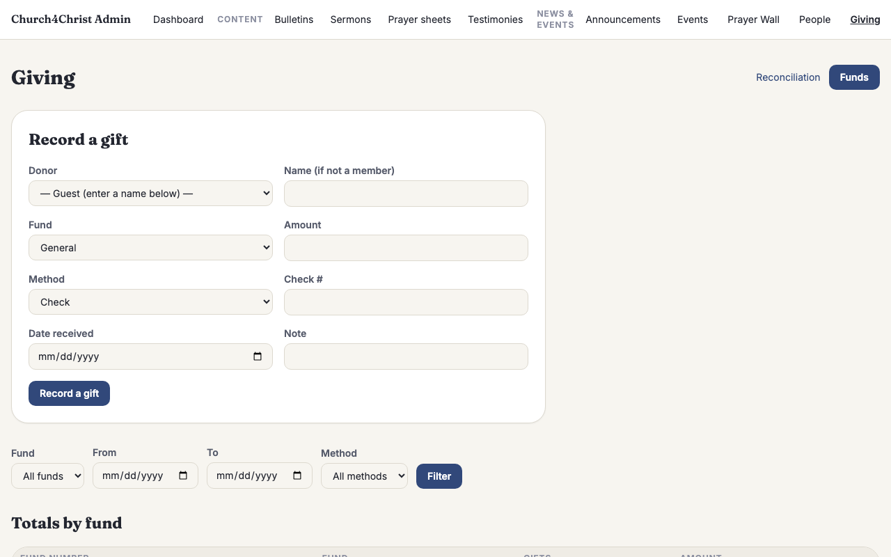
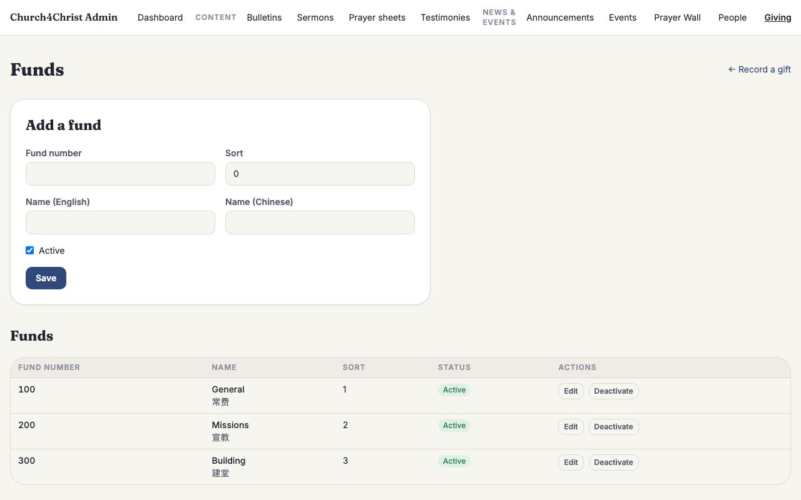
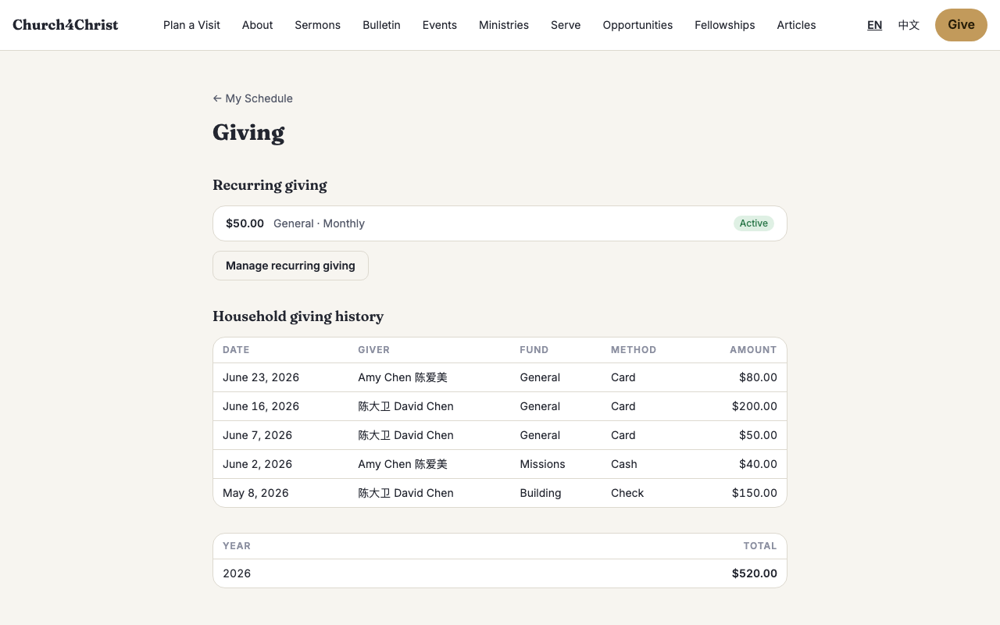
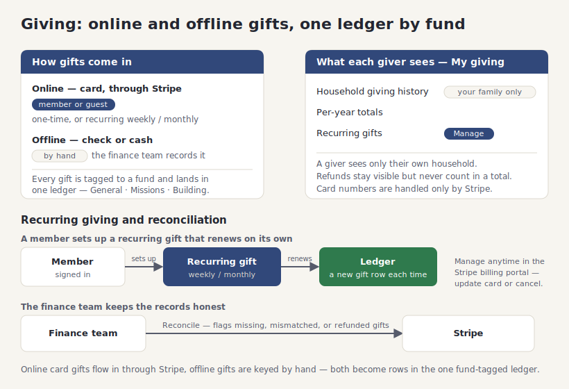

# Giving (online and offline donations)

## What it does

**Giving** lets your church receive and keep track of every gift in one place — the card
someone taps on their phone on Sunday morning, the check dropped in the offering box, the
cash counted after the service, and the monthly gift that renews on its own. Members and
first-time guests can give online in seconds, your finance team records the offline gifts by
hand, and every giver can look back over their own family's giving history.

It brings together four things a church normally juggles across a card reader, a
spreadsheet, and a separate donor app:

- **Online giving for anyone.** A guest can give a one-time gift with a card without an
  account — just a name and an email. A signed-in member can do the same, and can also set
  up a **recurring** weekly or monthly gift that renews by itself. Card payments run through
  **Stripe**, so the church never handles a card number.
- **Funds you define.** Split giving into the funds that match your church — **General**,
  **Missions**, **Building**, and any others — each with a number for your bookkeeping and a
  name in both English and Chinese. Givers pick the fund they want to support.
- **Offline gifts, recorded by hand.** Checks and cash never touch Stripe, so your finance
  team keys them into the same ledger: who gave, which fund, how much, the date received,
  and the check number. Online and offline gifts then live side by side.
- **A giving history each family can see.** Every signed-in member has a private **My
  giving** page showing their household's gifts, their recurring subscriptions, and a
  year-by-year total — the honest running picture a giver needs, without emailing the office.

Because money is involved, the whole module is careful: card numbers are handled only by
Stripe, refunds are never counted toward a total, and a giver only ever sees their own
household's gifts — never anyone else's.

## How your team uses it

**A member or guest gives online.** The public giving page at `/give` shows a short form:
pick a fund, enter an amount, choose one-time or (once signed in) weekly or monthly, and
continue to Stripe's secure checkout. A guest fills in a name and email and gives once; a
signed-in member can start a recurring gift that renews on its own. When the payment
succeeds, the gift lands in the ledger automatically.

**The finance team records checks and cash.** The giving admin page at `/admin/giving` has a
**Record a gift** form for everything that came in offline. Choose the giver from your
member list (or type a guest's name), pick the fund, enter the amount, mark it a check or
cash, add the check number and the date it was received, and save. Below the form, a
filterable **ledger** lists every gift — online and offline together — and a **Totals by
fund** table adds up what each fund has received over the date window you choose.

**Setting up funds.** On `/admin/giving/funds` an admin adds each fund with a number, an
English name, and a Chinese name, and can deactivate a fund without deleting it (its past
gifts stay in the ledger). Deactivated funds simply stop appearing as a choice for new
gifts.

**What a giver sees.** A signed-in member's **My giving** page at `/my/giving` has three
parts: their **recurring gifts** with a status and a **Manage** button, their **household's
giving history** (every gift from everyone in their family unit, including any refunds), and
a **per-year total**. The Manage button opens Stripe's own billing portal, where the giver
can update their card or cancel a recurring gift themselves — the church never has to touch
it.

**Keeping the records honest (reconciliation).** Online payments can occasionally drift out
of sync with the local ledger — a webhook that never arrived, a refund issued straight from
Stripe. The **Reconcile** page at `/admin/giving/reconcile` cross-checks the ledger against
Stripe and flags three kinds of drift: a paid gift Stripe has but the ledger is missing, a
gift whose amount does not match Stripe, and a gift refunded in Stripe but still marked paid
locally. It is read-only — it points out what to look at, and never changes a record on its
own. (This audit needs an optional Stripe connection; without it, the page shows setup
notes instead of failing.)

**Who can see the money.** Giving figures are sensitive, so access is deliberately narrow:

- The **giving admin** pages (record gifts, funds, reconcile) are open only to an **admin**
  or to someone with the **finance** flag set on their profile. An admin turns that flag on
  from a person's page in `/admin/people`, so a church treasurer can manage giving without
  being made a full site admin.
- The **My giving** page shows a giver only their **own household's** gifts — never another
  family's. Someone with no household sees just their own.
- **Refunds** stay visible in a giver's history (so the refund is honest), but never count
  toward any total.

## How it fits together

Online card gifts flow in through Stripe, offline checks and cash are keyed in by the
finance team, and both land in one ledger organized by fund. Givers watch their own
household's history and manage recurring gifts through Stripe's portal, while the finance
team reconciles the ledger against Stripe.

## Setting it up

Giving runs on the **Supabase (Postgres) backend** — it stays switched off on the default
D1 setup, because it needs Stripe, subscriptions, and a reconciliation database that D1
cannot host. Stand up the Supabase backend first (see
[`docs/supabase-setup.md`](../supabase-setup.md)), then:

1. **Add your Stripe keys.** Set `STRIPE_SECRET_KEY` (a test-mode `sk_test_…` key while you
   try it out, a live key in production) and `STRIPE_WEBHOOK_SECRET`. Also set `APP_ORIGIN`
   to your site's address so Stripe knows where to send givers back after checkout. Until
   the keys are set, the online form is inert — offline recording still works.
2. **Point a Stripe webhook at your site.** In the Stripe dashboard, add a webhook endpoint
   at `https://your-site/api/stripe/webhook` and subscribe it to these events:
   `checkout.session.completed`, `invoice.paid`, `charge.refunded`,
   `customer.subscription.updated`, and `customer.subscription.deleted`. This is how a
   completed payment, a monthly renewal, a refund, or a canceled subscription reaches your
   ledger. Copy the endpoint's signing secret into `STRIPE_WEBHOOK_SECRET`.
3. **Choose your currency (optional).** Gifts default to US dollars. To use another currency,
   set the `giving.currency` site setting to its three-letter code (for example `cad`).
4. **Add your funds** on `/admin/giving/funds`, and **mark your treasurer** with the finance
   flag on their person page so they can manage giving.

Once giving is live, reconciliation is an optional extra: a church can expose its Stripe
data to Supabase read-only to light up the Reconcile page's drift checks. Online giving works
fully without it — reconciliation is an audit convenience, not a requirement.

## For developers

- **Backend gating:** `giving` is a Supabase-only module (`requiresBackend: 'supabase'` in
  `src/lib/modules.ts`) — the enablement filter force-disables it on D1 regardless of its
  settings row. It owns the `/give/checkout`, `/my/giving`, `/api/giving`, and `/admin/giving`
  route prefixes and softly `uses` the `people` module.
- **Schema:** `migrations-supabase/0002_giving.sql` adds `funds` + `fund_i18n`, `gifts`, and
  `recurring_gifts`, plus the `finance` and `stripe_customer_id` columns on `people`
  (`migrations/0004_giving_people.sql` mirrors those two columns on D1, harmless there).
  Money is **integer cents** in every table and function; `gifts` carries two partial unique
  indexes (`stripe_payment_intent_id`, `stripe_invoice_id`) so a redelivered webhook dedups.
- **Data libraries:** `src/lib/fundDb.ts` (fund CRUD + the localized en-fallback join),
  `src/lib/givingDb.ts` (the ledger, per-fund and per-year totals, the household-scoped
  self-service reads, the recurring lifecycle, and the idempotent webhook writers),
  `src/lib/givingReconcile.ts` (the optional Stripe-FDW drift audit), and the pure Stripe
  client in `src/lib/stripe.ts` (fetch-based, Workers-compatible, secret never logged).
- **Checkout + webhook:** `src/pages/api/giving/checkout.ts` (one-time vs recurring session,
  guest-recurring bounces to sign-in), `src/pages/api/giving/portal.ts` (Stripe billing
  portal launch), and `src/pages/api/stripe/webhook.ts` → `src/lib/givingWebhook.ts` (one
  verified event in, a short outcome out; a foreign or malformed event always resolves to
  `ignored`, never a 500, and only a transient DB-connectivity error asks Stripe to retry).
- **Privacy lives in the reads, not the pages.** `listHouseholdGifts` / `householdYearTotals`
  scope to the viewer's *live* household (soft-deleted households drop out), falling back to
  the viewer alone; totals count only `succeeded` money, so refunds are excluded there but
  still returned to the ledger. Every admin function assumes the calling page has already
  gated to `admin ∪ finance`.
- **Demo data:** `seed/giving-seed.sql` (Postgres-only, applied by
  `scripts/db/seed-supabase.mjs` after `dev-seed.sql`) seeds three funds, a dozen gifts
  across every method and several households plus a guest, and one active recurring
  subscription — all with fictional data, obviously-fake Stripe ids, and relative dates.
- **Tests:** the `test/pg/` suites against real Postgres —
  `fundDb.test.ts`, `givingDb.test.ts`, `givingWebhook.test.ts`, `givingReconcile.test.ts`,
  `givingSchema.test.ts`, `money.test.ts`, `stripe.test.ts` — plus the giving smoke checks in
  `test/e2e-pg/smoke.test.ts`. See [Modules](modules.md) for the on/off behavior.
