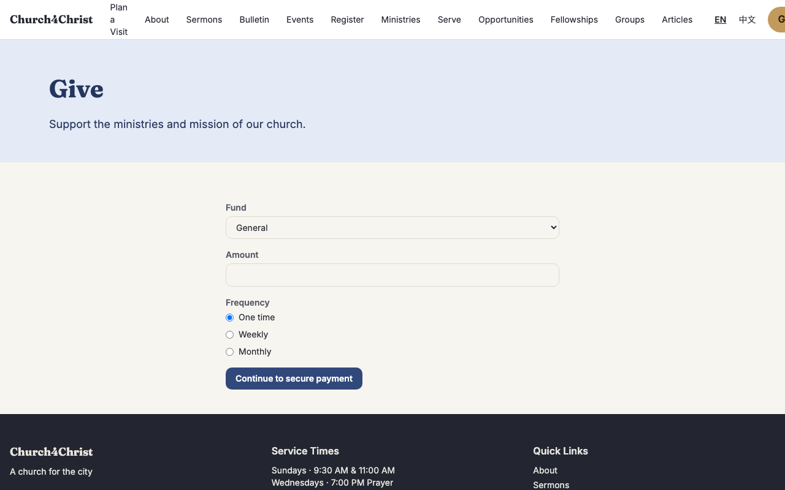
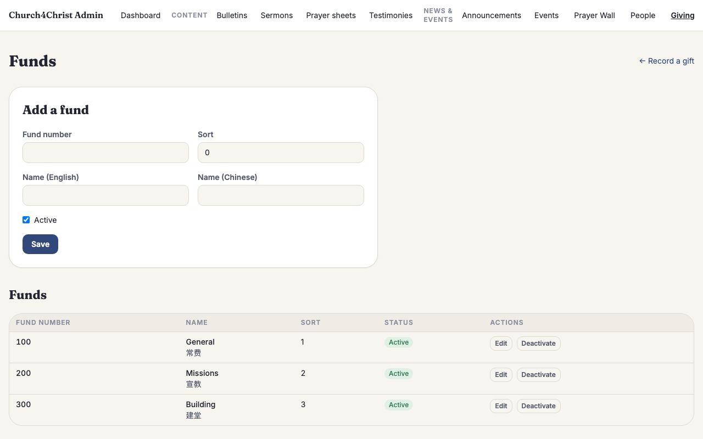
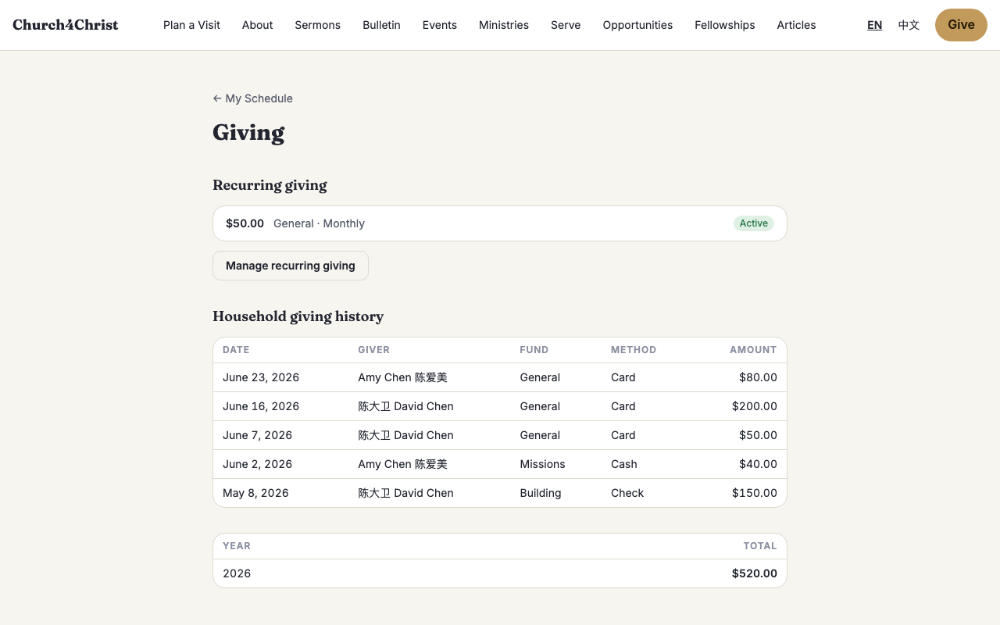
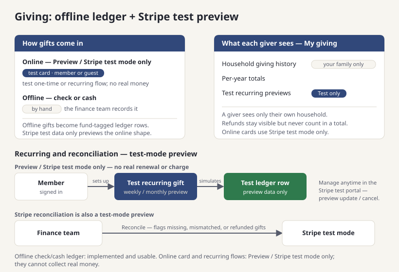

# Giving (manual ledger and Stripe checkout Preview)

> **Preview — Stripe test mode only.** The offline/manual ledger is implemented for recording
> checks and cash. Online one-time and recurring checkout is a test-only preview: use Stripe
> test credentials and test cards, and do not use this path to collect funds.

## What it does

**Giving** provides an implemented ledger for checks and cash, with funds, finance-team entry,
household history, and totals. It also includes a Preview of one-time and recurring Stripe
checkout so a team can evaluate the flow with test-mode data. Those online paths create test
charges only and are not a production donation service.

It brings together four things a church normally juggles across a card reader, a
spreadsheet, and a separate donor app:

- **Online checkout Preview.** With Stripe test mode configured, a guest can exercise a
  one-time test checkout without an account, and a signed-in member can also preview weekly
  or monthly recurring checkout. Stripe handles test-card details; this flow must not be used
  for production donations.
- **Funds you define.** Split giving into the funds that match your church — **General**,
  **Missions**, **Building**, and any others — each with a number for your bookkeeping and a
  name in both English and Chinese. Givers pick the fund they want to support.
- **Offline gifts, recorded by hand.** Checks and cash never touch Stripe, so your finance
  team keys them into the same ledger: who gave, which fund, how much, the date received,
  and the check number. These manual records are the implemented path for actual gifts;
  Stripe-generated rows in this repository are test-mode records.
- **A giving history each family can see.** Every signed-in member has a private **My
  giving** page showing their household's manual gifts, any test-mode Stripe entries and
  recurring subscriptions, and a year-by-year total.

Because money is involved, the module keeps test-card details at Stripe, excludes refunds
from totals, and limits a giver to their own household's history. These protections do not
change the Stripe Preview into a live-payment feature.

## How your team uses it

**A member or guest previews online checkout.** With Stripe test credentials configured, the
public giving page at `/give` shows a short form: pick a fund, enter a test amount, choose
one-time or (once signed in) weekly or monthly, and continue to Stripe test checkout. A guest
can exercise the one-time flow; a signed-in member can exercise the recurring flow. When the
test checkout succeeds, its test record lands in the ledger automatically.



**The finance team records checks and cash.** The giving admin page at `/admin/giving` has a
**Record a gift** form for everything that came in offline. Choose the giver from your
member list (or type a guest's name), pick the fund, enter the amount, mark it a check or
cash, add the check number and the date it was received, and save. Below the form, a
filterable **ledger** lists manual gifts alongside any Stripe test records, and a **Totals by
fund** table adds up what each fund has received over the date window you choose. A row of
summary cards above the form shows this month's total and gift count, the year-to-date
total, and how many funds are active, at a glance.


**Setting up funds.** On `/admin/giving/funds` an admin adds each fund with a number, an
English name, and a Chinese name, and can deactivate a fund without deleting it (its past
gifts stay in the ledger). Deactivated funds simply stop appearing as a choice for new
gifts.



**What a giver sees.** A signed-in member's **My giving** page at `/my/giving` has three
parts: their **test-mode recurring gifts** with a status and a **Manage** button, their
**household's giving history** (manual entries plus any Stripe test entries, including test
refunds), and a **per-year total**. For a test subscription, the Manage button opens Stripe's
test-mode billing portal, where the flow for updating a test card or cancelling can be
evaluated.



**Checking test records (reconciliation).** Stripe test data can occasionally drift out of
sync with the local ledger — for example, when a webhook never arrived or a test refund was
issued in Stripe. The **Reconcile** page at `/admin/giving/reconcile` cross-checks the ledger
against test-mode Stripe data and flags a missing record, an amount mismatch, or a refund
status mismatch. It is read-only and optional; without the connection, the page shows setup
notes instead of failing.

**Who can see the money.** Giving figures are sensitive, so access is deliberately narrow:

- The **giving admin** pages (record gifts, funds, reconcile) are open only to an **admin**
   or to someone with the **finance** flag set on their profile. An admin turns that flag on
   from a person's page in `/admin/people`, so a church treasurer can manage giving without
  being made a full site admin. This is a shared **payment operations** permission: when
  paid Registration is enabled, it also grants Stripe recovery and registration-payment
  cancellation authority.
- The **My giving** page shows a giver only their **own household's** gifts — never another
  family's. Someone with no household sees just their own.
- **Refunds** stay visible in a giver's history (so the refund is honest), but never count
  toward any total.

## How it fits together

Offline checks and cash are keyed into the implemented ledger by the finance team. Stripe
test checkouts can also create test records in that ledger so the online, recurring, portal,
webhook, and reconciliation flows can be previewed without collecting funds.



## Setting it up

Giving is **Supabase (Postgres)-only in the current implementation**. The module gate keeps it
off in the D1 configuration as a current repository boundary. Stand up the Supabase backend first (see
[`docs/supabase-setup.md`](../supabase-setup.md)), then configure the optional test Preview:

1. **Import Stripe test credentials through setup.** Get an `sk_test_…` key and the test
   endpoint's `whsec_…` signing secret, then pass them only to the setup process:

   ```bash
   CHURCH_SETUP_STRIPE_SECRET_KEY="sk_test_…" \
   CHURCH_SETUP_STRIPE_WEBHOOK_SECRET="whsec_…" \
   npm run setup
   ```

   These `CHURCH_SETUP_STRIPE_*` names are one-shot setup inputs. Setup stores them under
   the runtime secret names automatically; do not rename them to ambient `STRIPE_*`
   variables before running setup. Live keys are rejected, and a separately signed live
   webhook receives `400 live_mode_disabled` without being stored. Until the test
   credentials are set, the online form is inert — offline recording still works.
2. **Point a Stripe test-mode webhook at your site.** In the Stripe dashboard's test mode,
   add a webhook endpoint
   at `https://your-site/api/stripe/webhook` and subscribe it to all eight shared events:
   `checkout.session.completed`, `checkout.session.expired`,
   `checkout.session.async_payment_succeeded`, `checkout.session.async_payment_failed`,
   `invoice.paid`, `charge.refunded`, `customer.subscription.updated`, and
   `customer.subscription.deleted`. This is how a completed or asynchronous payment, an
   expiry, a monthly renewal, a refund, or a canceled subscription reaches the app. Use the endpoint's signing secret as the
   `CHURCH_SETUP_STRIPE_WEBHOOK_SECRET` input in step 1.
3. **Choose your currency (optional).** Gifts default to US dollars. To use another currency,
   set the `giving.currency` site setting to its three-letter code (for example `cad`).
4. **Add your funds** on `/admin/giving/funds`, and **mark your treasurer** with the finance
   flag on their person page so they can manage giving.

The Supabase worker runs durable webhook and Checkout recovery every five minutes. Admins
and finance users can inspect bounded receipts and retry or dismiss eligible test events at
`/admin/stripe-events`; raw customer and payment payloads are never shown there. The current
D1 implementation does not enable Giving or Stripe operations.

Reconciliation is an optional part of the Preview: a team can expose test-mode Stripe data to
Supabase read-only to exercise the Reconcile page's drift checks. The offline/manual ledger
does not require that connection.

## For developers

- **Backend gating:** `giving` is Supabase-only in the current implementation
  (`requiresBackend: 'supabase'` in `src/lib/modules.ts`) — the enablement filter
  force-disables it on D1 regardless of its settings row. It owns the `/give/checkout`,
  `/my/giving`, `/api/giving`, and `/admin/giving` route prefixes and softly `uses` the
  `people` module.
- **Schema:** `migrations-supabase/0002_giving.sql` adds `funds` + `fund_i18n`, `gifts`, and
  `recurring_gifts`, plus the `finance` and `stripe_customer_id` columns on `people`
  (`migrations/0004_giving_people.sql` mirrors those two columns on D1, harmless there).
  Money is **integer cents** in every table and function; `gifts` carries two partial unique
  indexes (`stripe_payment_intent_id`, `stripe_invoice_id`) so a redelivered webhook dedups.
- **Data libraries:** `src/lib/fundDb.ts` (fund CRUD + the localized en-fallback join),
  `src/lib/givingDb.ts` (the ledger, per-fund and per-year totals, the household-scoped
  self-service reads, the recurring lifecycle, and the idempotent webhook writers),
  `src/lib/givingReconcile.ts` (the optional Stripe-FDW drift audit), and the pure Stripe
  client in `src/lib/stripe.ts` (fetch-based, Workers-compatible, secret never logged).
- **Checkout + webhook:** `src/pages/api/giving/checkout.ts` (one-time vs recurring session,
  guest-recurring bounces to sign-in), `src/pages/api/giving/portal.ts` (Stripe billing
  portal launch), and `src/pages/api/stripe/webhook.ts` → `src/lib/givingWebhook.ts` (one
  verified event in, a short outcome out; a foreign or malformed event always resolves to
  `ignored`, never a 500, and only a transient DB-connectivity error asks Stripe to retry).
- **Privacy lives in the reads, not the pages.** `listHouseholdGifts` / `householdYearTotals`
  scope to the viewer's *live* household (soft-deleted households drop out), falling back to
  the viewer alone; totals count only `succeeded` money, so refunds are excluded there but
  still returned to the ledger. Every admin function assumes the calling page has already
  gated to `admin ∪ finance`.
- **Demo data:** `seed/giving-seed.sql` (Postgres-only, applied by
  `scripts/db/seed-supabase.mjs` after `dev-seed.sql`) seeds three funds, a dozen gifts
  across every method and several households plus a guest, and one active recurring
  subscription — all with fictional data, obviously-fake Stripe ids, and relative dates.
- **Tests:** the `test/pg/` suites against real Postgres —
  `fundDb.test.ts`, `givingDb.test.ts`, `givingWebhook.test.ts`, `givingReconcile.test.ts`,
  `givingSchema.test.ts`, `money.test.ts`, `stripe.test.ts` — plus the giving smoke checks in
  `test/e2e-pg/smoke.test.ts`. See [Modules](modules.md) for the on/off behavior.
