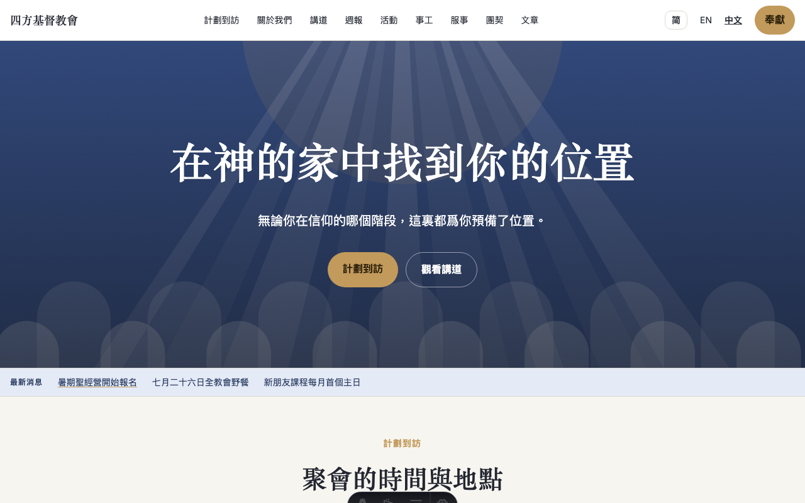
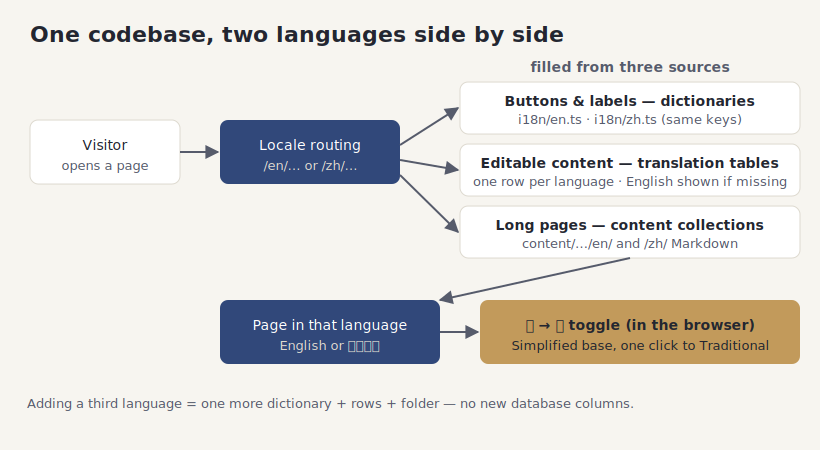

# Two languages, one website

## What it does

The whole site works in two languages, English and Chinese, from a single codebase. There is
no separate "English site" and "Chinese site" to keep in step — every page exists in both, and
a visitor's browser picks the language to show first. A toggle in the header switches languages
without leaving the page.

The words on the site come from three places, and it helps to know which is which. Fixed labels
like buttons and menus live in **dictionaries** your developers maintain. Editable content —
ministry names, event titles, announcements — has a **translation row** per language that your
staff fill in from the admin forms, English and Chinese side by side. Longer pages like "About"
and the pastor's articles are **Markdown files**, one per language.

For content, English is the safety net. If a Chinese translation has not been written yet, the
page falls back to the English version and marks it as not yet translated, rather than showing a
blank. So the site is never broken while a translation is in progress — it just shows what it has.

## How your team uses it

**One page, two languages.** Here is the home page in English and in Chinese. The content was
written once per language by your team — nothing is machine-translated — and the switch in the
header flips between them while keeping you on the same page.

**Editing side by side.** In the admin forms, translatable fields show one group per language,
next to each other. You fill in English and Chinese together, so a translation is never an
afterthought hidden on a separate screen.

**Simplified to Traditional, in one click.** The Chinese content is written in Simplified
characters. Readers who prefer Traditional characters can flip the whole page with a toggle —
the conversion happens right in their browser, instantly, and their choice is remembered. No
second copy of the content is stored; it is converted on the fly.

**Emails follow the reader.** The automatic emails (sign-in links, scheduling requests, the
weekly digest) go out in the recipient's saved language when they have one, and in both languages
stacked together when they do not — so nobody gets a message they cannot read.

**Adding a third language.** The site is built so a new language is a matter of adding one more
dictionary, one more translation row for each piece of content, and one more Markdown folder —
never a change to the database's shape. Your developers can follow the steps in the technical
docs; nothing about the structure has to be rebuilt.

**Good to know:**

- Nothing on the site is machine-translated. Your team writes each language, so the tone is yours
  in both.
- Search engines are told which page is the English one and which is the Chinese one, so each
  language is found on its own.
- Chinese pages use comfortable line spacing tuned for Chinese characters, so the reading
  experience is not just English typography with different words.
- The Simplified-to-Traditional switch never creates a second copy to maintain — you write in
  Simplified once, and Traditional readers get their conversion automatically.

## How it fits together

The diagram shows a request being routed by language, filled from the three sources, and then —
for Chinese readers — optionally converted to Traditional characters in the browser.

## For developers

- **Locales & routing:** `src/lib/locales.ts` (`LOCALES`, `DEFAULT_LOCALE`, `parseLocale`,
  `localePath`, `pickLocaleFromHeader`); the bare `/` redirect is in `src/middleware.ts`.
- **Dictionaries:** `src/i18n/en.ts` and `src/i18n/zh.ts` — identical key sets, `t(locale, key,
  vars)` interpolates `{vars}` and HTML-escapes them. Parity is enforced by
  `test/i18n.test.ts` (same keys, same placeholders, non-empty values).
- **Database content:** the `*_i18n` companion tables, joined with a LEFT JOIN on the requested
  locale plus a LEFT JOIN on the default (`en`) and `COALESCE` per field — one helper builds
  these joins (`i18nJoin` in `src/lib/db.ts`). N languages by inserting rows, never new columns.
- **Content collections:** `src/content/{pages,articles,fellowships,staff}/{en,zh}/…`, loaded by
  `src/lib/content.ts` with English fallback + a "not translated" badge.
- **简 → 繁 toggle:** `src/lib/s2t.ts` (`toTraditional`) with the generated table
  `src/lib/s2t-table.json`; the client toggle is `src/lib/zh-client.ts`. To add a language, extend
  `LOCALES`, add a dictionary, and provide the content rows/folders.
- **Tests:** `test/i18n.test.ts`, `test/locales.test.ts`, `test/s2t.test.ts`.
