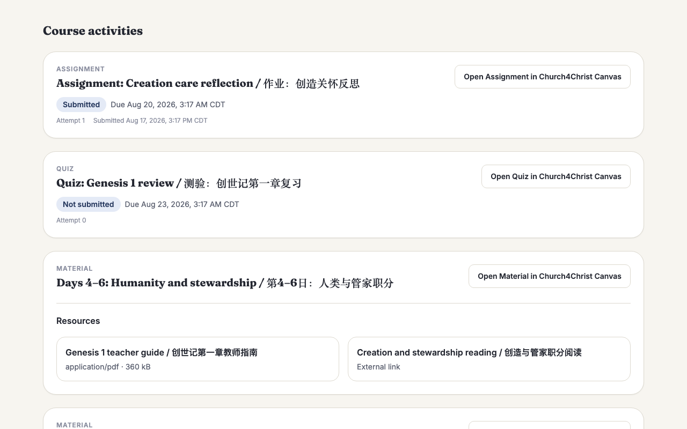
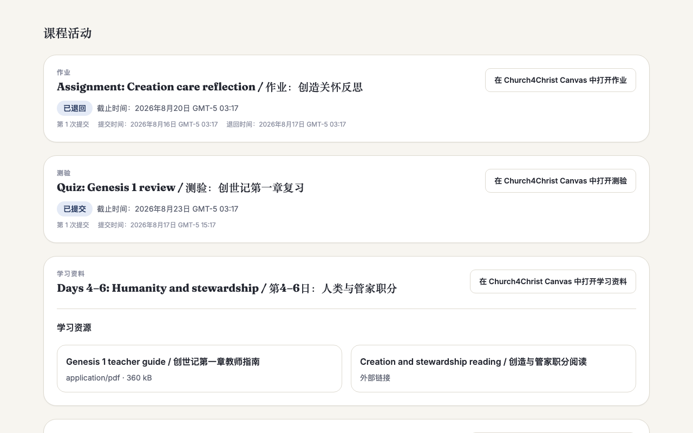
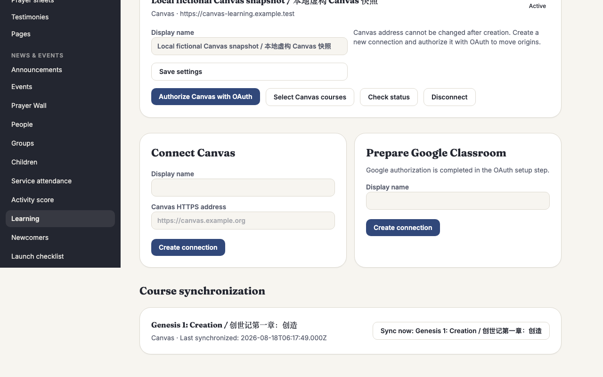

# Learning (continue beyond the classroom)

## What it does

Learning gives Sunday school, discipleship, membership classes, and similar ministries an
authenticated place to continue between in-person meetings. Learners can find prepared
privacy-enhanced YouTube videos, provider-hosted files, ordinary links, assignments, quizzes,
due dates, and their current submission state in English or Chinese.

Church4Christ is the provider-neutral learner hub and synchronization control plane; Google
Classroom or Canvas remains provider authoritative. Learners submit assignments and quizzes in
that provider's supported interface. Church4Christ then reconciles a bounded status snapshot—it
does not become a second gradebook or quiz engine.


**Diagram provenance.** Generated with OpenAI **gpt-image-2** on **2026-08-18**.
Prompt summary: create a polished bilingual English/Chinese workflow diagram showing Google
Classroom and Church4Christ Canvas as separate provider lanes; Church4Christ secure
synchronization; connect/map, verify/sync, privacy-bounded metadata, learner resources,
provider-side submission, status reconciliation, and an optional Activity Score branch.
Alt text: Google Classroom or Church4Christ Canvas enters a six-step, privacy-bounded Learning
flow through Church4Christ, ending in provider submission, reconciled status, and optional
Activity Score. The checked-in 2048×1152 PNG has SHA-256
`876a2adf737721297383ceaf8d15c223e9c937814d4fbb543b502c55ea377356`.

## Learner experience

An enrolled learner opens `/en/learn` or `/zh/learn`, chooses a course, and sees only the
normalized metadata authorized for that live Person, provider identity, and enrollment. The
course page uses a click-to-load `youtube-nocookie.com` facade with no autoplay. An unlisted
YouTube URL is convenient but is not private or access control. Provider files and ordinary
links open the exact validated HTTPS destination in a new tab; Church4Christ neither iframes
the provider nor proxies file bytes.

The following real 1280×800 local-D1 captures use the canonical fictional Genesis 1 demo.
Seeded learner **Sarah Johnson** supplies the English view, including her submitted assignment
and not-submitted quiz state. Seeded learner **Grace Lin** supplies the Chinese view, including
her returned assignment and submitted quiz state.





Assignments and quizzes are always completed in Google Classroom or Canvas. Church4Christ shows
due, submitted, and returned metadata only. Grades are not stored; answers are not stored;
comments, assignment bodies, uploaded files, and file bytes are not stored or rendered either.

## Administrator experience

An administrator with the dedicated Learning area grant opens `/admin/learning` to create and
authorize provider connections, map courses, inspect connection health and last-sync state, and
start a manual sync. Scheduled reconciliation scans only enabled Learning installations with
active mapped courses. Authenticated provider notifications can accelerate reconciliation, but
the official provider API remains authoritative and every pass stays bounded.



The screenshot intentionally uses a fictional local Canvas snapshot: **Local fictional Canvas
snapshot / 本地虚构 Canvas 快照** from demo data. Every provider launch shown by that snapshot
uses the reserved non-production host `https://canvas-learning.example.test`; the demo has no
provider credentials and assumes no provider network. Do not treat its health, OAuth, or
manual-sync buttons as a connected service. Replace it with an authorized real provider
connection before operational testing.

Transient rate limits and provider failures preserve the last complete snapshot and surface
staleness instead of partially deleting a course. Permanent authentication failures ask an
administrator to reconnect. Disconnecting a provider stops synchronization and removes the
credential envelope according to the documented cleanup path.

## Provider choices

- **Google Classroom:** Church4Christ uses the official Classroom API with administrator/teacher
  OAuth. Pub/Sub notifications, when configured, schedule authoritative reconciliation.
- **Church4Christ Learning — Canvas Edition:** an independently deployed Canvas LMS derivative
  communicates with Church4Christ through the Canvas REST API and, optionally, Live Events. It
  has its own PostgreSQL/Redis/services, deployment, backups, and source-publication obligations;
  it is not vendored into this Astro/Workers repository.

Provider choice is per program or course, so a church may operate Google Classroom for one
ministry and Canvas for another.

## Privacy and Activity Score

Personalized learner and administrator responses are `Cache-Control: no-store`. Provider
credentials remain encrypted server-side and never enter page HTML or browser JavaScript.
Provider URLs are normalized and allowlisted; unsafe destinations fail closed. Synchronization
logs contain bounded structural counts and error codes rather than People data, names, URLs,
tokens, raw bodies, or continuation tokens.

Learning engagement is an optional Activity Score source and is disabled with weight zero by
default. When explicitly configured, it counts only deduplicated assignment and quiz submission
events inside the selected window. Grades, lateness, course/activity titles, answers, files, and
comments never contribute. If Learning is disabled or disconnected, Activity Score renormalizes
the remaining available dimensions without deleting Learning events or changing the saved model.

## Canvas provenance and credit

Church4Christ Learning — Canvas Edition is based on the official
[Canvas LMS repository](https://github.com/instructure/canvas-lms), developed and maintained by
**Instructure, Inc.** The derivative baseline is upstream commit
`1c9f0bb8013ed69c4f2efe11fd483025469b7e6c` and remains licensed under **GNU AGPL v3** with the
upstream `LICENSE` and `COPYRIGHT` notices preserved. Church4Christ Learning — Canvas Edition is
not affiliated with, sponsored by, or endorsed by Instructure, Inc.

The derivative lives in a separate repository/checkout and deployment. Its
`CHURCH4CHRIST_NOTICE.md` records the pinned upstream, modification history, no-endorsement
notice, and the obligation for deployed modified versions to prominently offer corresponding
source to remote users. That legal/source boundary is separate from Church4Christ's GPLv3
application license.

## Demo capture and implementation notes

The Genesis fixture is loaded only by the canonical local `--demo-data` path. After migrating
and seeding local D1, start the app with the ignored local `.dev.vars`. Supply the matching
session secret to the screenshot process only through `SCREENSHOT_SESSION_SECRET`; do not print,
log, or check it in:

```bash
npm run db:migrate:local
npm run db:seed:local
npm run dev

# In a second shell, with SCREENSHOT_SESSION_SECRET set to the same local SESSION_SECRET:
npm run screenshots -- --only learning/genesis-1-en.png,learning/genesis-1-zh.png,learning/admin-overview.png
```

The harness refuses an unfiltered capture, mints a five-minute session for each exact seeded
identity, validates positive and rejection markers before writing, and requires every PNG to be
exactly 1280×800 and larger than 20 KB. The secret and session token are never printed or written
by the harness.

Core implementation lives in `src/lib/learningModel.ts`, the Google and Canvas adapters,
`src/lib/learningDb.ts`, `src/lib/learningSync.ts`, `src/lib/learningLearnerDb.ts`, the learner
pages under `src/pages/[locale]/learn/`, and the admin pages under
`src/pages/admin/learning/`. Portable migrations are `0017` through `0025`; the optional Activity
Score bridge is forward migration `0026_activity_score_learning.sql`.
