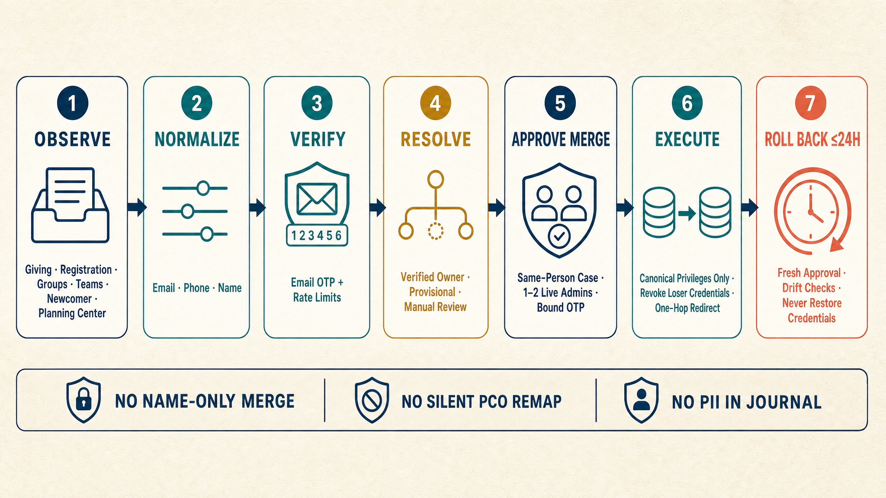
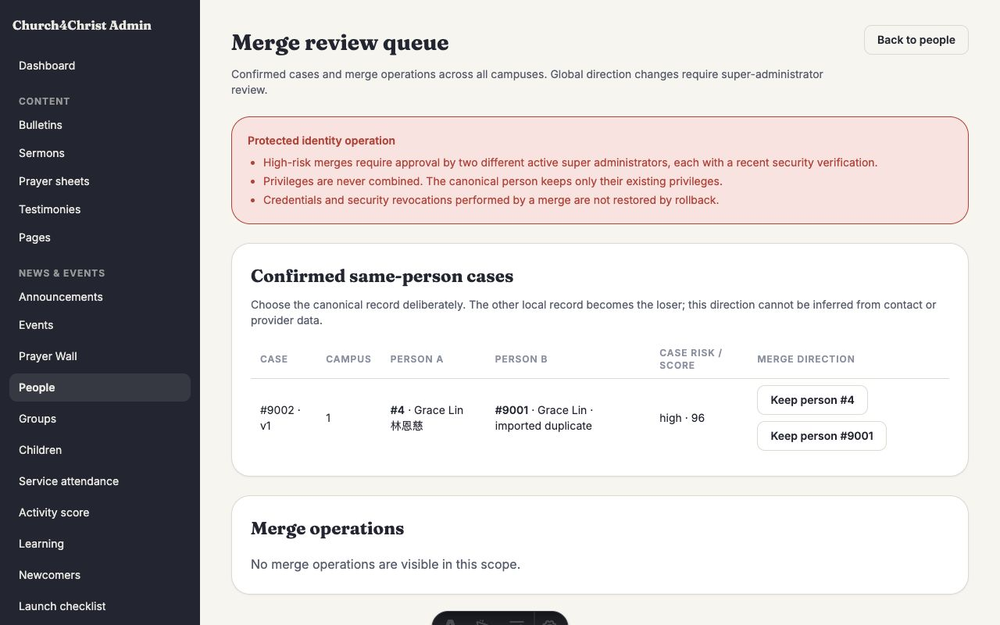
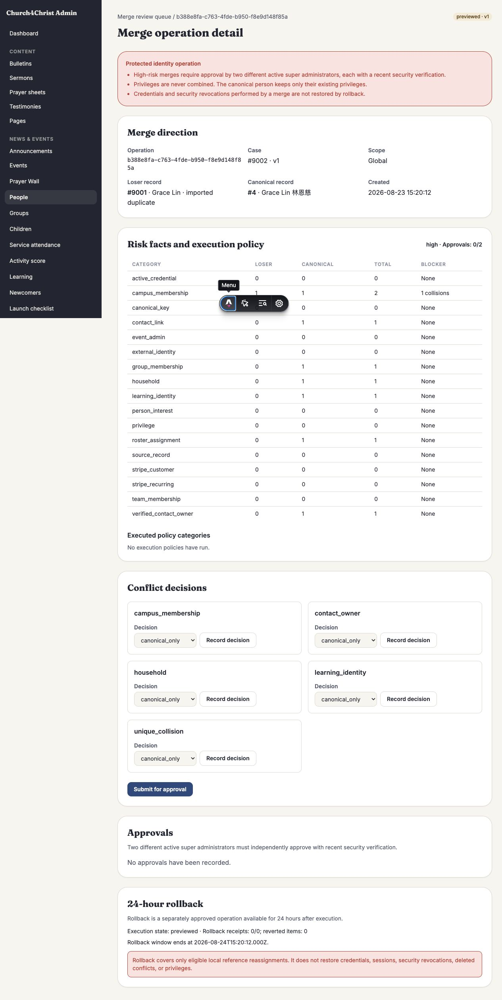

# 会友身份与重复档案防护 / Member identity

Giving、Registration、Groups、Teams、Newcomer、导入和 Planning Center 可能在不同时间看到
同一个人。这个功能的目标不是“按名字猜中一个人”，而是让这些入口共享一条可审计的身份链：
先记录来源事实，再确认谁真正拥有可验证的联系方式，最后才把业务记录接到现有会友或新账号。

核心原则是：**宁可进入人工复核，也不把两个人错误合并。** 姓名相同、拼写相近，或仅仅提交了
一个邮箱地址，都不能触发自动合并。邮箱验证码证明的是当前操作者控制该邮箱，不等同于“姓名相同
就是同一人”。

## 工作流 / Workflow



| Confirmed duplicate queue | Sealed risk and approval detail |
| --- | --- |
|  |  |

```text
Giving / Registration / Groups / Teams / Newcomer / Import
                                  Planning Center (read-only)
                         │
                         ▼
            Observe source record and changes
                         │
                         ▼
       Normalize contact candidates; store opaque digests
                         │
             ┌───────────┴───────────┐
             │                       │
   one current verified owner   ambiguous / shared / weak evidence
             │                       │
             ▼                       ▼
    OTP claim or signed account   review / recovery case
             │                       │
             └───────────┬───────────┘
                         ▼
       attach exact source version and continue business action
                         │
                         ▼
      possible duplicate → C1 sealed preview and approval controls
```

1. **Observe / 观察。** 每个来源记录有自己的稳定、带命名空间的 opaque key；后续更新成为新观察，
   不会因为 OTP 或 magic-link 密钥轮换而“失忆”并另建档案。
2. **Normalize / 规范化。** 邮箱、电话等只作为候选信号。身份审计保存来源版本、摘要和不含 PII
   的证据；业务表仍按自身的数据保留规则保存完成交易所需字段。
3. **Verified owner / 已验证所有者。** 只有当前、唯一的 verified contact owner 才能成为安全的
   自动关联候选。共享、未验证、冲突或仅姓名相似的证据进入 review，而不是自动选择一个 Person。
4. **OTP claim/account / 验证码认领与账号。** 对匿名认领或新账号，系统发送短期邮箱 OTP；验证码
   通过后仍会复核 owner、Person 状态、版本和会话 epoch，避免旧验证码在降权、登出或并发变更后生效。
5. **Business continuation / 业务续办。** 0034 为 Team application、Newcomer、Giving 和
   Registration 建立 durable intent；0035 把匿名 Giving、Registration 接到验证码续办。续办使用
   签名的 HttpOnly cookie，验证码不放在 URL 或 HTML 中，并在最终写入前重新校验来源版本、业务参数
   和当前 owner。重试复用同一 intent，成功附件、receipt 与业务状态以原子边界或可恢复 saga 收敛。
6. **Review and recovery / 复核与恢复。** 冲突证据进入版本绑定的 resolution case。高风险账号恢复
   只把“邮箱可达”当作请求证据，还需要冷却期、两位不同管理员的批准、最近的 email step-up 和可否决
   通知；任何 Person、联系方式、版本或批准状态漂移都会 fail closed。
7. **C1 preview/approval / 合并预览与审批。** 0033 提供精确的 risk set、preview hash、决策、
   step-up、审批和 append-only evidence 约束。预览会绑定联系人所有权、campus membership、外部账号、
   recurring payment、calendar、learning 等语义状态；内容或 generation 变化会使旧预览失效。0033 本身
   是预览/审批基础，并不代表合并执行已对管理员开放。
8. **Execute and rollback / 执行与回滚。** 0036 在 `/admin/people/identity/merge` 提供 super-admin
   队列和完整操作页。高风险操作需要两位不同、仍在职且有近期邮箱 step-up 的 super-admin；权限只保留
   canonical Person 原有值。执行把每条允许迁移的本地引用写入 sealed journal，并在同一事务完成前验证
   精确后置状态。24 小时内可另行申请、重新 OTP 审批并回滚可逆引用；凭据、会话撤销、安全降权、冲突
   删除和权限不会被回滚。

## 防冒用边界 / Fraud safeguards

- OTP 默认 10 分钟到期、最多 5 次尝试；发码在 15 分钟窗口内同时受 contact、可信 IP 和 opaque
  device bucket 限制。未知 IP 使用更严格的共享预算。限流 bucket 和验证码只保存 HMAC 结果。
- 新验证码会 supersede 同一用途的未消费挑战；消费时校验用途、来源、Person、联系方式、会话 epoch、
  到期时间和 HMAC binding，避免跨流程或旧会话重放。
- “姓名相同”从不自动匹配；未验证邮箱、共享邮箱和冲突的 verified owner 也不会自动合并。需要时系统
  创建 provisional identity 或 review case，而不是偷偷复用一条 Person。
- 联系方式变更、恢复、step-up、来源附件和合并审批都使用 expected version/CAS。并发期间状态变化时，
  操作失败并要求重新开始或重新预览。
- 安全日志、identity receipt、Planning Center webhook receipt 和合并快照只记录 bounded opaque ID、
  计数、状态或摘要，不记录验证码、provider secret、webhook body 或原始联系方式。

限流是反滥用层，不是唯一的身份依据。部署方仍应保护邮箱投递配置、管理员账号和 Worker secrets，
并对异常认领、恢复否决和 review backlog 建立运营响应。

## Planning Center：只读证据，不是自动合并器

0037 的 Planning Center People 集成只调用固定的官方只读路径。Client ID、secret、webhook HMAC
secret 和 User-Agent 留在 Worker bindings；数据库保存非秘密连接配置、opaque provider ID、摘要、游标、
租约和 redacted status。

- 精确 Person 读取会解析 JSON:API `included` 中的 email/phone resources，但只把确定、未 blocked、
  按 provider 规则选择的联系方式交给同一 identity gateway。
- 唯一 verified owner 可以形成本地 mapping；无联系方式、多个候选、共享或冲突证据保持 unmatched 或
  进入 review。同步不会创建本地 Person，也不会在本地执行 Person merge。
- Planning Center 的 Person Merger event 只成为外部证据和 resolution case。它不能直接改写本地 owner、
  mapping 或 Person；provider 后续 remap 也会使已封印的合并预览失效。
- 手动同步需要 super-admin 和近期 email step-up。小时任务按 due connection 入队并做 bounded、可重试的
  公平处理；webhook 验签和 organization binding 通过后，receipt 与 jobs 一起 durable commit。客户端遵守
  provider rate headers 和 `Retry-After`，把重试时间持久化，而不是紧密重试。

连接与 secret 的具体配置见 [部署手册](../deploy.md#9-optional-configure-planning-center-synchronization)。

### 尚未覆盖的真实 provider 验证

仓库内测试不会连接真实 Planning Center tenant，也不会发送真实邮箱。因此上线前仍需在 staging 用目标
organization 完成一次人工验收：确认 PAT/organization 绑定、官方只读权限、分页、rate-limit 与
`Retry-After` 行为、webhook HMAC/重送，以及 OTP 邮件的真实投递和延迟。不要把 fixture、mock 或本地
Postgres/D1 通过等同于 provider 端到端验证。

## 版本边界 / Migration boundary

| Migration | 已提供的边界 |
| --- | --- |
| 0028 | Person identity state/version、verified contacts、merge redirects 与禁用认证基础 |
| 0029 | OTP 消费绑定的账号操作与 canonical identity keys |
| 0030 | 旧 email-change cutover、session epoch 和全局登出约束 |
| 0031 | 稳定 source key、source observations、claim/attachment receipts 与 provisional operations |
| 0032 | 两人审批、冷却期、veto 通知和 append-only recovery evidence |
| 0033 | C1 risk snapshot、preview/decision/approval seal；执行与 UI 不属于该 migration |
| 0034 | Team/Newcomer/Giving/Registration 的 durable business intents |
| 0035 | 匿名 Giving/Registration 的 OTP continuation 与最小业务 payload |
| 0036 | 受限 merge handler、逐行 sealed journal、绑定审批、原子执行和 24 小时 drift-protected rollback |
| 0037 | Planning Center 只读 connection、sync job、webhook receipt、mapping 和 merger evidence |

### 0036：合并执行与 24 小时回滚

D1 与 PostgreSQL 的 `0036_identity_merge_execution.sql` 已提供 execution seal、逐行 journal evidence、
独立审批的 rollback operation 和不超过 24 小时的 expiry。运行时使用 closed literal handler registry；
不支持或存在 hard conflict 的引用会阻止执行。PostgreSQL 对所有封印目标取得具体行锁，D1 与 PostgreSQL
都在 completion 时逐项验证 `reference_key + local_row_id` 的 canonical/revoked 后置状态，因此删除、改给
第三人或零行 mutation 会让整批事务回滚。管理员 UI、双语文案、OTP-bound 审批和 rollback 路径均已接通。

回滚不是“撤销所有安全动作”：它只恢复 journal 标为 reversible 且仍符合 sealed post-state 的本地引用。
loser 的认证凭据不会复活，两边 identity/session version 仍单调递增；任何 row drift、审批漂移或超时都会
fail closed，需要重新复核，而不是强行覆盖当前数据。

## 部署要点 / Operations

- `IDENTITY_VERIFICATION_SECRET` 可按 OTP 策略轮换；`IDENTITY_SOURCE_KEY_SECRET` 与
  `IDENTITY_SOURCE_KEY_ID`、`IDENTITY_RECOVERY_KEY_SECRET` 与 `IDENTITY_RECOVERY_KEY_ID`
  分别受数据库 pin 保护，不能直接原地替换。
- Planning Center 使用四个独立 Worker secret/config bindings；不要把值放进 repository、数据库、
  日志、截图或支持工单。
- 迁移、密钥 pin、恢复通知、Planning Center connection/webhook 与上线检查详见
  [deployment runbook](../deploy.md#stable-identity-source-key)。

## English summary

Member identity is a proof-bound, review-first pipeline across church modules. A submitted name or email is
never enough to auto-merge people: only a unique current verified owner plus the required signed session or
email OTP can attach a source record. Ambiguity goes to review, high-risk recovery needs cooling and two-person
approval, and Planning Center remains read-only evidence. Migration 0033 supplies sealed merge preview and
approval controls. Migration 0036 adds a closed-handler, atomic execution path and a separately approved,
drift-protected 24-hour rollback for reversible local references; credentials, revocations, and privileges are
intentionally never restored.
