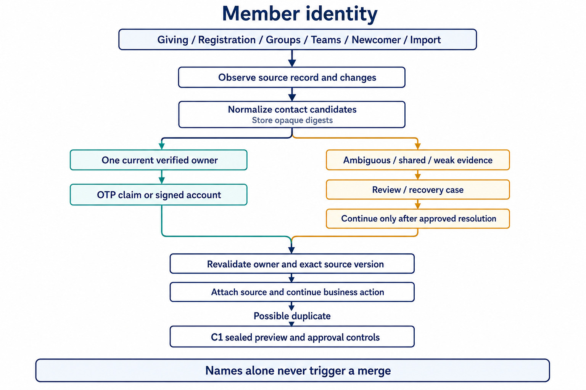

# Member identity and duplicate protection

Giving, Registration, Groups, Teams, Newcomer, and imports may encounter the same person
at different times. Member identity gives these entry points a shared, auditable path:
record the source facts, verify ownership of a contact method, and then attach the business
record to an existing member or a new account.

**Prefer manual review over incorrectly merging two people.** Matching names, similar
spellings, or a submitted email address never trigger an automatic merge. An email
one-time password (OTP) proves control of that mailbox, not that two people with the same
name are the same person.

## Workflow

1. **Observe.** Each source record has a stable, namespaced opaque key. Updates become new
   observations; rotating OTP or magic-link secrets does not lose the record's history or
   create a second identity.
2. **Normalize.** Email addresses and phone numbers are candidate signals. Identity audits
   retain source versions, digests, and evidence without personally identifiable information
   (PII). Business tables retain transaction fields under their own retention policies.
3. **Verify the owner.** Only a unique, current verified contact owner can be a safe candidate
   for automatic attachment. Shared, unverified, conflicting, or name-only evidence goes to
   review instead of automatically selecting a Person.
4. **Claim or sign in.** Anonymous claims and new accounts use a short-lived email OTP.
   Successful verification still rechecks the owner, Person status, version, and session epoch
   so an old code cannot survive a privilege reduction, logout, or concurrent change.
5. **Continue the business action.** Migration 0034 adds durable intents for Team applications,
   Newcomer, Giving, and Registration; 0035 connects anonymous Giving and Registration to OTP
   continuation. A signed HttpOnly cookie carries continuation state. Codes never appear in
   URLs or HTML. Before the final write, the system revalidates the source version, business
   parameters, and current owner. Retries reuse the same intent; successful attachments,
   receipts, and business state converge within an atomic boundary or a recoverable saga.
6. **Review and recover.** Conflicting evidence enters a version-bound resolution case.
   High-risk account recovery treats mailbox access only as request evidence. It also requires
   a cooling period, approval by two distinct administrators, recent email step-up verification,
   and notifications that allow a veto. Any change to the Person, contact, version, or approval
   state fails closed.
7. **Preview and approve a merge.** Migration 0033 supplies the exact risk set, preview hash,
   decisions, step-up, approvals, and append-only evidence. The preview binds contact ownership,
   campus membership, external accounts, recurring payments, calendar, and learning state.
   Changes to content or generation invalidate the preview. This migration supplies the
   preview and approval foundation; execution is added by 0036.
8. **Execute with a recovery boundary.** Super administrators use
   `/admin/people/identity/merge`. High-risk actions require two distinct, currently authorized
   super administrators with recent email step-up. Only the canonical Person's existing
   privileges survive. Each allowed local reference is recorded in a sealed journal, and its
   exact post-state is verified before the transaction completes. Reversible references can
   be rolled back within 24 hours through a separate request and fresh OTP-bound approval.
   Credentials, session revocations, security downgrades, conflict deletions, and privileges
   are never restored by rollback.

## Administrator experience

| Confirmed duplicate queue | Sealed risk and approval detail |
| --- | --- |
|  |  |

## Fraud safeguards

- OTPs expire after 10 minutes by default and allow at most five attempts. Issuance is limited
  over a 15-minute window by contact, trusted IP, and opaque device bucket. Unknown IPs share
  a stricter budget. Rate-limit buckets and codes are stored only as HMAC results.
- A new code supersedes unconsumed challenges for the same purpose. Consumption checks purpose,
  source, Person, contact, session epoch, expiry, and HMAC binding to prevent cross-flow or
  stale-session replay.
- Matching names, unverified or shared mailboxes, and conflicting verified owners never cause
  automatic merges. The system creates a provisional identity or review case when needed.
- Contact changes, recovery, step-up, source attachment, and merge approval use expected
  versions and compare-and-swap (CAS). Concurrent changes require a restart or fresh preview.
- Security logs, identity and webhook receipts, and merge snapshots contain only bounded
  opaque IDs, counts, statuses, or digests. They exclude codes, provider secrets, webhook bodies,
  and raw contact details.

Rate limiting is an abuse-control layer. Operators must also protect email delivery settings,
administrator accounts, and Worker secrets, and respond to unusual claims, recovery vetoes,
and the review backlog.

## Migration boundaries

| Migration | Provided boundary |
| --- | --- |
| 0028 | Person identity state/version, verified contacts, merge redirects, and authentication disabling |
| 0029 | OTP-bound account operations and canonical identity keys |
| 0030 | Legacy email-change cutover, session epoch, and global logout constraints |
| 0031 | Stable source keys, observations, claim/attachment receipts, and provisional operations |
| 0032 | Two-person recovery approval, cooling periods, veto notifications, and append-only evidence |
| 0033 | C1 risk snapshots and preview/decision/approval seals; excludes execution and UI |
| 0034 | Durable business intents for Teams, Newcomer, Giving, and Registration |
| 0035 | Anonymous Giving/Registration OTP continuation and minimal business payloads |
| 0036 | Restricted merge handlers, per-row sealed journals, bound approvals, atomic execution, and drift-protected 24-hour rollback |
| 0037 | Optional read-only Planning Center connections, sync jobs, webhook receipts, mappings, and merger evidence |

### Merge execution and 24-hour rollback

Both database backends provide execution seals, per-row journal evidence, separately approved
rollback operations, and expiry within 24 hours through `0036_identity_merge_execution.sql`.
The runtime uses a closed registry of explicitly supported handlers. Unsupported references
and hard conflicts block execution. PostgreSQL locks every sealed target row. Both D1 and
PostgreSQL verify the canonical/revoked post-state of every `reference_key + local_row_id` at
completion; deletion, reassignment to a third person, or a zero-row mutation rolls back the
whole transaction. The administrator UI, bilingual copy, OTP-bound approvals, and rollback
path are connected.

Rollback restores only local references marked reversible in the journal that still match
the sealed post-state. The merged-away Person's credentials remain revoked, and both
identities' identity/session versions keep increasing. Row drift, changed approvals, or
expiry fail closed and require review rather than overwriting current data.

## Operations

- `IDENTITY_VERIFICATION_SECRET` can rotate under the OTP policy. The source pair
  `IDENTITY_SOURCE_KEY_SECRET` / `IDENTITY_SOURCE_KEY_ID` and recovery pair
  `IDENTITY_RECOVERY_KEY_SECRET` / `IDENTITY_RECOVERY_KEY_ID` are pinned in the database and
  cannot simply be replaced in place.
- Keep integration credentials in Worker bindings, outside the repository, database, logs,
  screenshots, and support tickets. External evidence does not authorize a local merge.
- Repository tests use fixtures and do not prove real email delivery or provider behavior.
  Verify delivery, permissions, pagination, rate limits, webhook verification, and retries
  in an authorized staging environment before launch.
- See the [deployment runbook](../deploy.md#stable-identity-source-key) for migrations, key
  pinning, recovery notifications, optional integration setup, and launch checks.
