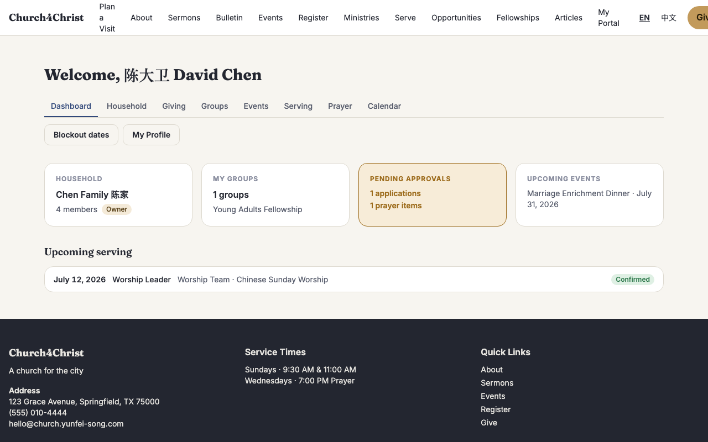
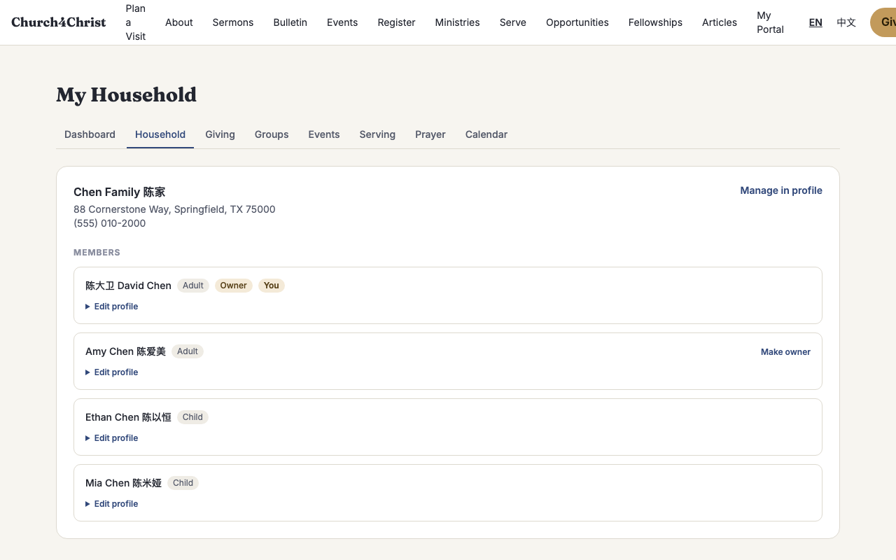
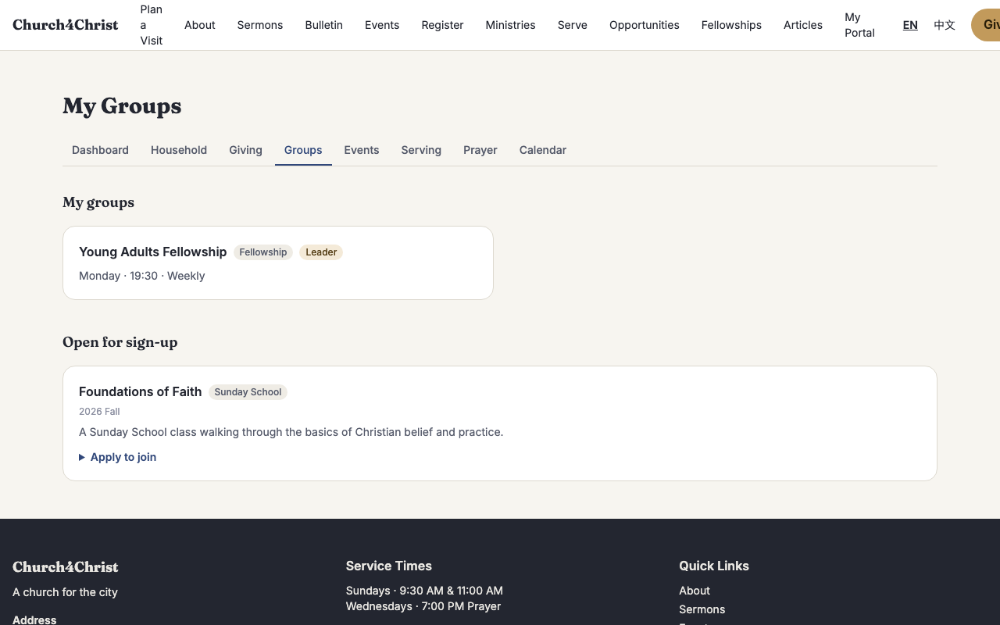
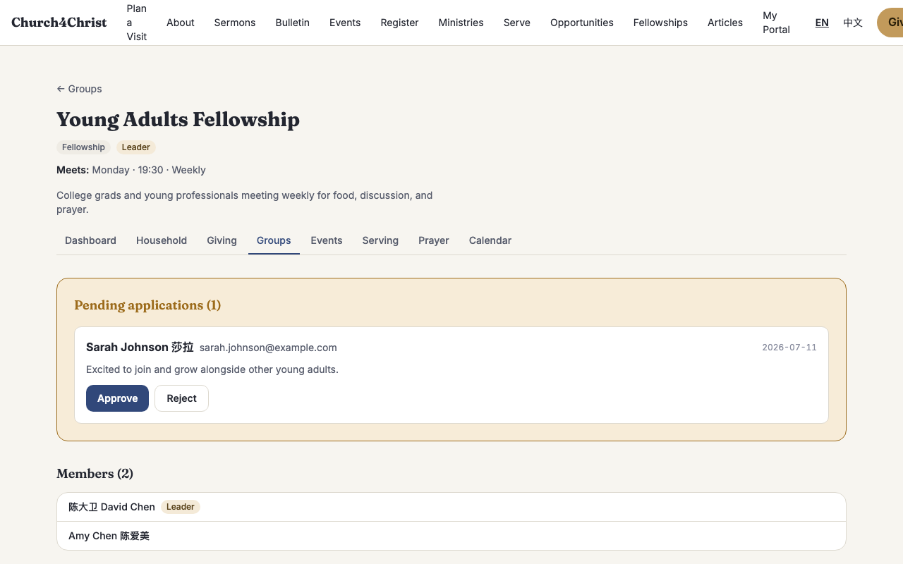
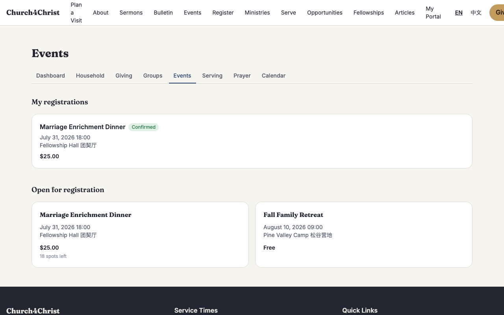
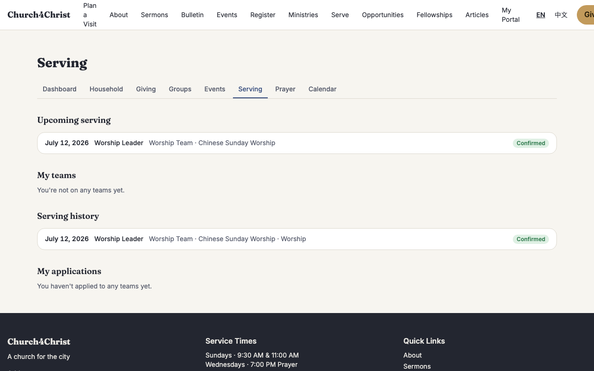
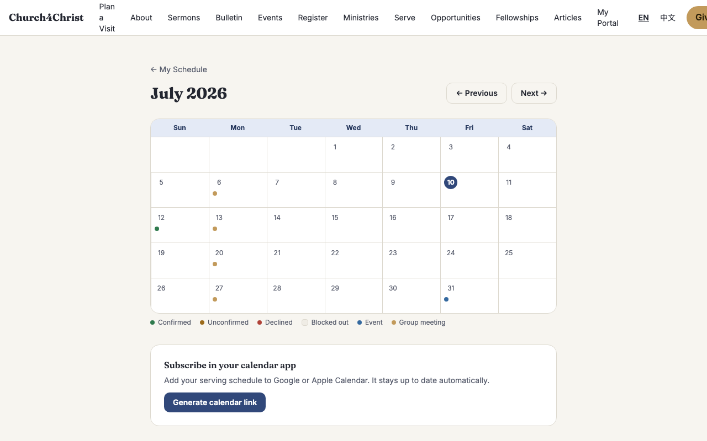
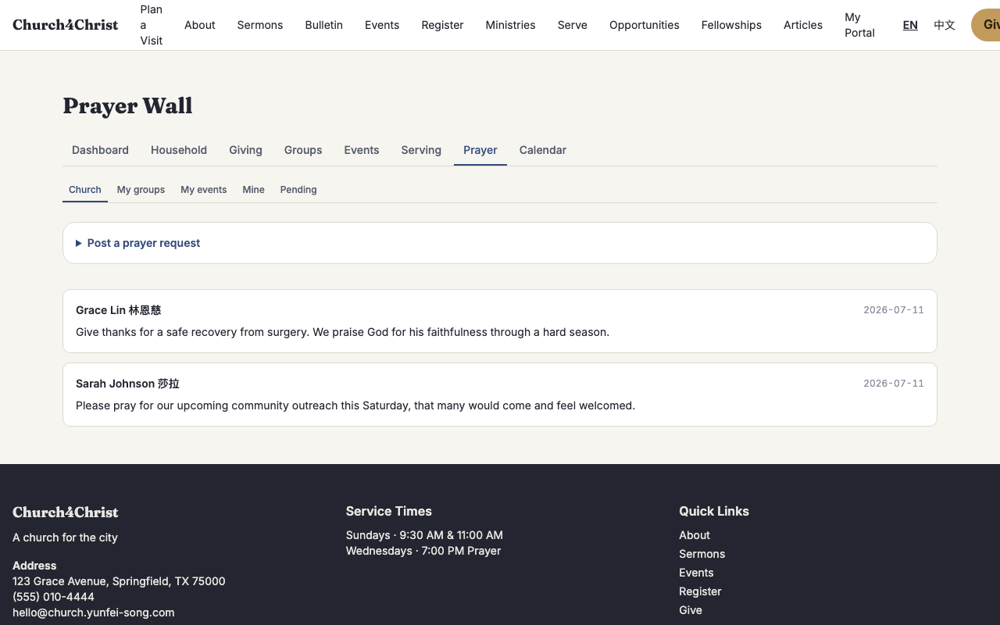
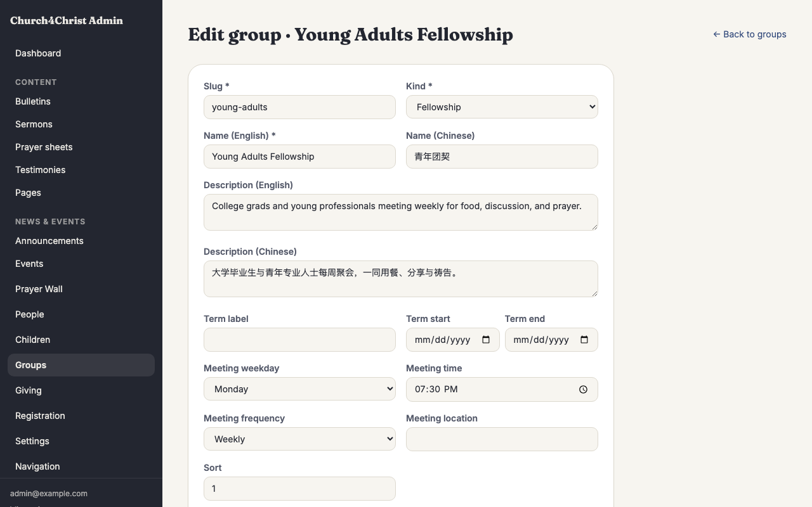
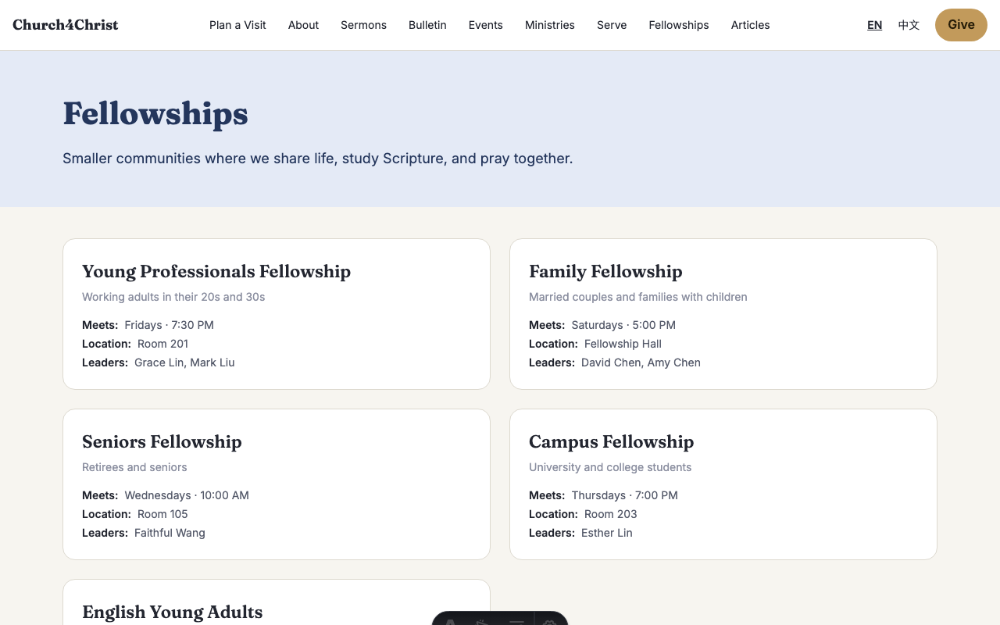

# Member portal

## What it does

A signed-in home for your members — **My Portal** — where they can see their
household, join a fellowship or Sunday School class, register for events,
check their serving schedule, subscribe to a personal calendar, and post to
the prayer wall, all from one place. Members get in with the same magic-link
sign-in already used for serving (no password to remember), and land on a
dashboard that surfaces only what applies to them.

The portal builds entirely on records your church already has — households,
people, fellowships, events, teams — so nothing needs to be created twice.
Turning it on adds the member-facing `/my/*` pages and their corresponding
admin controls; turning it off removes the tab strip and 404s those pages,
leaving the rest of the site untouched.

**This module requires the Supabase (Postgres) backend.** Churches running
the default Cloudflare D1 backend won't see the portal tab or its settings
row — see [Module boundaries](#module-boundaries) below.

## What members see

**The dashboard.** After signing in, `/my` shows a row of cards: the
member's household (with an **Owner** badge if they manage it), how many
groups they belong to, a pending-approvals card when something is waiting on
them (a group application to review, a prayer request to moderate), and
their next couple of upcoming event registrations. Below that sits the
existing serving schedule — pending assignments to accept or decline, and
upcoming confirmed dates.

**Household.** `/my/household` lists every member of the household with
their role (adult/child) and an **Edit profile** panel each person (or an
owner, on their behalf) can open to update names, contact details, birthday,
address, and avatar. A household can have **up to two owners** — adults with
their own account who may add, edit, and manage the rest of the household
much like an admin would, but scoped to their own family. The signed-in
member can also request an email change here, which goes out as a
confirmation link before it takes effect.

**Giving visibility.** On `/my/giving`, an owner sees the whole household's
gift history and yearly totals — everyone else sees only their own gifts.
A housemate's giving is never shown to a non-owner, even within the same
household.

**Groups — fellowships and Sunday School.** `/my/groups` lists the groups a
member already belongs to (leader-badged where they lead) and any group open
for signup that they haven't joined. Applying is a one-click form with an
optional note; a leader reviews pending applications from the group's own
detail page and approves or rejects them. Once inside a group, members see
its roster, meeting schedule, and a **files** section — leaders can upload
documents (notes, schedules, sign-up sheets) for the group to download.

**Events.** `/my/events` lists the member's own registrations alongside
every event currently open for registration, linking out to the same public
checkout flow used elsewhere on the site.

**Serving.** `/my/serving` gathers everything about a member's volunteering
in one tab: upcoming assignments, the teams they're on, their full serving
history, and any pending team applications — a fuller view than the
dashboard's summary.

**Calendar.** `/my/calendar` is a month grid combining serving assignments,
blockout dates, group meetings, and registered events in one view, plus a
**Subscribe** button that generates a personal calendar feed link — add it to
Google Calendar or Apple Calendar and it stays current automatically.
Blockout dates (`/my/blockouts`, linked from the dashboard) are managed
separately, with support for single dates, ranges, and weekly/biweekly
recurrence.

**Prayer wall.** `/my/prayer` has four reading tabs — **Church**, **My
groups**, **My events**, and **Mine** — plus a **Pending** tab that only
appears for someone who currently has something to approve. Posting a
request picks a scope:

- **Church** — visible to every member once approved.
- **Group** — visible to that group's members once approved.
- **Event** — visible to the event's registrants once approved.
- **Private** — visible only to the author; posted straight through with no
  approval step.

Approval follows the scope: a **group** request is approved by that group's
leaders, an **event** request by that event's admins, and a **church**
request only by a church admin — who can also step in on any scope. This
keeps moderation with the people closest to each group or event, without
requiring a church admin to review everything.

## Setting it up as an admin

**Turn the module on.** In **Admin → Settings → Modules**, the **Member
Portal** checkbox appears alongside Giving and Registration in the backend-
gated row — it's greyed out with an explanatory note on any backend other
than Supabase.

**Assign household owners.** In **Admin → People**, opening a household
member's profile shows an **Owner** checkbox for adults with a linked
account; up to two per household. This is the same control the member sees
on their own household page — an admin can set it directly instead of asking
the member to do it.

**Manage groups.** **Admin → Groups** (formerly Fellowships) is where you
create and edit fellowships and Sunday School classes — name, description,
meeting schedule, term, and whether it's open for signup. This admin editor
works on both backends; the members/leaders roster underneath it only
appears once the portal module is on.

**Assign event admins.** Opening an event in **Admin → Registration** adds
an **Event admins** panel (portal-only) where you pick from active people
with an account. An event admin moderates that event's prayer requests, the
same authority a group leader has over their group's requests.

**Nothing else moves.** The public `/fellowships` pages, event registration,
and giving continue to work exactly as they did — the portal adds a
member-facing layer on top, it doesn't replace anything.

## Module boundaries

The member portal is additive: it sits alongside the existing public site
and reuses the same underlying data (people, households, fellowships,
events, teams). A church running the default D1 backend sees no portal tab,
no portal settings row, and none of its `/my/household`, `/my/groups`,
`/my/events`, `/my/serving`, or `/my/prayer` routes — those 404 exactly as if
the module didn't exist. `/my` (the serving schedule) and `/my/calendar`
still work everywhere, since serving predates the portal and doesn't require
Supabase.

## For developers

- **Schema:** `migrations-supabase/0006_member_portal.sql` — Supabase-only
  tables: `group_members`, `group_applications`, `group_files`,
  `event_admins`, `prayer_items`, plus `household_members.is_owner` and
  `people.pending_email`. `member_groups` / `member_group_i18n` (fellowship
  and Sunday School definitions) live on both backends so a D1 church can
  still manage groups via the content collection.
- **Household ownership:** `src/lib/portalDb.ts` — `getPortalHousehold` /
  `isHouseholdOwner` (read paths), `setOwner` (promote/demote, capped at 2
  per household, app-layer enforced), `updateMemberProfile` (self, owner, or
  admin editing a member's `people` row or a dependent's display
  name/role).
- **Groups:** `src/lib/groupDb.ts` — public/admin CRUD for group
  definitions (portable SQL), plus Supabase-only membership
  (`listMyGroups`, `addGroupMember`, `setGroupLeader`) and applications
  (`applyToGroup`, `decideGroupApplication`, dedupe via a
  WHERE-NOT-EXISTS-guarded insert since `group_applications` carries no
  partial unique index). `computeMeetingDates` is pure date math (weekly /
  biweekly / monthly occurrences within a range) shared by the portal
  calendar and the ICS feed.
- **Group files:** `src/lib/groupFiles.ts` — the codebase's first
  auth-gated R2 route (every other media route is public). Keys are random,
  not content-addressed, so re-uploading identical bytes never leaks
  cross-group existence. Extension and MIME type must both match an
  allow-list entry; SVG is intentionally excluded.
- **Prayer wall:** `src/lib/prayerDb.ts` — `postPrayerItem` validates
  scope/id shape and eligibility (group membership, event registration or
  event-admin status), auto-approves `private`, and queues everything else
  as `pending`. `listPendingForApprover` / `decidePrayerItem` /
  `deletePrayerItem` are the only functions that take the real
  `user.isAdmin` — every read/post path is membership-driven, never
  admin-driven, per the module's permission model. `event_admins` helpers
  live in this file (not `regDb`) because they exist to serve prayer
  moderation; the registration admin console imports them from here.
- **Module gating:** module key `portal` (`src/lib/modules.ts`) is
  backend-gated (`requiresBackend: 'supabase'`) and owns the
  `/my/household`, `/my/groups`, `/my/events`, `/my/serving`, `/my/prayer`,
  and `/email-change` prefixes; it has no admin prefixes of its own since
  its admin surfaces (owner checkboxes, group roster, event admins) live
  inside existing People / Groups / Registration pages and gate in-page on
  `locals.modules.has('portal')`. `PortalNav.astro` is the shared tab strip
  and hides Household/Groups/Events/Serving/Prayer when the module is off.
- **Tests:** `test/portalDb.test.ts`, `test/groupDb.test.ts`,
  `test/groupFiles.test.ts`, `test/prayerDb.test.ts` unit-test the
  dialect-neutral SQL against the D1 harness (same pattern as the rest of
  the codebase). Real Postgres coverage lives in
  `test/e2e-pg/portal-household.test.ts`, `portal-groups.test.ts`,
  `portal-calendar.test.ts`, `portal-prayer.test.ts`, and
  `portal-dashboard.test.ts` — see [`CONTRIBUTING.md`](../../CONTRIBUTING.md)
  for running the `pg` suite locally.
