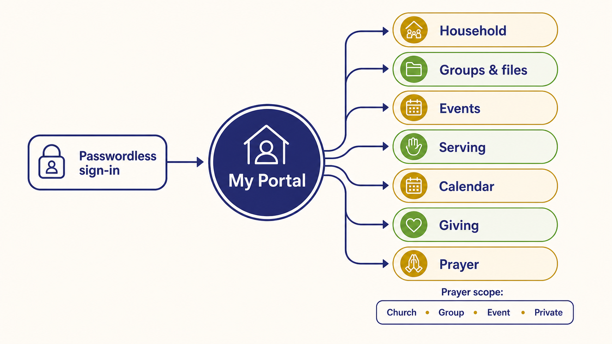
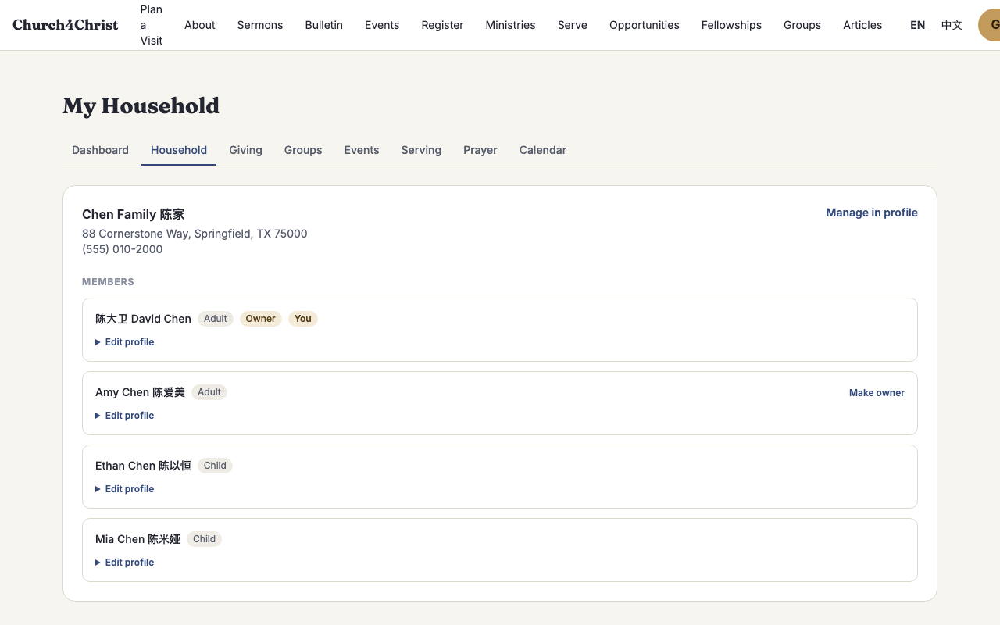
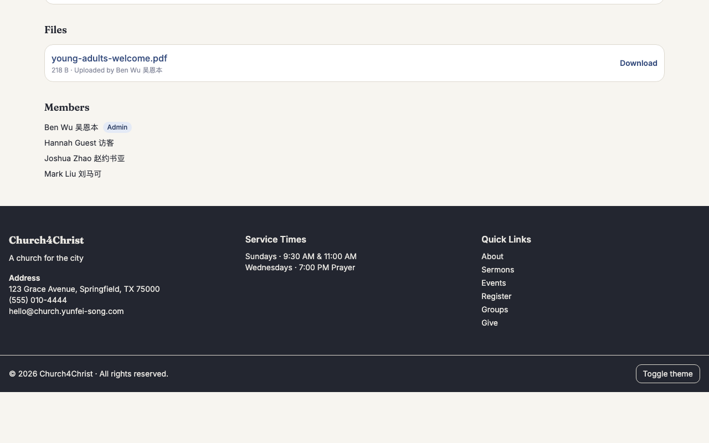
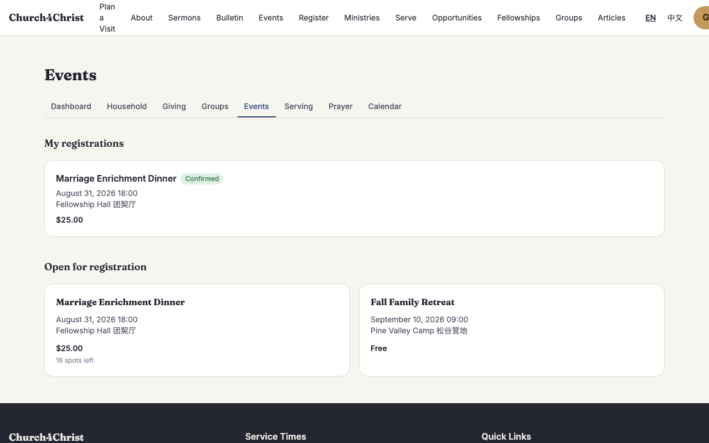
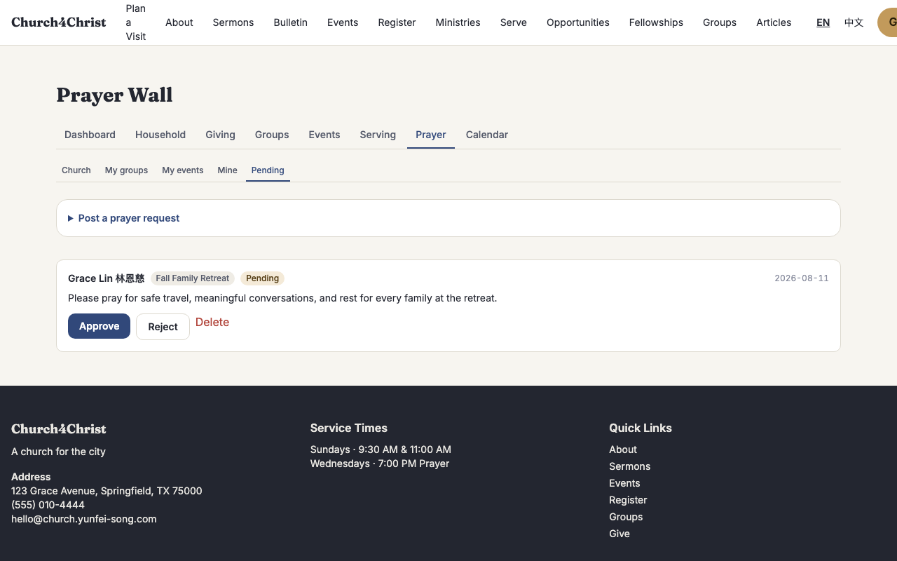

# Member portal

## What it does

**My Portal** is the signed-in home for members. It brings together household
profiles, groups, event registrations, serving, a personal calendar, giving, and
scoped prayer without creating a second member directory or a separate account.
Members use the same passwordless email link as the rest of Church4Christ: enter
the email already attached to their people record, open the link, and continue to
the page they requested.

The portal itself is optional and **Supabase (Postgres)-only**. It is force-disabled
on D1 even if a stale setting says it is on. Groups and Volunteer Scheduling still
work independently on D1, while Giving and Registration have their own Supabase-only
module gates. Portal declares soft `uses` of Volunteer Scheduling and Groups, not hard
dependencies, so selecting Portal in a custom setup does not automatically enable either
one.

## How members use it

### Start from one dashboard

The dashboard at `/my` greets the signed-in member and keeps their nearest actions
together. The complete composition pictured below uses **Portal + Volunteer Scheduling +
Groups**: Volunteer Scheduling owns `/my`, Calendar, and the serving data; Portal adds the
household, event, and prayer views; and Groups supplies the Groups card/tab and protected
file surface. Giving and Registration are separate switches that add their own tab or
registration details. Choose these modules explicitly in a custom setup—Portal's soft
`uses` do not select them for you.




There is no portal password to distribute or reset. In production, a member opens
`/<locale>/signin`, requests a magic link, and follows it from their email. Local
development can use `AUTH_DEV_BYPASS_EMAIL` only while running `astro dev`; the
bypass is compiled out of production builds.

### Manage a household with clear responsibilities

Every linked member can edit their own profile on **My Household**. A household can
have up to two owners. An owner can edit another household member or dependent,
change that person's avatar, and promote another eligible linked adult to co-owner.
An owner cannot demote themselves; another owner or a site administrator must do
that. A non-owner cannot edit the other members.



The portal page deliberately does not replace the core profile workflow. Creating a
household, editing its shared name/address/phone, adding or removing a dependent, and
leaving a household still happen at `/<locale>/profile`; **Manage in profile** links
there. The signed-in member's confirmed email-change request starts from My Household.

Giving follows the same responsibility boundary. A household owner sees the household
ledger and totals on My Giving; another adult sees only gifts tied to their own person
record.

### Join groups and use protected files

Portal groups are the same groups managed by the standalone [Groups](groups.md)
module. Members browse the existing directory, request to join public groups, and see
private groups only when they belong to them. Group administrators approve join
requests, maintain the roster, schedule meetings, and upload shared files from the
group management page.



The file bytes live in the `MEDIA` R2 bucket while Postgres stores the group-scoped
metadata. A download succeeds only for an active member of that group or an authorized
site administrator. Downloads are private, are never served from the public `/media/`
route, and are forced to download rather than render inline. Turning Groups off hides
the directory; turning Portal off removes the protected-file extension while preserving
its records and R2 objects.

### Follow events, serving, the calendar, and giving

**My Events** lists the member's existing registration records. When the separate
Registration module is enabled, it also shows events currently open for registration
and links to the public registration flow. The public Events module (`/events`) remains
a separate publishing feature. Paid Registration and online Giving are Preview/test-only
in this repository; the screenshot uses fictional test data, not a production charge.



The serving dashboard and My Serving read the same teams, assignments, applications,
open slots, and history as Volunteer Scheduling. The personal calendar combines serving
assignments and blockouts with portal group meetings, plus the member's registrations
when Registration is enabled. Members can generate or rotate a private iCalendar token
for Google Calendar, Apple Calendar, or another calendar application.

Giving remains independently gated. When enabled, its own My Giving tab appears and
applies the household owner/member privacy rule described above. Switching Portal off
does not switch off Volunteer Scheduling, Registration, Giving, Groups, or the public
Events module; each keeps following its own setting and backend requirement.

### Share and moderate prayers by scope

A member chooses one of four scopes when posting:

- **Church** — any signed-in member can post; it enters the full site administrators'
  moderation queue and appears to portal members after approval.
- **Group** — only an active member of that group can post or read approved requests;
  that group's administrators or a full site administrator moderate it.
- **Event** — registrants and designated event administrators can post or read approved
  requests; event administrators or a full site administrator moderate it.
- **Private** — it is auto-approved but visible only to its author. It never enters a
  moderation queue.



Authors can review every status under **Mine** and delete their own requests. Approvers
see only pending requests inside their authority: a group administrator cannot moderate
another group, an event administrator cannot moderate another event, and a limited admin
does not gain church-wide prayer access merely by having an admin role.

This scoped portal prayer flow is separate from the public Prayer Wall intake module and
its admin board.

## Setting it up

### Production or guided setup

1. Follow [`docs/supabase-setup.md`](../supabase-setup.md) and run `npm run setup`.
   Choose **Full Church** for the complete composition pictured above, or explicitly
   select **Member Portal + Volunteer Scheduling + Groups**. Portal's soft `uses` do not
   auto-enable the other two. Setup selects Supabase, writes the `HYPERDRIVE` and `MEDIA`
   bindings, runs the current migrations, and records every module setting. Giving and
   Registration remain independently gated selections.
2. Configure the production `MEDIA` R2 bucket. Protected group-file rows in Postgres
   are not useful without the matching R2 objects.
3. Configure production email by following [Email & automation](email-automation.md).
   Passwordless sign-in and confirmed email changes need a working sender. The sender
   domain must be onboarded for Cloudflare Email Sending; `EMAIL_FROM` alone does not
   perform that onboarding.
4. In **Admin → Settings → Modules**, enable **Member Portal** and each related module
   the church intends to use. Giving and Registration remain Supabase-only and are
   enabled separately.
5. In **Admin → People**, put members in the correct households and designate no more
   than two eligible adult owners. In **Admin → Groups**, appoint group administrators.
   Designated event administrators are managed from the registration event.
6. Deploy, request a real passwordless sign-in link from `/<locale>/signin`, and verify
   one ordinary member, one household owner, one group administrator, and one event
   administrator before inviting the congregation.

### Local fictional demo

The local demo must use a dedicated test Postgres database—never a production database.
Set `SUPABASE_DB_URL` in the host shell without placing or echoing it in `.dev.vars`, then
run `npm run setup` in Local mode with demo data. That guided path is provider-aware: for a
Supabase selection it migrates and seeds Postgres, then stages, uploads, and verifies the
checked-in demo assets in local R2. Never select demo data for a production database.

For DB-only migration or seed troubleshooting, the existing commands are:

```bash
npm run db:migrate:supabase
npm run db:seed:supabase
```

`db:seed:supabase` loads the entire fictional development seed plus the Giving,
Registration, and Portal fixtures. It is for an isolated local/demo database only, never
production. After DB-only troubleshooting, rerun the same guided `npm run setup` Local
demo-data flow with the same choices so its provider-aware `seed-media` step verifies and
repairs the matching local R2 image and protected-file objects.

Start local development from the same host shell so Wrangler can build the local
Hyperdrive binding:

```bash
CLOUDFLARE_HYPERDRIVE_LOCAL_CONNECTION_STRING_HYPERDRIVE="$SUPABASE_DB_URL" npm run dev
```

For a local identity-only check, set `AUTH_DEV_BYPASS_EMAIL` in that development
environment to one of the fictional seeded addresses. Do not use the bypass as a
production authentication mechanism.

Turning **Member Portal** off makes its navigation and owned routes return not found. It
does **not** delete people, households, owner flags, group files, prayer items, event
administrators, serving records, registrations, giving records, or R2 objects. Re-enable
the module to use the preserved portal data again.

## Route and module boundaries

The portal navigation is a composition of independently gated capabilities. A custom
selection does not follow soft `uses`: selecting Portal alone does not enable Volunteer
Scheduling or Groups. The full dashboard shown in this guide therefore requires Portal +
Volunteer Scheduling + Groups. The table below matches `config/capabilities.json` and
`src/components/PortalNav.astro`.

| Surface | Owning module | Behavior at the boundary |
|---|---|---|
| `/my`, `/my/blockouts`, `/my/calendar`, `/cal/*` | `serve` | Volunteer Scheduling must be selected for the dashboard and Calendar; Portal does not enable it automatically. Portal/group/registration records enrich these surfaces only when their modules are also enabled. |
| `/my/household`, `/my/events`, `/my/serving`, `/my/prayer`, `/email-change/*` | `portal` | Authenticated, Supabase-only portal routes. Its `uses` of Groups and Volunteer Scheduling are soft composition hints, not auto-enabled dependencies. |
| `/groups/*`, `/signup/*`, `/attendance/*` | `groups` | Groups must be selected for the Groups card/tab and directory. It works on either backend; protected file panels/downloads additionally require Portal and R2. |
| `/events` and `/admin/events` | `events` | Public event and announcement publishing; independent from registration records shown in My Events. |
| `/register/*`, `/api/register/*`, `/admin/registration/*` | `registration` | Supabase-only and independently switched; enables the open-registration section and registered-event calendar marks. |
| `/my/giving`, `/give/checkout/*`, `/api/giving/*`, `/admin/giving/*` | `giving` | Supabase-only and independently switched; its PortalNav tab appears only while Giving is enabled. |
| Public Prayer Wall intake and `/admin/prayer-wall` | `prayer-wall` | Separate from Portal's Church/Group/Event/Private prayer scopes and moderation queue. |

## For developers

- **Capability and navigation contract:** `config/capabilities.json`,
  `src/lib/modules.ts`, `src/components/PortalNav.astro`, and
  `src/lib/routePolicy.ts`. Longest-prefix matching lets Portal or Giving own a
  specific `/my/...` route while Volunteer Scheduling continues to own `/my`.
- **Pages:** `src/pages/[locale]/my/{index,household,events,serving,calendar,prayer,giving}.astro`,
  `src/pages/[locale]/profile.astro`, and `src/pages/[locale]/groups/[id].astro`.
- **Data and authorization:** `src/lib/portalDb.ts` (household owners and profile
  edits), `src/lib/groupFiles.ts` (validation, R2 metadata, and file ACL),
  `src/lib/prayerDb.ts` (scope eligibility and moderation), and
  `src/lib/calendar.ts` (combined calendar marks).
- **Schema and demo:** `migrations-supabase/0009_member_portal.sql`,
  `seed/portal-seed.sql`, and `seed/portal-files/`.
- **Tests:** `test/portalDb.test.ts`, `test/groupFiles.test.ts`,
  `test/prayerDb.test.ts`, `test/calendar.test.ts`, `test/modules.test.ts`,
  `test/pg/portalSeed.test.ts`, `test/portalMediaSeed.test.ts`, and
  `test/e2e-pg/portal-prayer.e2e.test.ts`.
