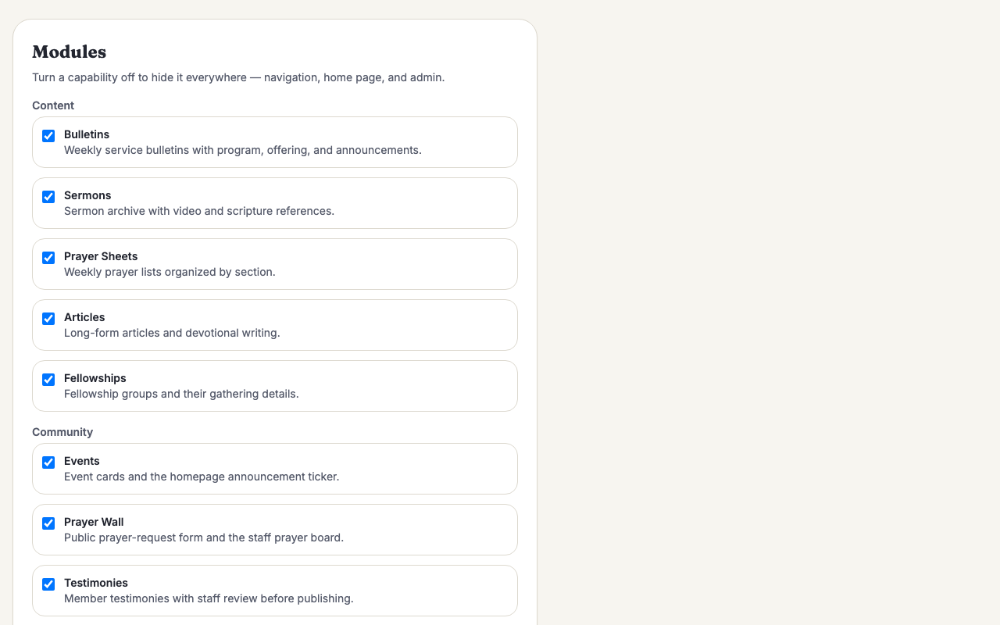
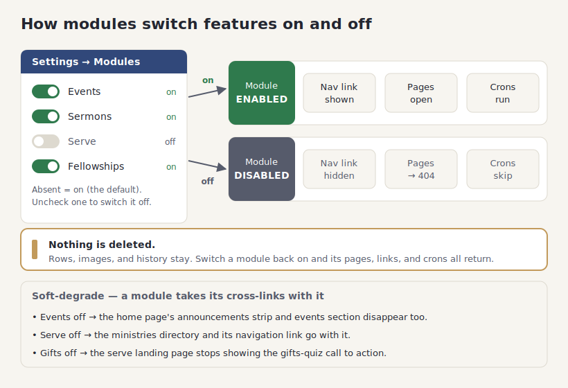

# Modules (switch off what you don't need)

## What it does

Church4Christ ships with everything turned on — bulletins, sermons, a prayer wall,
volunteer scheduling, events, articles, and more. That is a lot for a church that just
wants a simple site with service times and a sermon archive. **Modules** let you keep
only the parts you use.

Each capability is a **module** you can switch off from one panel in Settings. When a
module is off, it disappears from the whole site: its navigation links, its pages, its
home-page sections, and even its background emails. Nothing is deleted — the content and
history stay exactly where they are — so if you change your mind, you flip the switch back
on and everything returns. New churches start with a smaller, less intimidating site;
established churches can turn features on as they grow into them.

Everything is on by default, which is why the demo shows the full feature set. Turning a
module off never touches the always-on core: the home page, visit and about pages, staff
directory, giving page, sign-in, settings, and the nightly backup are always present.

## How your team uses it

**The Modules panel.** An admin opens **Settings** and scrolls to **Modules**. Each
capability is a checkbox, grouped into Content, Community, and Volunteering. Uncheck the
ones you do not need and click **Save modules** — the change takes effect immediately.

**The 11 modules:**

| Group | Module | What it includes |
|---|---|---|
| Content | **Bulletins** | Weekly service bulletins with program, offering, and announcements. |
| Content | **Sermons** | The sermon archive with video and scripture references. |
| Content | **Prayer Sheets** | Weekly prayer lists organized by section. |
| Content | **Articles** | Long-form articles and devotional writing. |
| Content | **Fellowships** | Fellowship groups and their gathering details. |
| Community | **Events** | Event cards and the home-page announcement ticker. |
| Community | **Prayer Wall** | The public prayer-request form and the staff prayer board. |
| Community | **Testimonies** | Member testimonies, with staff review before publishing. |
| Community | **People** | Member profiles, households, pastoral notes, and invite-to-serve. Turning it off hides those panels and tools everywhere; the basic people directory that powers sign-in stays. |
| Volunteering | **Serve** | Ministries, teams, scheduling, applications, and reminders. |
| Volunteering | **Gifts Quiz** | The spiritual-gifts quiz with ministry recommendations. |

**What happens when a module is off.** The capability is hidden everywhere at once, not
half-removed:

- Its **navigation links vanish** from the header and footer, and its **cards leave the
  admin dashboard** — nobody sees a button that would only say "not allowed."
- Its **pages return "not found" (404)** for everyone, whether they are signed in or not,
  and whether the page is public or in the admin area. There is no back door.
- Its **automatic emails stop** — turn Serve off and the weekly serving reminders and
  digest simply do not send.
- Its **content is kept**. Bulletins, sermons, and every other record stay in the
  database untouched. **Flip the module back on and every page, link, and email returns**
  exactly as it was.

**Soft-degrade: a module takes its cross-links with it.** Modules are not islands — some
features point at each other, and turning one off tidies up those references too, so you
never get a link to a page that no longer exists:

- Turn **Events off** and the home page's **announcements strip and events section
  disappear** along with the events pages.
- Turn **Serve off** and the **ministries directory** (and its navigation link) is hidden
  with it, since ministries live inside the serve module.
- Turn **Gifts off** and the serve landing page **stops showing the gifts-quiz call to
  action** — the rest of scheduling keeps working.
- Turn **Serve off** but leave the gifts quiz on and the quiz still runs, just **without
  the ministry recommendations** that would point people at teams.

Because the defaults are all-on, a brand-new site looks exactly like the demo. You only
ever subtract.

## How it fits together

One panel writes a simple on/off setting per module. On every request the site reads that
set of enabled modules and reacts: an enabled module shows its nav links, opens its pages,
and runs its crons; a disabled one hides its links, returns 404 for its pages, and skips
its crons. Nothing is erased, so the switch is fully reversible, and cross-links
soft-degrade so an off module never leaves a dangling reference.

## For developers

- **Registry:** `src/lib/modules.ts` is the pure, tested source of truth. `MODULES` maps
  each of the 11 keys to the locale-stripped route prefixes it owns (public and admin), its
  nav dictionary keys, and its soft `uses` (degrade-only, never a hard gate). `moduleForPath`
  is the classifier — longest matching prefix wins, so `/serve/gifts` resolves to `gifts`
  even though `/serve` also matches.
- **Enablement + cache:** module state lives in the `module.<key>` settings rows (absent =
  on; only the exact string `'0'` disables). `getEnabledModules(db)` reads them with a 60s
  per-isolate cache; `clearModuleCache()` drops it after an admin save. The middleware puts
  the result on `locals.modules` (a `Set<ModuleKey>`).
- **Enforcement:** `src/middleware.ts` is the single choke point — after locale resolution
  and before route policy, a path owned by a disabled module rewrites to `/404` with a 404
  status. A DB failure fails open to all-enabled so a fresh install never 500s.
- **Surface reactions:** the header, footer, home page, admin dashboard, and settings all
  read `Astro.locals.modules` to hide links and sections; `src/lib/digest.ts` gates the
  serving reminder and digest crons on the `serve` module; `src/worker.ts` clears the module
  cache before each scheduled run so a warm isolate reads fresh state.
- **Admin panel:** `src/pages/admin/settings/index.astro` renders the grouped checkboxes and
  writes all 11 `module.<key>` rows explicitly (an unchecked box is written as `'0'`, not
  left partial), then calls `clearModuleCache()`.
- **Tests:** `test/modules.test.ts` (registry, cache, `moduleForPath`) and
  `test/moduleGating.test.ts` (middleware 404s + hidden surfaces); module-off e2e assertions
  live in `test/e2e/`.
