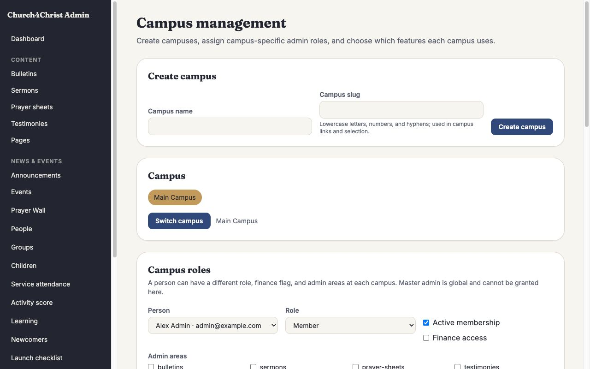
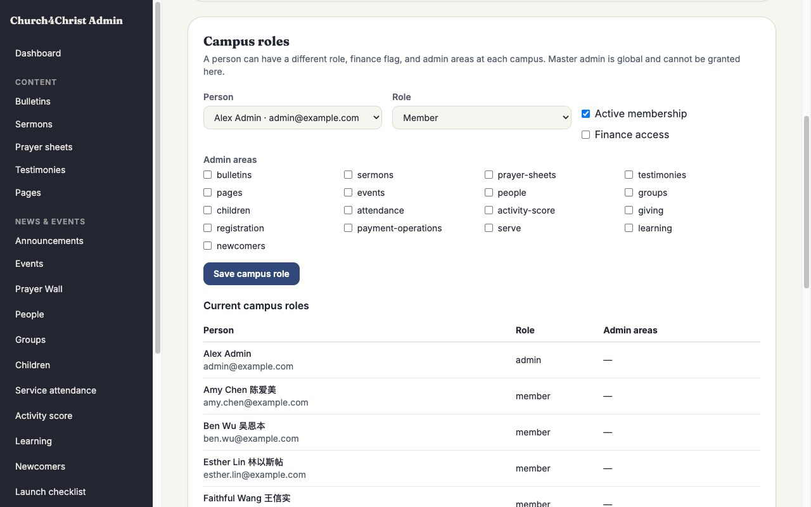

# Multiple campuses on one backend

Church4Christ can run several campuses on one shared D1 or Supabase/Postgres backend. Each
request resolves one campus before authorization and data access. Feature rows, settings,
enabled modules, and administrative grants are then limited to that campus.

This is a core tenancy capability rather than another optional feature toggle: each campus
can choose from the installation's available modules while keeping its operational records
and campus-specific admin roles separate.

The existing `super_admin` account flag is the **master-admin** boundary. Only a master admin can select **All campuses**,
create campuses, assign campus memberships, and inspect the
combined backend. No other role can enter all-campus mode. An ordinary user, editor, finance
helper, or campus admin can select only a campus where they have an active membership.

## At a glance

| Person | What they can see and manage |
|---|---|
| Master admin | Every campus, the **All campuses** combined view, campus creation, memberships, and campus feature controls. |
| Campus admin | Only active campuses where they have a membership, with the role and admin-area grants assigned there. |
| Editor, finance helper, or member | Only their active campus memberships and the features allowed by their campus-local permissions. |
| Public visitor | The requested active campus, or the installation's default campus when none is selected. |

## Administration

Master admins use **Admin → Campuses** to:

- create a campus with a stable URL/cookie slug;
- add or update a person's campus membership;
- assign that campus's `member`, `editor`, or `admin` role;
- grant finance and bounded admin-area access for that campus; and
- enable or disable modules for that campus.

A single person can therefore be an administrator at one campus, an editor at another, and
an ordinary member at a third. Master-admin status is global and deliberately cannot be
granted from this page.

Campus module controls can only narrow the backend-wide module set. They cannot enable a
Supabase-only module on D1 or override a module disabled globally. The selector in the admin
shell changes campus through the same-origin `POST /campus/switch` endpoint. Its cookie is
HTTP-only, SameSite=Lax, and the redirect target is restricted to the current origin.

## Data boundary

`people` remains the shared sign-in identity table so one email can belong to more than one
campus. Authority lives in `campus_memberships`: role, active status, finance access, and
admin-area grants are all campus-local. A newly created identity records its home campus and
is attached to it by a database trigger in the same transaction.

All feature-owned tables carry a non-null `campus_id`. Middleware wraps the request database
with `src/lib/campusScope.ts`, which injects the selected campus into inserts and limits
reads, updates, and deletes. People reads join through active campus membership. The flat
settings API is transparently mapped to `campus_settings`; themes, identity text, navigation,
and other settings can therefore differ by campus. The Supabase-only Giving, Registration,
member-portal, and private Stripe operation tables use the same boundary.

The default `main` campus preserves an existing installation. Migration `0027_multi_campus`
backfills all existing feature rows, users, permissions, and settings to campus 1; campuses
without explicit module rows inherit the backend-wide module set. Existing APIs that edit
the legacy permission columns keep the default-campus membership synchronized.

## Request resolution

The `campus` query parameter takes precedence over the `c4c_campus` cookie. Anonymous public
requests may use any active campus and otherwise fall back to the active default campus.
Authenticated non-master users must have an active membership in the requested campus;
unauthorized selection returns 403. Only a master admin may request the reserved `all` value.

Master admins default to all-campus mode. They can deliberately switch into one campus to
preview exactly what that campus sees. This is the only unscoped application context.

For day-to-day work, the admin shell posts campus changes to `/campus/switch` and then keeps
the selected campus in an HTTP-only cookie. Switching changes the authorization context,
effective modules, settings, theme, and database scope together; it is not just a visual
filter.

## Deployment and verification

Apply `migrations/0027_multi_campus.sql` on D1 or the matching
`migrations-supabase/0027_multi_campus.sql` on Supabase/Postgres before deploying this code.
Take and verify a backup first, rehearse the upgrade in staging, and follow
[`docs/upgrade.md`](../upgrade.md). The migration is forward-only.

After deployment, verify at least two campuses with different settings and feature records,
one campus admin restricted to each campus, one person belonging to both campuses with
different roles, and one master admin in all-campus mode.
