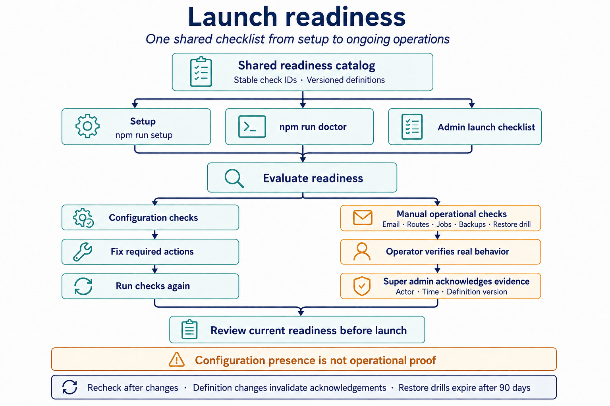
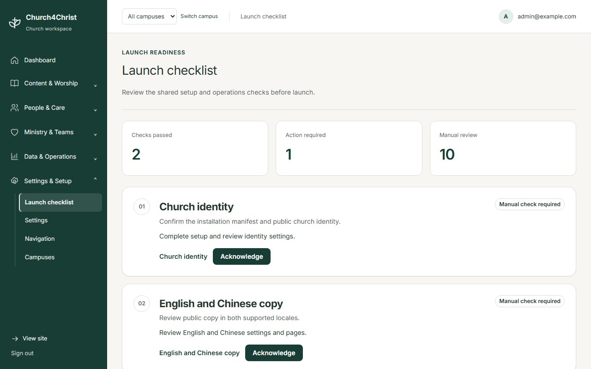

# Launch readiness

New installation? Start with [Setup for people and AI agents](../setup.md), then use
this checklist to verify the resulting installation and track operational work.

Church4Christ keeps readiness definitions in `config/readiness.json`. Setup, `npm run doctor`,
and `/admin/onboarding` use the same stable check IDs and bilingual descriptions. The catalog
covers identity and locales, service times, staff grants, People migration decisions,
Newcomer ownership, attendance/check-in mapping, origin/domain/email, routes and jobs,
backups, and restore drills.

## Workflow

1. Run setup and `npm run doctor`, then open `/admin/onboarding` to review the same catalog
   of readiness checks in the administrator interface.
2. Follow each required action, correct the configuration, and run the checks again.
3. For manual items, verify the real operational behavior and retain evidence in the church's
   runbook. A super administrator can then acknowledge the review.
4. Revisit the checklist before launch and after operational changes. Definition changes
   invalidate old acknowledgements; restore-drill acknowledgements expire after 90 days.

## Administrator experience

This screenshot uses a fictional local demonstration environment. Action-required and manual
items are expected: the checklist does not treat a configured value as proof that production
email, routes, scheduled jobs, backups, or restores work. See the
[feature visual capture notes](../design/feature-visuals.md) for reproduction details.

## Access and acknowledgements

Every authenticated real administrator can read the admin checklist. It is an always-on,
non-grantable admin area: members and editors cannot open it, limited administrators need no
extra grant, and only a super administrator can acknowledge a manual check. Acknowledgements
record actor, time, and definition version. Restore-drill acknowledgements expire after 90
days; other acknowledgements remain current until their definition version changes.

Configuration presence is not operational proof. Routes, scheduled jobs, backups, and
restores remain manual or action-required until an operator verifies them. The page and
doctor never display secrets, provider payloads, contact records, backup contents, or
credential-bearing URLs.

## Learning readiness

For **Learning**, catalog/database readiness means only that the `people` dependency, module
setting, migrations `0017`–`0026`, and inspectable schedule/configuration are coherent. OAuth
consent and minimal scopes, Google Pub/Sub or Canvas Live Events delivery, real provider mapping,
manual/`:45` sync, `:15` cleanup/renewal, disconnect revocation, credential rotation, retention,
and matched restore are external/manual evidence. Setup, the admin checklist, and doctor do not
make provider calls or reveal provider configuration, so an operator must record those proofs in
the church's approved runbook before launch. When Learning is enabled, the canonical
`learning-provider-operations` manual item exposes that work in the admin checklist; a super-admin
acknowledgement records review of the external evidence, not proof that Church4Christ performed it.

## Doctor output

Doctor JSON uses schema version 2. Every item has exactly `checkId`, `status`, `severity`,
legacy `code`, `message`, and `remediation`. Normal mode fails only an error-level required
action; strict mode also fails warning-level required actions and manual checks.
