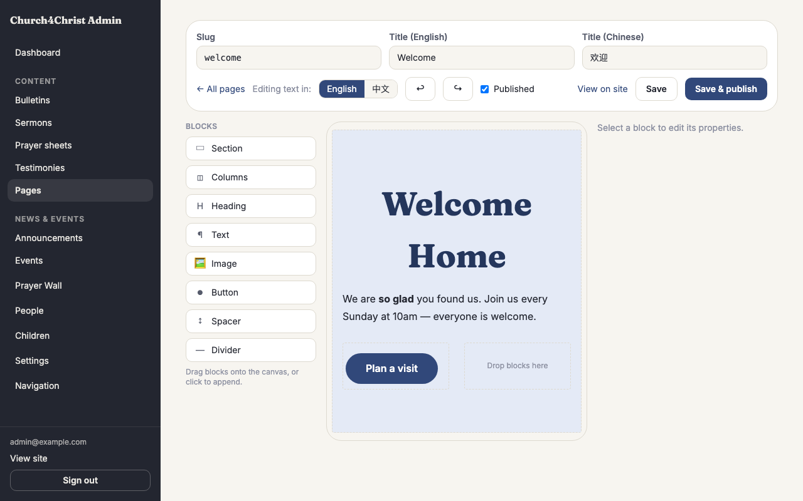
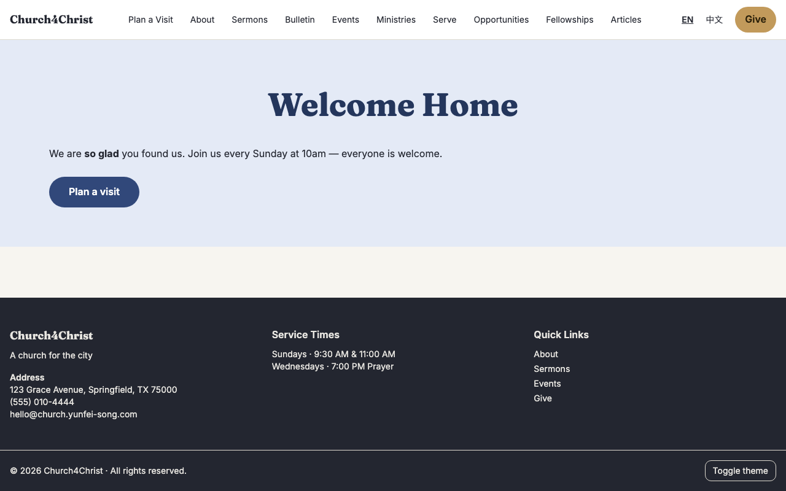

# Page builder

## What it does

A **drag-and-drop design tool** for your own custom pages — things like "Our Story,"
"Beliefs," or "Directions" — where you build the layout yourself instead of typing
everything into one long box. Blocks (a heading, a photo, a button, a two-column layout,
and so on) are dragged onto a canvas, arranged in any order, and styled from simple menus
that always match your church's chosen theme, in both light and dark mode.

It sits alongside the classic page editor your team already knows — nothing about that
editor changes, and every page you built with it before stays exactly as it was. The page
builder is simply a second, visual way to create a *new* page, for whoever prefers
dragging blocks over writing Markdown.

- **Blocks to build with.** Sections (a full-width band with its own background), Columns
  (side-by-side layout), Heading, Text, Image, Button, Spacer, and Divider. A section can
  hold columns and other blocks; columns hold everything else.
- **Bilingual by design.** Every piece of text — headings, paragraphs, button labels,
  image alt text — has its own English and 中文 version, switched with one toggle at the
  top of the screen. If a Chinese field is left blank, the page quietly shows the English
  version instead, so a half-translated page never shows a blank spot to a visitor.
- **Always on-theme.** Backgrounds, widths, alignment, and sizes are chosen from dropdown
  menus, not free-form colors or pixel values — so a page you design today keeps looking
  right if the church later switches its theme or a visitor's device is in dark mode.
- **Images upload right into the page.** Pick a file and it uploads on the spot, or reuse
  a photo you already uploaded elsewhere from a "recent uploads" picker — no separate
  media step.

## How your team uses it

**Starting a new page.** From **Pages** in the admin area, click **New page (builder)**.
You land on a blank canvas with a palette of blocks down the side. Drag a block onto the
canvas, or click it to drop it into the page automatically — both work the same way.

**Building the layout.** Add a Section first (it is the outer band that holds everything),
then drag Columns or content blocks inside it. Click any block on the canvas to select it;
its options — background color, width, alignment, size, and so on — appear in a properties
panel on the right. Delete or duplicate a block with the buttons on that panel. Undo and
redo are always available if a change does not look right.

**Entering text in two languages.** A language toggle near the top switches the whole
editor between English and 中文. Type your English copy, flip the toggle, and type the
Chinese version for the same blocks — the layout does not change, only which language's
words you are typing.

**Saving your work.** **Save** stores your progress as a draft — nothing changes on the
live site yet. **Save & publish** makes the page live immediately at its address
(`/en/p/‹slug›` and `/zh/p/‹slug›`). You can keep saving drafts and revisit them later
before ever publishing, and every save is kept as a snapshot so a page can be traced back
through its history.

**Setting the page's address and title.** The slug (its web address), and the English and
Chinese titles, are set at the top of the builder alongside Save. The classic Pages list
still shows every page — builder-made or classic — with its status, and a **Design** link
to reopen a builder page for more editing.

## What visitors see

A page built this way loads exactly like any other page on the site — fast, with no
visible difference between a hand-coded page and one you dragged together. There is
nothing extra running in the visitor's browser: the editing tool itself never ships to a
visitor, only the finished page.

## Turning it off

Like every capability in Church4Christ, the page builder is a **module** you can switch
off under **Settings → Modules** (in the Content group) if your team never wants the
drag-and-drop tool. Turning it off only removes the *design tool itself* — the **New page
(builder)** button and the **Design** links disappear from the admin area. Any pages you
already built and published with it **keep working and keep looking exactly the same**
for every visitor; nothing goes offline. Flip the module back on whenever your team wants
to design another page. See [Modules](modules.md).

## Tips

- Build the layout first in one language, get it looking right, then switch the toggle
  and translate — it is easier than typing both languages block by block.
- A page you started in the classic editor stays a classic Markdown page; a page you
  start in the builder stays a builder page. Switching a page's format is not something
  you do from the Pages list — start over with a new page in whichever tool you want to
  use.
- Save often. A draft never appears on the public site until you choose **Save &
  publish**, so it is safe to save early and often while you figure out the layout.
