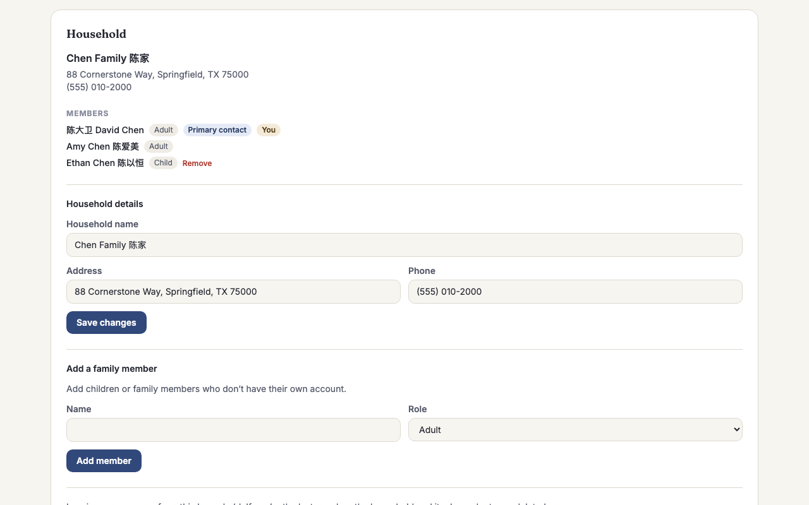
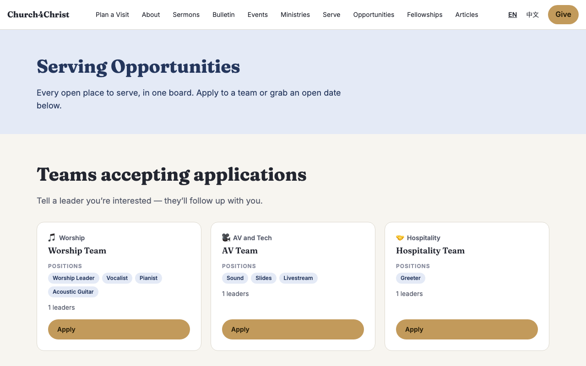
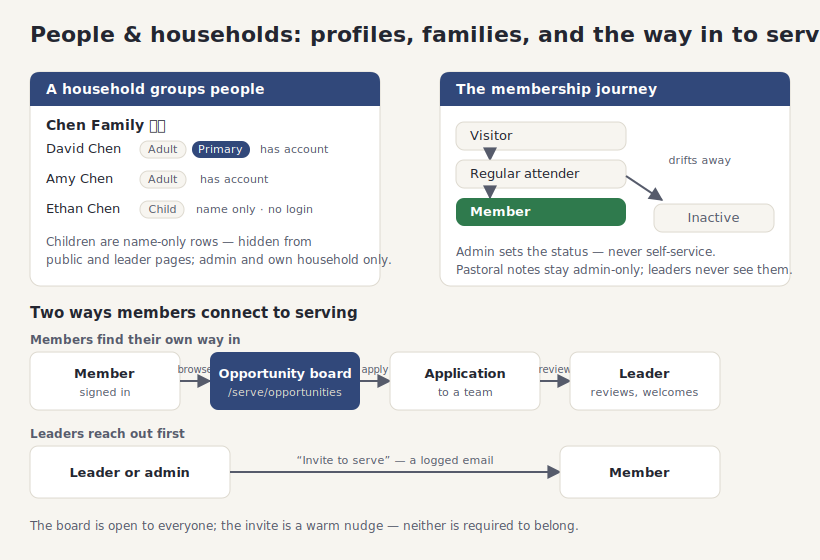

# People & households (member management)

## What it does

Most church tools only know the people who serve. This one knows everyone. **Member
management** gives every person in your congregation a profile — not just the volunteers
on a rota — so a first-time visitor, a faithful attender who has never signed up for
anything, and a long-time member are all first-class records you can care for.

It adds four things on top of the plain contact list your site already had:

- **A profile everyone can fill in.** Signed-in members can add their own birthday and
  address, review the ministries they are interested in, and see their serving history —
  without an admin typing it for them.
- **Households, including children who don't need accounts.** A family shares one
  **household** card with a name, address, and phone. Adults each have their own sign-in,
  but children are added as **name-only** entries — no email, no login — so you can record
  a whole family without inventing fake accounts for the kids.
- **A membership journey.** Every person carries a status that tracks where they are with
  your church: **Visitor** &#8594; **Regular attender** &#8594; **Member**, plus
  **Inactive** for someone who has drifted away. It is a gentle, honest picture of your
  congregation, and only an admin can set it — it is never something a person changes about
  themselves.
- **Pastoral notes, kept private.** Admins can keep quiet, pastoral notes on a person — a
  visit, a prayer request, a season of care. These are **admin-only**: ministry leaders,
  even the leader of a team that person serves on, never see them.

And because non-serving members matter too, the module connects people to serving from
both directions. Members can browse an **opportunity board** and apply to any open team
themselves; and leaders or admins can **reach out first** with a warm "Invite to serve"
email that is logged, so no one falls through the cracks.

## How your team uses it

**A member's own profile and household.** When someone signs in and opens their profile,
they can fill in their birthday and address and manage their family's household card:
create one (they become its primary contact), edit the name, address, and phone, and add
or remove name-only family members like children. Leaving a household is one click, and if
they were the last adult in it, the household and its dependents are cleaned up with them.

**Finding somewhere to serve.** The **opportunity board** at `/serve/opportunities`
gathers every open place to serve onto one page: teams that are accepting applications
(with their ministry and open positions) and upcoming serving dates that still need
someone. Each one has an **Apply** button that drops the member straight into the team's
application. It is the single "where can I help?" page you can point anyone to.

**Managing a person, as an admin.** The admin people directory (`/admin/people`) gains
filters — by membership status, whether someone is serving, and whether they have a
household — so you can answer real questions like "who are our regular attenders who have
never served?" Opening a person shows the full picture: their household (assign, create,
link, set who is the primary adult), their **pastoral notes** timeline, their serving
applications, and the birthday, address, status, and joined-on date. The notes panel says
plainly on its face that leaders never see it.

**Reaching out.** From a person's page, an admin (or a team leader, from their own leader
view) can click **Invite to serve**, pick a team, and send a warm, localized email
inviting that person to apply. Admins can invite to any team; a leader can only invite to
teams they lead. The result is honest: you see **"Invitation sent"** when it went, or a
plain note that it could not be sent because the person has no email on file or their
account is inactive. Every invite is logged, so outreach is a record, not a guess.

**Who sees what.** The privacy rules are firm and worth stating for your team:

- **Pastoral notes** are admin-only. Leaders never see them.
- **Birthday, address, and household details** are visible to the person themselves and to
  admins. A ministry leader looking at someone's profile sees only what they need for
  scheduling — teams, serving history, and blockout dates — and nothing household-related.
- **Children** (name-only entries) never appear on any public or leader page. They show
  only to admins and to the adults of their own household.
- The **directory** stays admin-only, as it always has.

## How it fits together

A household groups adults (who each have an account) with name-only children (who don't).
Every person moves along the visitor-to-member journey, with pastoral notes kept for admins
only. And members reach serving two ways — they find the opportunity board and apply, or a
leader reaches out first with a logged invite.

## For developers

- **Schema:** migration `migrations/0003_people.sql` adds the member fields to `people`
  (`birthday`, `address`, `membership_status` with a four-value `CHECK`, `joined_on`) and
  the new `households`, `household_members`, and `person_notes` tables. Dependents are
  **name-only rows** (`household_members.person_id IS NULL`) — `people.email` stays
  `NOT NULL` because it is the auth key; partial unique indexes enforce one household per
  real person.
- **Data libraries:** `src/lib/householdDb.ts` (create/edit, add/remove dependents, link
  real people, leave — with the one-household-per-person and adults-only rules),
  `src/lib/notesDb.ts` (pastoral notes; soft-deleted, and it does **no** authorization
  itself — every function assumes the calling page has already gated to an admin), and
  `src/lib/opportunityDb.ts` (`listApplicationTeams`, `listOpportunitySlots` — the board
  aggregation). Person fields persist through `savePerson` in `src/lib/adminDb.ts`.
- **Form parsing:** `parsePersonForm` (admin-only fields gated behind its `admin` option so
  a self-service save can never set status/joined-on) and `parseHouseholdForm` in
  `src/lib/validate.ts`.
- **Privacy rules live in the pages, not the libs.** Notes render only in
  `src/pages/admin/people/[id].astro`; the leader-facing `src/pages/[locale]/profile/[id].astro`
  deliberately exposes teams, serving history, and blockout dates (reasons nulled for
  non-admins) and never notes, birthday, address, or household. Self-service household
  mutations in `src/pages/[locale]/profile.astro` pass `isAdmin=false` so the lib re-verifies
  the actor is an adult of the target household.
- **Outreach email:** `sendServeInvite` in `src/lib/notify.ts` (best-effort, logged to
  `email_log` as kind `outreach`); templated via the `invite.email.*` dictionary keys.
- **Module gating:** the `people` module owns **no route prefixes** (its surfaces live in
  the pre-existing `/profile` and `/admin/people` core routes, and the board is under the
  `serve` module). Each added panel checks `Astro.locals.modules.has('people')`, so turning
  the module off hides the depth without 404-ing the core directory or sign-in. See
  [Modules](modules.md).
- **Tests:** `test/schema.people.test.ts`, `test/householdDb.test.ts`,
  `test/notesDb.test.ts`, `test/opportunityDb.test.ts`, `test/adminDb.people.test.ts`, and
  the `parsePersonForm`/`parseHouseholdForm` cases in `test/validate.test.ts`; end-to-end
  coverage in `test/e2e/people-admin.e2e.test.ts` and the household/board/privacy
  assertions in `test/e2e/volunteer.e2e.test.ts`.
