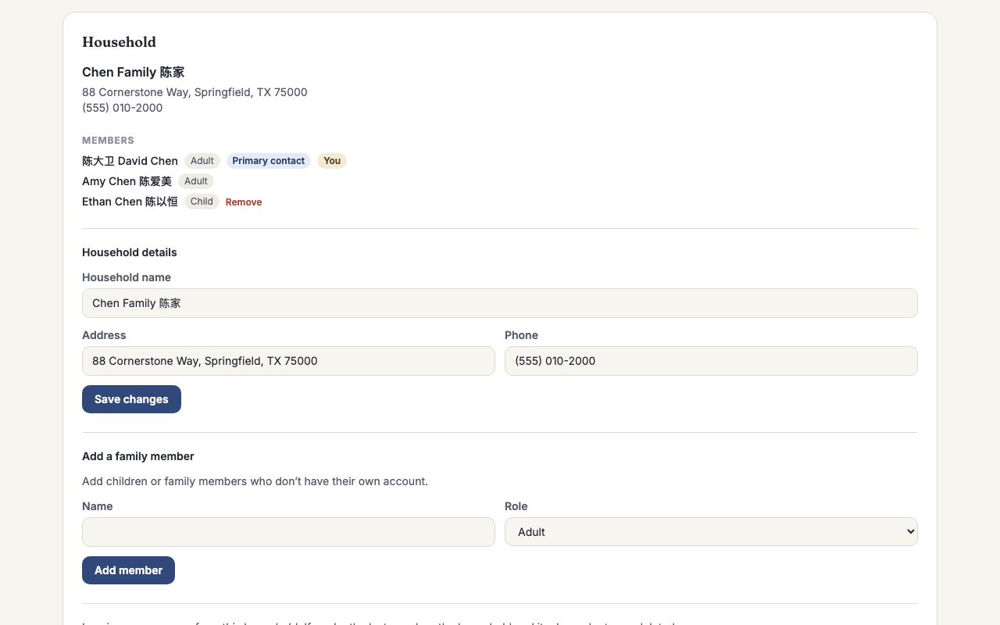
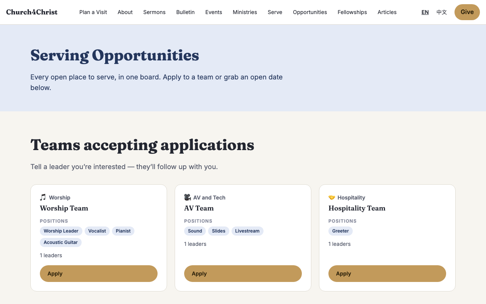
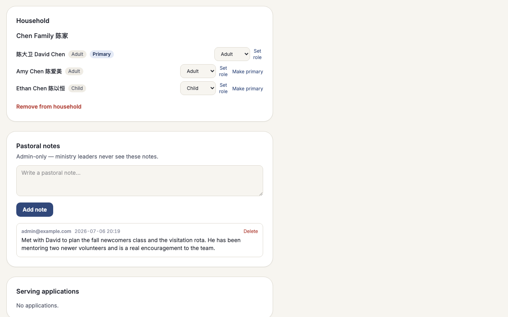
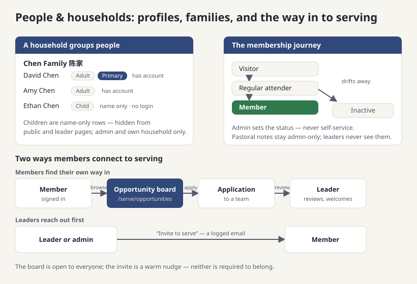

# People & households (member management)

## What it does

Most church tools only know the people who serve. This one knows everyone. **Member
management** gives every person in your congregation a profile — not just the volunteers
on a rota — so a first-time visitor, a faithful attender who has never signed up for
anything, and a long-time member are all first-class records you can care for.

It adds four things on top of the plain contact list your site already had:

- **A profile everyone can fill in.** Signed-in members can add their own birthday and
  address, review the ministries they are interested in, and see their serving history —
  without an admin typing it for them.
- **Households, including children who don't need accounts.** A family shares one
  **household** card with a name, address, and phone. Adults each have their own sign-in,
  but children are added as **name-only** entries — no email, no login — so you can record
  a whole family without inventing fake accounts for the kids.
- **A membership journey.** Every person carries a status that tracks where they are with
  your church: **Visitor** &#8594; **Regular attender** &#8594; **Member**, plus
  **Inactive** for someone who has drifted away. It is a gentle, honest picture of your
  congregation, and only an admin can set it — it is never something a person changes about
  themselves.
- **Pastoral notes, kept private.** Admins can keep quiet, pastoral notes on a person — a
  visit, a prayer request, a season of care. These are **admin-only**: ministry leaders,
  even the leader of a team that person serves on, never see them.

And because non-serving members matter too, the module connects people to serving from
both directions. Members can browse an **opportunity board** and apply to any open team
themselves; and leaders or admins can **reach out first** with a warm "Invite to serve"
email that is logged, so no one falls through the cracks.

## How your team uses it

**A member's own profile and household.** When someone signs in and opens their profile,
they can fill in their birthday and address and manage their family's household card:
create one (they become its primary contact), edit the name, address, and phone, and add
or remove name-only family members like children. Leaving a household is one click, and if
they were the last adult in it, the household and its dependents are cleaned up with them.



**Finding somewhere to serve.** The **opportunity board** at `/serve/opportunities`
gathers every open place to serve onto one page: teams that are accepting applications
(with their ministry and open positions) and upcoming serving dates that still need
someone. Each one has an **Apply** button that drops the member straight into the team's
application. It is the single "where can I help?" page you can point anyone to.



**Managing a person, as an admin.** The admin people directory (`/admin/people`) gains
filters — by membership status, whether someone is serving, and whether they have a
household — so you can answer real questions like "who are our regular attenders who have
never served?" Opening a person shows the full picture: their household (assign, create,
link, set who is the primary adult), their **pastoral notes** timeline, their serving
applications, and the birthday, address, status, and joined-on date. The notes panel says
plainly on its face that leaders never see it.



### CSV import for admins

Admins with full People access can open `/admin/people/import`, download the canonical
`church4christ-people-import.csv` template from
`/admin/people/import/template.csv`, select a completed UTF-8 CSV, and choose **Preview**.
Use the downloaded template rather than renaming or omitting columns: the header contract
is exactly these 18 fields (the template keeps them in this order):

```csv
record_type,display_name,email,first_name,last_name,phone,language,membership_status,birthday,joined_on,address,active,household_key,household_name,household_address,household_phone,household_role,household_primary
```

The upload limit is 256 KiB, 200 data rows, and 100 households. The two record types work
as follows:

- A `person` row creates an account-bearing person. `display_name` and a valid, unique
  `email` are required. Optional values include names, phone, `language` (`en` or `zh`),
  `membership_status` (`visitor`, `regular`, `member`, or `inactive`), `YYYY-MM-DD` dates,
  address, and `active` (`true` or `false`). The person can sign in only while `active`
  is `true`; the imported application role is always `member`.
- A `dependent` row creates a name-only household member, not a person or sign-in. It
  requires `display_name` and `household_key`; person fields such as email, phone,
  language, membership status, dates, address, and active must stay blank.
- `household_key` is an import-local grouping key (`a-z`, `0-9`, `.`, `_`, or `-`, up to
  64 characters). It never identifies or attaches to an existing household. Every key
  needs a household name and at least one `person` row. Within each key there must be
  **exactly one** `person` whose `household_role` is `adult` and whose
  `household_primary` is `true`; that row is the primary contact. Other person rows use
  an explicit `adult` or `child` role and `household_primary=false`. Dependents cannot be
  primary. If household name, address, or phone is repeated on several rows for the same
  key, the non-empty values must agree.

This is deliberately a **create-only** operation. It does not update or merge people,
revive soft-deleted people, change an existing person's email, attach rows to an existing
household, grant admin/team privileges, or send email. An imported email conflicts whether
the matching existing person is live and active, inactive, or soft-deleted. A same-name
**live** household is a warning, not an attachment rule: acknowledging the warning creates
a new, separate household. Review possible duplicates before continuing.

Preview parses and preflights the CSV without writing any people, households, or
memberships. Commit does not trust the preview response: the server reparses the uploaded
file and reruns current database preflight checks before writing. Parser or email-conflict
errors block the import; warnings must be explicitly acknowledged. A repeated or stale
submission is checked again and conflicts instead of updating existing rows.

All writes are one atomic database operation on both D1 and PostgreSQL: either every
person, household, and membership is committed, or none is. The importer never chunks a
file into partial commits. This matters for D1 capacity: D1 Free currently permits 50
queries per Worker invocation, while the largest accepted import can require about 500
batch statements (up to 200 people, 100 households, and 200 memberships) plus preflight
scans. A large D1 import therefore needs a plan/runtime with a paid-capable invocation
limit; otherwise reduce the file before previewing. Pricing and limits can change, so the
current [Cloudflare D1 limits](https://developers.cloudflare.com/d1/platform/limits/) are
authoritative.

### Portable CSV exports for admins

Admins with full People access can open `/admin/people/export` from the People directory.
The server takes a read snapshot and prepares numbered UTF-8 CSV downloads that use the
same exact 18-field header as the importer:

```csv
record_type,display_name,email,first_name,last_name,phone,language,membership_status,birthday,joined_on,address,active,household_key,household_name,household_address,household_phone,household_role,household_primary
```

Each part is limited to 200 data rows, 100 households, and 256 KiB including the header.
One export can contain at most 25 parts, 5,000 data rows, and about 6.25 MiB of CSV. A
household is atomic and is never split between parts. If a single household cannot fit, a
household has no live adult primary, or another bounded integrity or portability check
fails, discovery reports `repair_required` and emits no partial CSV. Cells beginning with
a spreadsheet formula prefix receive a leading apostrophe through the shared CSV safety
encoder.

The standard export contains current live records for active and inactive people, their
live household membership, and live name-only dependents. It deliberately excludes
pastoral notes, application roles, admin permissions, security/session data, and internal IDs.
D1 reads it as one four-query transactional snapshot; PostgreSQL reads the same four
projections in a repeatable-read transaction. Every download is private, `no-store`, and
requires either full People-area permission or super-admin access.

Export and import are portable, but the importer remains **create-only**. Exported email
addresses collide with their source installation, so an exported part can be imported
without conflicts only into a clean target (or after an operator has separately resolved
every collision). Import does not merge, restore, or update records.

Pastoral notes use a separate sensitive flow at `/admin/people/export-notes`. It is
super-admin only, requires an explicit `EXPORT PASTORAL NOTES` acknowledgement, and emits
the exact columns:

```csv
person_ref,person_email,author_attribution,body,created_at
```

The notes export includes at most 5,000 notes, all live and attached to live subjects, and
at most 10 MiB. It uses the subject's current email for operator matching and preserves
the historical author-attribution text even if that account changed or was removed.
`person_ref` is a file-local label only; it is not a database foreign key or a join key
for another export.
There is no notes importer in this release.

A successful notes POST appends one `audit_events` record with the actor, time, action kind,
and numeric counts for people and notes. The audit event contains no email, note body,
filename, or CSV content. If the audit append fails, the request fails closed and returns no
CSV. The confirmation GET only renders the warning and performs neither a notes read nor an
audit write. On D1, notes generation uses a two-query snapshot plus one audit insert;
PostgreSQL uses the equivalent repeatable-read snapshot and audit insert.

**Reaching out.** From a person's page, an admin (or a team leader, from their own leader
view) can click **Invite to serve**, pick a team, and send a warm, localized email
inviting that person to apply. Admins can invite to any team; a leader can only invite to
teams they lead. The result is honest: you see **"Invitation sent"** when it went, or a
plain note that it could not be sent because the person has no email on file or their
account is inactive. Every invite is logged, so outreach is a record, not a guess.

**Who sees what.** The privacy rules are firm and worth stating for your team:

- **Pastoral notes** are admin-only. Leaders never see them.
- **Birthday, address, and household details** are visible to the person themselves and to
  admins. A ministry leader looking at someone's profile sees only what they need for
  scheduling — teams, serving history, and blockout dates — and nothing household-related.
- **Children** (name-only entries) never appear on any public or leader page. They show
  only to admins and to the adults of their own household.
- The **directory** stays admin-only, as it always has.

## How it fits together

A household groups adults (who each have an account) with name-only children (who don't).
Every person moves along the visitor-to-member journey, with pastoral notes kept for admins
only. And members reach serving two ways — they find the opportunity board and apply, or a
leader reaches out first with a logged invite.



## For developers

- **Schema:** migration `migrations/0003_people.sql` adds the member fields to `people`
  (`birthday`, `address`, `membership_status` with a four-value `CHECK`, `joined_on`) and
  the new `households`, `household_members`, and `person_notes` tables. Dependents are
  **name-only rows** (`household_members.person_id IS NULL`) — `people.email` stays
  `NOT NULL` because it is the auth key; partial unique indexes enforce one household per
  real person.
- **Export audit schema:** forward migration `migrations/0011_people_exports.sql` (with
  `migrations-supabase/0011_people_exports.sql` parity) creates the PII-free
  `audit_events` table and its actor/time index.
- **Data libraries:** `src/lib/householdDb.ts` (create/edit, add/remove dependents, link
  real people, leave — with the one-household-per-person and adults-only rules),
  `src/lib/notesDb.ts` (pastoral notes; soft-deleted, and it does **no** authorization
  itself — every function assumes the calling page has already gated to an admin), and
  `src/lib/opportunityDb.ts` (`listApplicationTeams`, `listOpportunitySlots` — the board
  aggregation). Person fields persist through `savePerson` in `src/lib/adminDb.ts`.
- **Form parsing:** `parsePersonForm` (admin-only fields gated behind its `admin` option so
  a self-service save can never set status/joined-on) and `parseHouseholdForm` in
  `src/lib/validate.ts`.
- **Privacy rules live in the pages, not the libs.** Notes render only in
  `src/pages/admin/people/[id].astro`; the leader-facing `src/pages/[locale]/profile/[id].astro`
  deliberately exposes teams, serving history, and blockout dates (reasons nulled for
  non-admins) and never notes, birthday, address, or household. Self-service household
  mutations in `src/pages/[locale]/profile.astro` pass `isAdmin=false` so the lib re-verifies
  the actor is an adult of the target household.
- **Outreach email:** `sendServeInvite` in `src/lib/notify.ts` (best-effort, logged to
  `email_log` as kind `outreach`); templated via the `invite.email.*` dictionary keys.
- **Module gating:** the pre-existing `/profile` and `/admin/people` surfaces remain core
  routes, and the board stays under the `serve` module. The exact
  `/admin/people/import`, `/admin/people/export`, `/admin/people/export.csv`, and
  `/admin/people/export-notes` routes belong to the `people` module. Import and standard
  export require the full People admin area; notes export requires a super admin. Each
  other added panel checks
  `Astro.locals.modules.has('people')`. Turning the module off hides the depth without
  404-ing the core directory or sign-in. See [Modules](modules.md).
- **Tests:** `test/schema.people.test.ts`, `test/householdDb.test.ts`,
  `test/notesDb.test.ts`, `test/opportunityDb.test.ts`, `test/adminDb.people.test.ts`, and
  the `parsePersonForm`/`parseHouseholdForm` cases in `test/validate.test.ts`; end-to-end
  coverage in `test/e2e/people-admin.e2e.test.ts` and the household/board/privacy
  assertions in `test/e2e/volunteer.e2e.test.ts`.
- **CSV import:** `src/lib/peopleImport.ts` owns the exact header and pure validation
  contract; `src/lib/peopleImportDb.ts` owns create-only preflight and atomic persistence.
  The `/admin/people/import` routes repeat People-module and full-area authorization,
  return only bounded issue metadata, and never include uploaded cell values in errors.
- **CSV export:** `src/lib/peopleExport.ts` validates and partitions the canonical export;
  `src/lib/peopleExportDb.ts` loads bounded D1/PostgreSQL snapshots;
  `src/lib/pastoralNotesExport.ts` owns the separate notes format; and
  `src/lib/auditDb.ts` appends the deliberately PII-free audit event. Route and built-worker
  coverage verifies module, permission, snapshot, download, privacy, and fail-closed audit
  behavior on both database backends.
