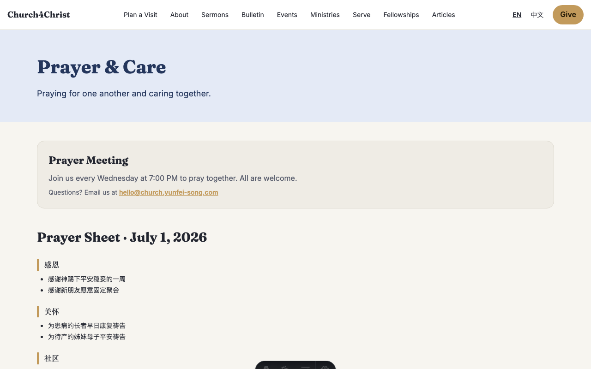
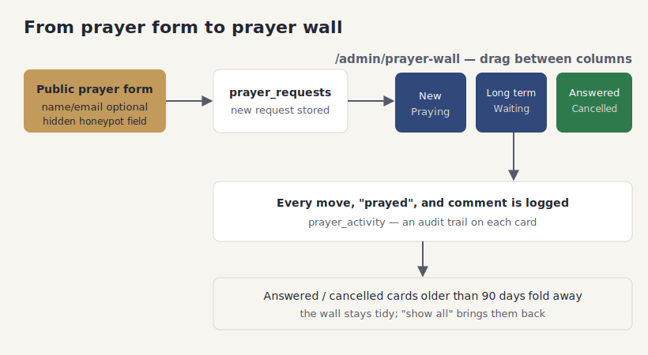

# The prayer wall

## What it does

The prayer wall is how your church receives and cares for prayer requests. Anyone can send
one from the public site — no account needed — and giving a name or email is optional, so
people can ask for prayer privately if they wish. Behind the scenes, the prayer team works
those requests on a simple board in the admin area.

That board is a **kanban**: columns you move cards across as a request's journey unfolds.
A new request lands in "New," moves to "Praying," and eventually to "Answered" or, when it
is a longer road, "Long term" or "Waiting." Moving a card is a drag, or a tap on a small
menu when you are on your phone.

Every action leaves a trace. When someone moves a card, marks that they prayed, or adds a
note, it is recorded on that request's history. And to keep the board from filling up
forever, answered and cancelled requests older than 90 days quietly fold away — still there
if you need them, just out of the daily view.

## How your team uses it

**Receiving a request.** Visitors send prayer requests from a short form on the site (it is
on the home page and on its own prayer page). A hidden anti-spam field keeps bots out, and a
consent checkbox makes sure people mean to share.

**Working the board.** In the admin area, open the prayer wall. Each request is a card in one
of six columns, and each column has a plain meaning:

- **New** — just arrived, not yet picked up.
- **Praying** — the team is actively praying over it.
- **Long term** — an ongoing situation the team keeps carrying week to week.
- **Waiting** — paused, waiting on news or a next step.
- **Answered** — God has answered; a moment to give thanks.
- **Cancelled** — withdrawn, a duplicate, or no longer relevant.

Drag a card to a new column as things progress; each card can also record that someone prayed,
or hold a short comment from the team. A row of summary cards at the top shows how many
requests are New, Praying, and Answered, and the board's total, at a glance.

**The history on each card.** Expand a card to see its trail — every move, every "prayed,"
every note, oldest first. This is how a prayer team hands off between people without losing
the thread of where a request stands.

**Keeping it tidy.** Requests in the two closing columns (Answered, Cancelled) that are more
than 90 days old are hidden from the default view so the board stays about what is active. A
"show all" toggle brings the older cards back whenever you want them.

**Good to know:**

- Requests are **private** — they appear only on the admin board, never on the public site. A
  "prayer wall" here means the team's working board, not a public display.
- People can ask for prayer without leaving a name or email, so treat every request gently and
  assume you may not be able to follow up directly.
- Nothing is ever truly deleted from view — folded-away cards are one toggle from coming back —
  so past requests remain a record of how God has answered.
- Because moves and notes are logged with a timestamp, a prayer team can hand off between
  members and everyone sees the same up-to-date story on each card.
- A hidden spam-trap field and a consent checkbox keep the board free of bot submissions and make
  sure people meant to share, so the team spends its time praying rather than sorting junk.

## How it fits together

The diagram traces a request from the public form, onto the board, across its columns, into
its logged history, and finally into the 90-day fold.

## For developers

- **Intake:** `src/lib/prayerRequest.ts` (`submitPrayerRequest`, honeypot + consent +
  optional name/email) behind `src/pages/api/prayer-request.ts`; the form component is
  `src/components/PrayerForm.astro`.
- **The board:** `src/lib/adminDb.ts` (`PRAYER_STATUSES`, the request list with its 90-day
  fold, `prayer_activity` reads, and the move/log writers) driving
  `src/pages/admin/prayer-wall/index.astro`.
- **Data:** `prayer_requests` holds the request and its status; `prayer_activity` holds the
  per-card trail (`moved` / `prayed` / `comment`).
- **Tests:** `test/prayer-request.test.ts`, `test/adminDb.prayer.test.ts`.
