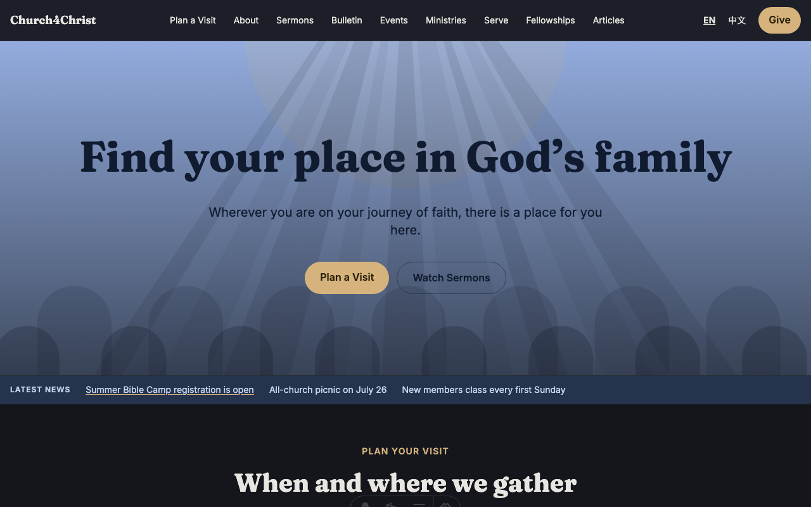
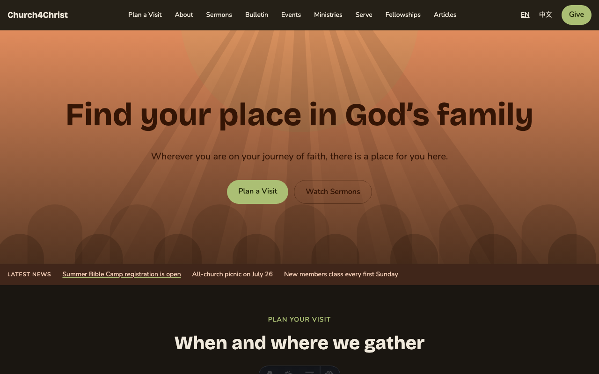
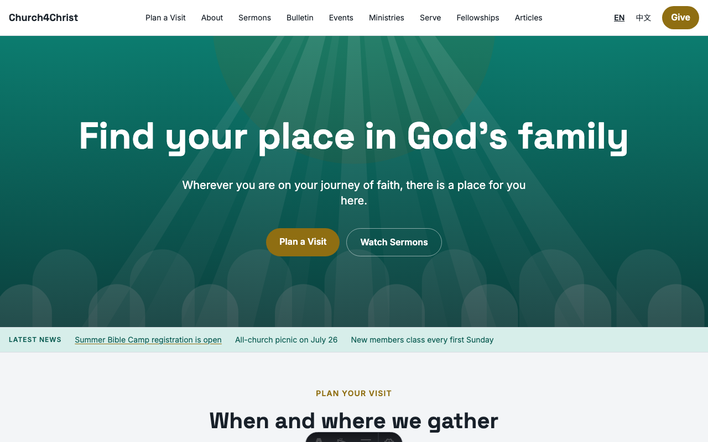
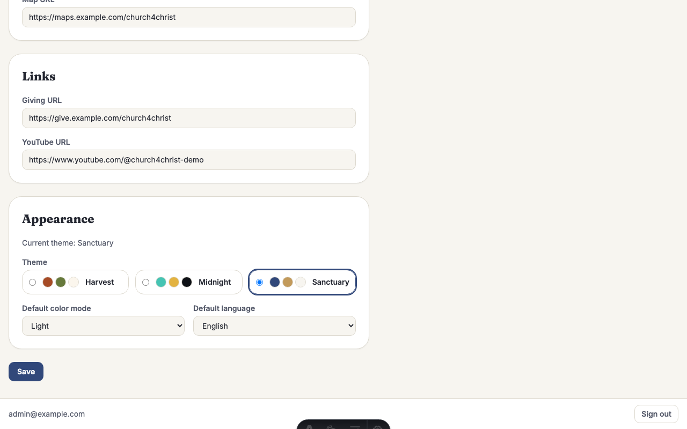
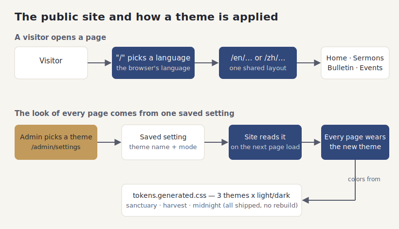

# The public website and themes

## What it does

This is the part of the site everyone can see without signing in: your home page,
service times, news, sermons, the weekly bulletin, events, ministries, staff bios,
articles, and a prayer request form. It is your church's front door on the web.

Every public page comes in two languages, English and Chinese, and a visitor's
browser decides which one to show first. Someone can switch languages at any time
with the toggle in the header, and the page they were reading stays the same page,
just in the other language.

The whole site's look — colors, fonts, light or dark — comes from a single choice
called a **theme**. Three themes ship ready to use, and an admin can switch between
them from the settings page. There is nothing to rebuild or redeploy: pick a theme,
save, and the next page anyone loads wears the new colors.

## How your team uses it

**The home page.** This is what most visitors see first. It carries your hero image,
a rotating news ticker, upcoming events, service times, and a short prayer form.

Here is the same home page in Chinese. The content is written once per language, so
nothing is machine-translated — your team controls both.

**The rest of the public site.** The header menu leads to the sermon archive, the
weekly bulletin, an events page, the ministries directory, staff bios, the pastor's
articles, and pages like "Plan a Visit." Each has its own doc, but they all share the
same header, footer, and theme.

**Choosing a theme.** Three themes are included. Each one also has a light and a dark
version, so there are six looks in total. You do not design these yourself; you pick
the one that fits your church.

| Theme | Light | Dark |
|---|---|---|
| **Sanctuary** (the default — warm blue and gold) |  |  |
| **Harvest** (earthy, warmer tones) |  |  |
| **Midnight** (dark-first, high contrast) |  |  |

**Switching live.** An admin opens the settings page, picks a theme and a default
light/dark mode, and saves. That writes one small setting, and every page picks it up
on its next load — no waiting, no technical steps. Visitors can still flip between
light and dark for themselves using the toggle in the footer.

**Good to know:**

- Colors, fonts, and spacing all come from the theme, so you never end up with mismatched shades
  across pages — the whole site stays consistent by design.
- Want colors that match your church exactly rather than one of the three presets? That is a small
  developer task: adjust the theme's color file and rebuild. An AI assistant like Claude Code can
  do it — point it at this repo and ask (see the main README's "Build it with an AI assistant").
- Photos are not required. The site ships with original illustrated placeholder art, so it looks
  finished on day one; swap in your own photography whenever you are ready.

## How it fits together

The picture below shows the two flows on this page: how a visitor's request finds the
right language, and how the one saved theme restyles the entire site.

## For developers

- **Layout & pages:** `src/layouts/Base.astro` sets `<html data-theme data-mode lang>`
  and includes a tiny inline script that avoids a dark-mode flash. Public routes live
  under `src/pages/[locale]/`.
- **Theme resolution:** `src/lib/theme.ts` (`getActiveTheme`, per-isolate cached) reads
  the `theme.name` / `theme.default_mode` rows via `src/lib/settings.ts`.
- **Design tokens:** `design/themes/{sanctuary,harvest,midnight}.json` are the source of
  truth; `scripts/build-tokens.mjs` compiles them into `src/styles/tokens.generated.css`
  (all three themes × light/dark), and `scripts/check-tokens.mjs` fails the build on any
  raw hex/font literal in `src/`. Components use semantic utilities only (`bg-primary`,
  `text-ink-muted`), wired up in `src/styles/base.css`.
- **Locale routing:** `src/lib/locales.ts` (`pickLocaleFromHeader`, `localePath`) and the
  redirect in `src/middleware.ts`.
- **Tests:** `test/theme.test.ts`, `test/themeMeta.test.ts`, `test/tokens.test.ts`,
  `test/locales.test.ts`; the end-to-end home-render checks live in `test/e2e/`.
