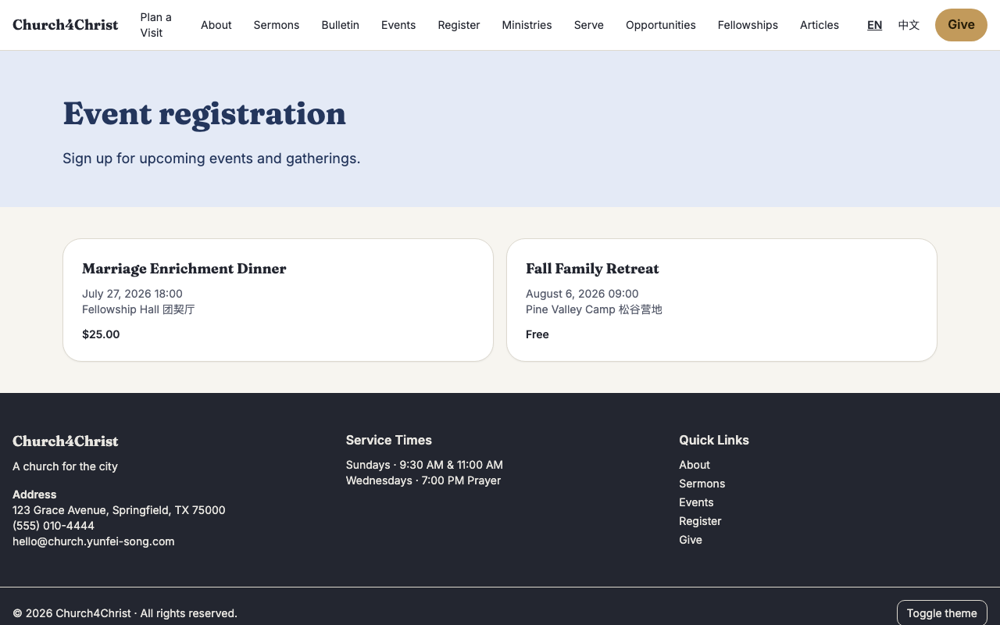
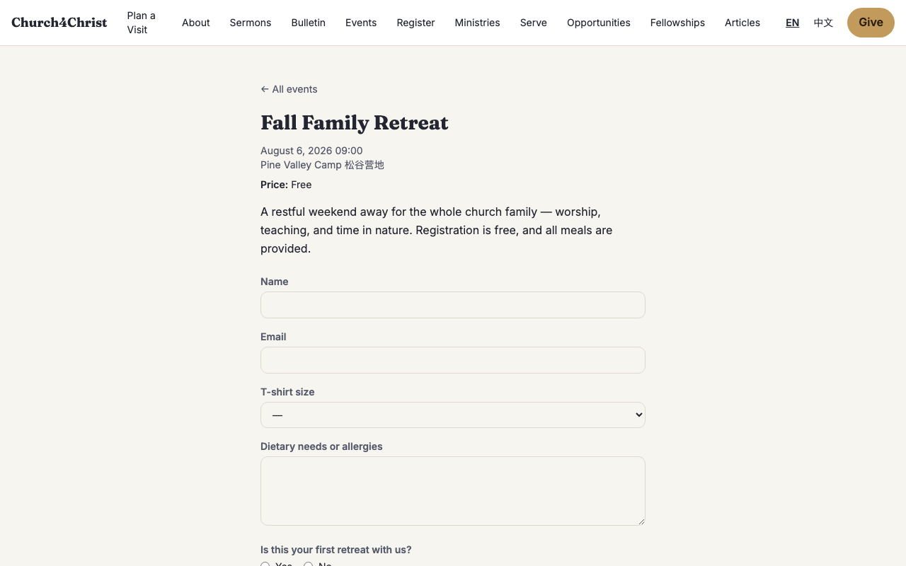
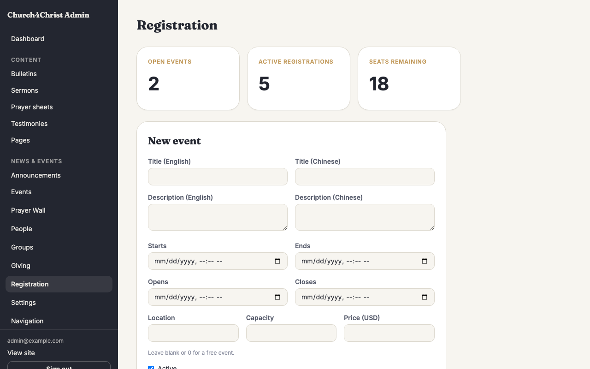
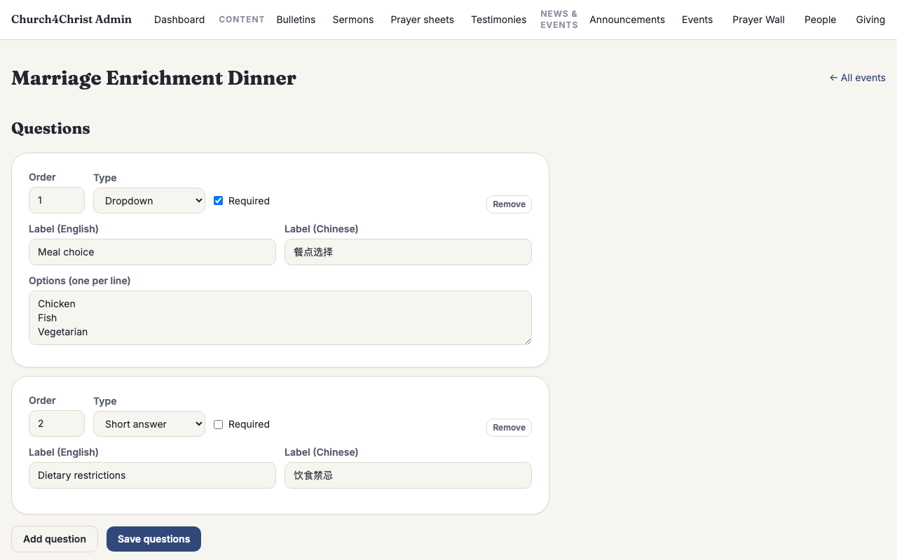
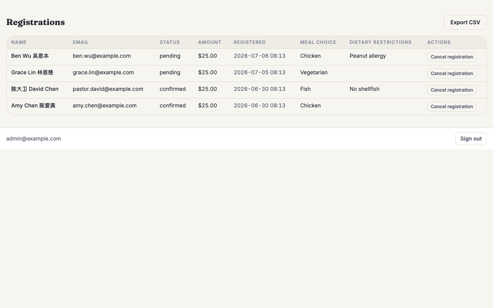
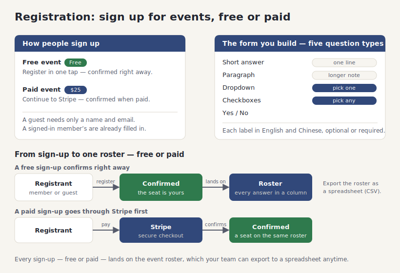

# Registration (sign-ups for events, free or paid)

## What it does

**Registration** lets your church put an event online and collect sign-ups — a free family
retreat, a paid marriage dinner, a summer camp with a T-shirt size to choose. You create the
event, add whatever questions you need to ask, set a price and a seat limit if there is one,
and share the link. Members and first-time guests fill in the form, pay by card when the event
costs money, and land on a confirmation page. Your team watches the roster fill up and exports
it to a spreadsheet whenever they need it.

It brings together the things a church normally patches from a paper sign-up sheet, a
separate payment link, and a spreadsheet:

- **Events anyone can sign up for.** A guest can register without an account — just a name and
  an email. A signed-in member registers with one tap, their name and email already filled in.
  Each event shows its date, place, and price (or **Free**) on a simple public page.
- **The questions you actually need.** Every event carries its own short form. Ask for a
  **T-shirt size** as a dropdown, **dietary needs** as a paragraph, **first time?** as a
  yes/no — five field types in all, each in English and Chinese, each optional or required as
  you choose.
- **Payment built in, when it is a paid event.** Set a price and the sign-up continues to
  **Stripe's** secure checkout; the church never handles a card number. A free event skips
  payment entirely and confirms on the spot.
- **A roster your team can export.** Every registration lands on the event's roster with its
  answers laid out in columns. One click downloads the whole roster as a spreadsheet
  (CSV) — names, emails, amounts, and every answer — ready for name tags, meal counts, or a
  check-in list.

Because some events cost money and every roster holds people's names and emails, the module is
careful: card numbers are handled only by Stripe, a paid seat is only ever confirmed by
Stripe's own signed notification, and the roster and its export are open only to your staff.

## How your team uses it

**A member or guest signs up.** The public page at `/register` lists every event currently open
for sign-up — each as a card with its date, location, and price or a **Free** label, and a
**Full** badge once every seat is taken. Opening an event shows its details and a form built
from the questions you set. A signed-in member sees their name and email already filled in; a
guest types both. For a free event, submitting registers them right away and shows a
"you're registered" page. For a paid event, submitting continues to Stripe to pay, and the seat
is confirmed the moment the payment clears.





**Creating an event.** The admin page at `/admin/registration` has a form for a new event:
a title and description in English and Chinese, when it **starts** and **ends**, an optional
**location**, an optional **capacity** (leave it blank for unlimited), and a **price** in
dollars (leave it blank or `0` for a free event). Two optional fields — **Opens** and
**Closes** — control the sign-up window: by default an event is open right away and stays open
until it starts, but you can open sign-ups later or close them early. Below the form, a table
lists every event with how many have registered, its price, and whether it is active. Editing an
event reuses the same form, and unchecking **Active** hides an event without deleting it (its
registrations stay on the roster).



**Adding questions.** Each event has its own **Questions & roster** page at
`/admin/registration/<event>`. The question builder lets you add as many questions as you like,
each with a type:

- **Short answer** — a single line (a name, a phone number).
- **Paragraph** — a longer note (dietary needs, special requests).
- **Dropdown** — pick one from a list you type in (a T-shirt size, a workshop choice).
- **Checkboxes** — pick any number from a list (which sessions to attend).
- **Yes / No** — a simple yes-or-no.

Each question has an English and a Chinese label, an order number, and a **Required** switch.
Dropdown and checkbox questions get an **Options** box where you type each choice on its own
line. You can add and remove questions and reorder them, and editing a question later keeps the
answers people have already given.



**Watching the roster and exporting it.** The same page lists every registration below the
questions — name, email, status (**confirmed**, **pending**, or **cancelled**), amount, when they
signed up, and each answer in its own column. An admin can **cancel** a registration, which frees
its seat. The **Export CSV** button downloads the whole roster as a spreadsheet file, one column
per question, ready to open in Excel or Google Sheets for name tags, meal counts, or a check-in
list.



**Payments (Stripe).** A paid event runs its money through **Stripe**, exactly like the Giving
module — the church never sees a card number. When someone registers for a paid event, the seat
is held as **pending** while they are at Stripe's checkout, and it becomes **confirmed** only
when Stripe sends back its signed confirmation that the payment cleared. If they abandon the
payment, Stripe's expiry notice releases the held seat automatically, so an unfinished checkout
never quietly blocks a spot. A free event never touches Stripe at all.

**Capacity and the sign-up window.** When you set a **capacity**, both confirmed sign-ups and
seats currently being paid for count toward it — so a seat someone is in the middle of paying
for is not quietly handed to someone else. When every seat is taken, the event shows **Full** and its form is replaced
by a "this event is full" notice. Leave capacity blank for an unlimited event. The **Opens** and
**Closes** times let you schedule when sign-ups begin and end; outside that window the event
simply does not appear as open.

**Who can manage events.** Creating events, editing questions, and viewing or exporting the
roster are open to an **admin** or an **editor** (the same staff who run bulletins and events).
A volunteer team leader with no editor role cannot reach these pages or download a roster —
the roster is people's names, emails, and answers, so access stays deliberately narrow. The
public sign-up pages, of course, are open to everyone, and a hidden anti-spam field quietly
drops bot submissions so they can never exhaust an event's seats.

## How it fits together

You create an event and add its questions. Members and guests sign up on the public page; a
free sign-up confirms immediately, while a paid one continues to Stripe and confirms when the
payment clears. Every sign-up lands on the event's roster with its answers, which your team can
export to a spreadsheet at any time.



## Setting it up

Registration runs on the **Supabase (Postgres) backend** — it stays switched off on the default
D1 setup, because paid events need Stripe and a database that can hold the checkout state. Stand
up the Supabase backend first (see [`docs/supabase-setup.md`](../supabase-setup.md)). Free events
work with no payment setup at all; to take money for paid events, add Stripe the same way the
Giving module does:

1. **Import Stripe test credentials through setup.** Pass an `sk_test_…` key and the test
   endpoint's `whsec_…` signing secret only to the setup process:

   ```bash
   CHURCH_SETUP_STRIPE_SECRET_KEY="sk_test_…" \
   CHURCH_SETUP_STRIPE_WEBHOOK_SECRET="whsec_…" \
   npm run setup
   ```

   Setup writes the runtime secrets automatically. The `CHURCH_SETUP_STRIPE_*` values are
   one-shot setup inputs, not ambient runtime variables. Live keys are rejected, and signed
   live webhook events receive `400 live_mode_disabled` without storage. If Giving already
   imported these test credentials, Registration uses the same pair.
2. **Point a Stripe webhook at your site.** In the Stripe dashboard, add one shared endpoint at
   `https://your-site/api/stripe/webhook` and subscribe it to all eight events:
   `checkout.session.completed`, `checkout.session.expired`,
   `checkout.session.async_payment_succeeded`, `checkout.session.async_payment_failed`,
   `invoice.paid`, `charge.refunded`, `customer.subscription.updated`, and
   `customer.subscription.deleted`. Completed or asynchronously successful payment confirms a
   paid seat; expiry or asynchronous failure releases it. Use the signing secret as the
   `CHURCH_SETUP_STRIPE_WEBHOOK_SECRET` input in step 1. Registration and Giving share this one
   endpoint — each event tells them apart on its own.
3. **Create your first event** on `/admin/registration`, add its questions on the event's
   **Questions & roster** page, and share the public link (`/register`).

Supabase runs durable webhook and pending-Checkout recovery every five minutes. Admins and
finance users can reconcile, attach a retrieved and verified `cs_test_…` session, or perform
an explicitly confirmed cancellation from `/admin/stripe-events`; raw request and customer
data are not displayed. D1 does not support Registration or Stripe operations.

The **payment operations** permission covers both Giving and paid Registration. Grant it only
to people trusted to reconcile Stripe events, attach verified sessions, and explicitly cancel
pending paid registrations as well as manage gifts.

Free events need none of the Stripe steps — create the event, add questions, and share the link.
Add Stripe only when you want to charge for one.

## For developers

- **Backend gating:** `registration` is a Supabase-only module (`requiresBackend: 'supabase'` in
  `src/lib/modules.ts`) — the enablement filter force-disables it on D1 regardless of its
  settings row. It owns the `/register` and `/api/register` public prefixes and the
  `/admin/registration` admin prefix, and depends on no other module.
- **Schema:** `migrations-supabase/0003_registration.sql` adds `reg_events` + `reg_event_i18n`,
  `reg_questions` + `reg_question_i18n`, `registrations`, and `reg_answers`. Money is **integer
  cents**; a paid registration carries a partial unique index on `stripe_checkout_session_id` so
  a redelivered webhook dedups, and `registrations(event_id, status)` is indexed for the seat
  counts.
- **Data library:** `src/lib/regDb.ts` holds the open-window event reads with live seat counts,
  the answer validator (`validateAnswers`), the atomic registration+answers writer with its
  documented capacity-race backstop (`createRegistration`), the Checkout-session lifecycle
  transitions (`attachCheckoutSession` / `confirmBySession` / `cancelBySession`), the admin
  event + question editors (`saveEvent` / `saveQuestions`), and the roster + RFC4180 CSV export.
  Form parsing lives in `src/lib/regForms.ts`.
- **Submit + webhook:** `src/pages/api/register/submit.ts` (module-gates, resolves identity,
  validates answers, then splits free→confirmed vs paid→pending+Stripe, compensating by
  cancelling the pending row if Stripe fails). Paid registrations ride the **same** Stripe
  webhook as giving: `src/pages/api/stripe/webhook.ts` → `src/lib/givingWebhook.ts`, routed by
  `metadata.kind === 'registration'` — `checkout.session.completed` confirms the seat,
  `checkout.session.expired` frees it, and a gift event is never touched by the registration
  branch.
- **Access:** the two admin pages and the CSV route re-tighten from the `console` route class to
  `editor ∪ admin` before any DB read (the roster is PII); the public pages and the submit
  endpoint are open, with a honeypot field that silently drops bot sign-ups so they cannot
  exhaust capacity.
- **Demo data:** `seed/registration-seed.sql` (Postgres-only, applied by
  `scripts/db/seed-supabase.mjs` after `dev-seed.sql` and `giving-seed.sql`) seeds one free
  upcoming event with three questions, one paid $25 event (capacity 20), and seven
  registrations — confirmed and pending, with answers — all fictional, with obviously-fake
  Stripe ids and relative dates.
- **Tests:** the `test/pg/` suites against real Postgres — `regDb.test.ts`, `regSchema.test.ts`,
  `regWebhook.test.ts` — plus the migration-runner check in `test/pg/runner.test.ts`. See
  [Modules](modules.md) for the on/off behavior.
