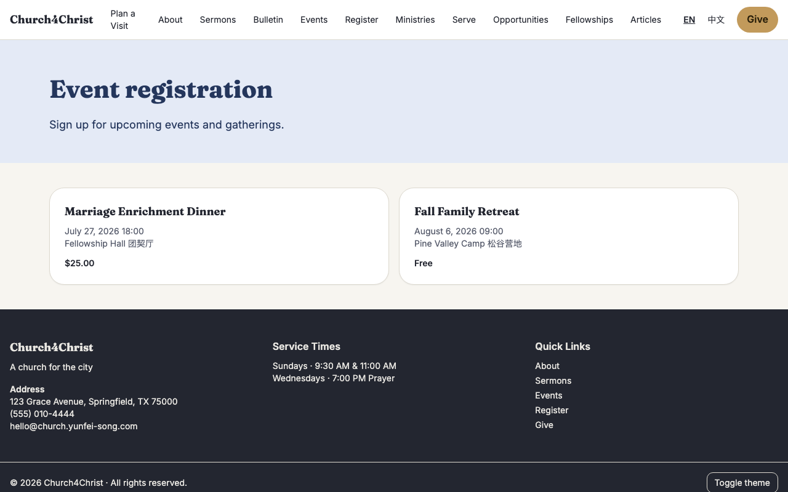
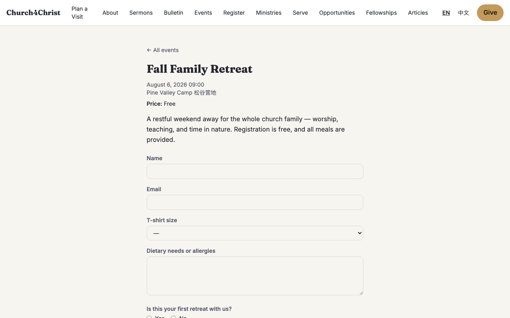
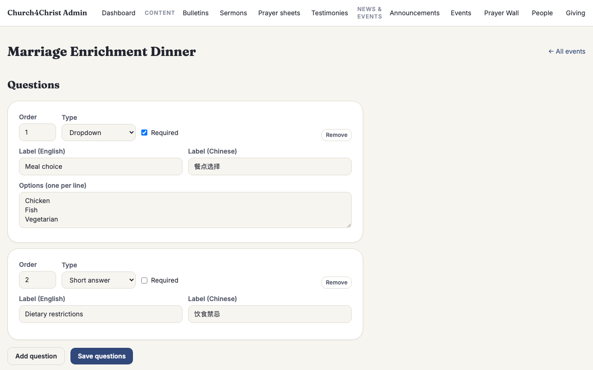
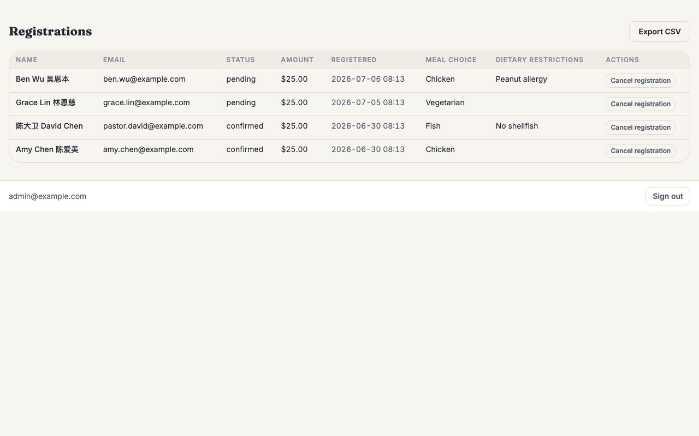
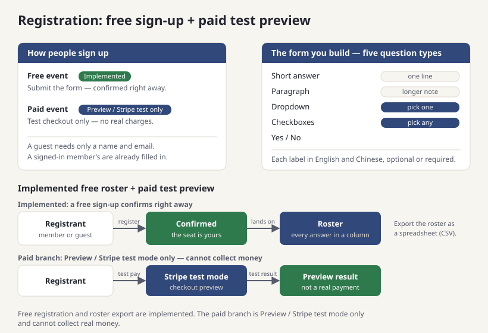

# Registration (free sign-ups and paid checkout Preview)

> **Preview — Stripe test mode only.** Free event registration is implemented and does not
> require Stripe. Paid registration is a test-only Preview that accepts test credentials and
> test cards; it must not be used to collect event fees.

## What it does

**Registration** lets your church put a free event online and collect sign-ups, custom answers,
and roster data without Stripe. You create the event, add the questions you need, set a seat
limit if there is one, and share the link. The same module includes a paid-checkout Preview for
evaluating the Stripe test flow, but that path is not available for production fees.

It brings together the things a church normally patches from a paper sign-up sheet, a
separate payment link, and a spreadsheet:

- **Events anyone can sign up for.** A guest can register without an account — just a name and
  an email. A signed-in member registers with one tap, their name and email already filled in.
  Each event shows its date, place, and price (or **Free**) on a simple public page.
- **The questions you actually need.** Every event carries its own short form. Ask for a
  **T-shirt size** as a dropdown, **dietary needs** as a paragraph, **first time?** as a
  yes/no — five field types in all, each in English and Chinese, each optional or required as
  you choose.
- **Paid-checkout Preview.** Set a test price and the sign-up can continue to **Stripe test
  mode**, where Stripe handles test-card details. This is for evaluating the workflow only;
  a free event skips Stripe entirely and confirms on the spot.
- **A roster your team can export.** Every registration lands on the event's roster with its
  answers laid out in columns. One click downloads the whole roster as a spreadsheet
  (CSV) — names, emails, amounts, and every answer — ready for name tags, meal counts, or a
  check-in list.

Because every roster holds people's names and emails, its pages and exports are open only to
staff. In the paid Preview, test-card details stay at Stripe and a pending test seat is confirmed
only by Stripe's signed test-mode notification. Those controls do not make paid registration
production-ready.

## How your team uses it

**A member or guest signs up.** The public page at `/register` lists every event currently open
for sign-up — each as a card with its date, location, and price or a **Free** label, and a
**Full** badge once every seat is taken. Opening an event shows its details and a form built
from the questions you set. A signed-in member sees their name and email already filled in; a
guest types both. For a free event, submitting registers them right away and shows a
"you're registered" page. For a paid Preview event, submitting continues to Stripe test
checkout, and the seat is confirmed when the signed test event is processed.





**Creating an event.** The admin page at `/admin/registration` has a form for a new event:
a title and description in English and Chinese, when it **starts** and **ends**, an optional
**location**, an optional **capacity** (leave it blank for unlimited), and a **price** in
dollars (leave it blank or `0` for a free event). Two optional fields — **Opens** and
**Closes** — control the sign-up window: by default an event is open right away and stays open
until it starts, but you can open sign-ups later or close them early. Below the form, a table
lists every event with how many have registered, its price, and whether it is active. Editing an
event reuses the same form, and unchecking **Active** hides an event without deleting it (its
registrations stay on the roster). A row of summary cards above the form shows how many events
are currently open, how many active registrations there are, and how many seats remain across
those events, at a glance.


**Adding questions.** Each event has its own **Questions & roster** page at
`/admin/registration/<event>`. The question builder lets you add as many questions as you like,
each with a type:

- **Short answer** — a single line (a name, a phone number).
- **Paragraph** — a longer note (dietary needs, special requests).
- **Dropdown** — pick one from a list you type in (a T-shirt size, a workshop choice).
- **Checkboxes** — pick any number from a list (which sessions to attend).
- **Yes / No** — a simple yes-or-no.

Each question has an English and a Chinese label, an order number, and a **Required** switch.
Dropdown and checkbox questions get an **Options** box where you type each choice on its own
line. You can add and remove questions and reorder them, and editing a question later keeps the
answers people have already given.



**Watching the roster and exporting it.** The same page lists every registration below the
questions — name, email, status (**confirmed**, **pending**, or **cancelled**), amount, when they
signed up, and each answer in its own column. An admin can **cancel** a registration, which frees
its seat. The **Export CSV** button downloads the whole roster as a spreadsheet file, one column
per question, ready to open in Excel or Google Sheets for name tags, meal counts, or a check-in
list.



**Paid checkout (Stripe Preview).** In test mode, a paid event exercises the same checkout
lifecycle as Giving. The seat is held as **pending** during Stripe test checkout and becomes
**confirmed** only after the signed test event is processed. An expiry event releases the test
hold. A free event never touches Stripe, and the paid path must not be used for event fees.

**Capacity and the sign-up window.** When you set a **capacity**, both confirmed sign-ups and
pending test checkouts count toward it, so the paid Preview can exercise seat holds. When every
seat is taken, the event shows **Full** and its form is replaced
by a "this event is full" notice. Leave capacity blank for an unlimited event. The **Opens** and
**Closes** times let you schedule when sign-ups begin and end; outside that window the event
simply does not appear as open.

**Who can manage events.** Creating events, editing questions, and viewing or exporting the
roster are open to an **admin** or an **editor** (the same staff who run bulletins and events).
A volunteer team leader with no editor role cannot reach these pages or download a roster —
the roster is people's names, emails, and answers, so access stays deliberately narrow. The
public sign-up pages, of course, are open to everyone, and a hidden anti-spam field quietly
drops bot submissions so they can never exhaust an event's seats.

## How it fits together

You create an event and add its questions. Members and guests can complete implemented free
sign-ups on the public page. A paid Preview continues to Stripe test checkout and exercises the
pending-to-confirmed lifecycle. Every resulting registration lands on the event roster with its
answers for CSV export.



## Setting it up

Registration is **Supabase (Postgres)-only in the current implementation**. The module gate keeps
it off in the D1 configuration as a current repository boundary. Stand up the Supabase backend first (see
[`docs/supabase-setup.md`](../supabase-setup.md)). Free events need no payment setup; configure
Stripe only to evaluate the paid test Preview:

1. **Import Stripe test credentials through setup.** Pass an `sk_test_…` key and the test
   endpoint's `whsec_…` signing secret only to the setup process:

   ```bash
   CHURCH_SETUP_STRIPE_SECRET_KEY="sk_test_…" \
   CHURCH_SETUP_STRIPE_WEBHOOK_SECRET="whsec_…" \
   npm run setup
   ```

   Setup writes the runtime secrets automatically. The `CHURCH_SETUP_STRIPE_*` values are
   one-shot setup inputs, not ambient runtime variables. Live keys are rejected, and signed
   live webhook events receive `400 live_mode_disabled` without storage. If Giving already
   imported these test credentials, Registration uses the same pair.
2. **Point a Stripe test-mode webhook at your site.** In the Stripe dashboard's test mode, add
   one shared endpoint at `https://your-site/api/stripe/webhook` and subscribe it to all eight
   events:
   `checkout.session.completed`, `checkout.session.expired`,
   `checkout.session.async_payment_succeeded`, `checkout.session.async_payment_failed`,
   `invoice.paid`, `charge.refunded`, `customer.subscription.updated`, and
   `customer.subscription.deleted`. Completed or asynchronously successful payment confirms a
   paid seat; expiry or asynchronous failure releases it. Use the signing secret as the
   `CHURCH_SETUP_STRIPE_WEBHOOK_SECRET` input in step 1. Registration and Giving share this one
   endpoint — each event tells them apart on its own.
3. **Create your first event** on `/admin/registration`, add its questions on the event's
   **Questions & roster** page, and share the public link (`/register`).

Supabase runs durable test-webhook and pending-Checkout recovery every five minutes. Admins and
finance users can reconcile, attach a retrieved and verified `cs_test_…` session, or perform
an explicitly confirmed cancellation from `/admin/stripe-events`; raw request and customer
data are not displayed. The current D1 implementation does not enable Registration or Stripe
operations.

The **payment operations** permission covers both Giving and paid Registration. Grant it only
to people trusted to reconcile Stripe events, attach verified sessions, and explicitly cancel
pending paid registrations as well as manage gifts.

Free events need none of the Stripe steps — create the event, add questions, and share the link.
Use the Stripe steps only to test the paid Preview; they do not enable production charges.

## For developers

- **Backend gating:** `registration` is Supabase-only in the current implementation
  (`requiresBackend: 'supabase'` in `src/lib/modules.ts`) — the enablement filter force-disables
  it on D1 regardless of its settings row. It owns the `/register` and `/api/register` public
  prefixes and the `/admin/registration` admin prefix, and depends on no other module.
- **Schema:** `migrations-supabase/0003_registration.sql` adds `reg_events` + `reg_event_i18n`,
  `reg_questions` + `reg_question_i18n`, `registrations`, and `reg_answers`. Money is **integer
  cents**; a paid registration carries a partial unique index on `stripe_checkout_session_id` so
  a redelivered webhook dedups, and `registrations(event_id, status)` is indexed for the seat
  counts.
- **Data library:** `src/lib/regDb.ts` holds the open-window event reads with live seat counts,
  the answer validator (`validateAnswers`), the atomic registration+answers writer with its
  documented capacity-race backstop (`createRegistration`), the Checkout-session lifecycle
  transitions (`attachCheckoutSession` / `confirmBySession` / `cancelBySession`), the admin
  event + question editors (`saveEvent` / `saveQuestions`), and the roster + RFC4180 CSV export.
  Form parsing lives in `src/lib/regForms.ts`.
- **Submit + webhook:** `src/pages/api/register/submit.ts` (module-gates, resolves identity,
  validates answers, then splits free→confirmed vs paid→pending+Stripe, compensating by
  cancelling the pending row if Stripe fails). Paid registrations ride the **same** Stripe
  webhook as giving: `src/pages/api/stripe/webhook.ts` → `src/lib/givingWebhook.ts`, routed by
  `metadata.kind === 'registration'` — `checkout.session.completed` confirms the seat,
  `checkout.session.expired` frees it, and a gift event is never touched by the registration
  branch.
- **Access:** the two admin pages and the CSV route re-tighten from the `console` route class to
  `editor ∪ admin` before any DB read (the roster is PII); the public pages and the submit
  endpoint are open, with a honeypot field that silently drops bot sign-ups so they cannot
  exhaust capacity.
- **Demo data:** `seed/registration-seed.sql` (Postgres-only, applied by
  `scripts/db/seed-supabase.mjs` after `dev-seed.sql` and `giving-seed.sql`) seeds one free
  upcoming event with three questions, one paid $25 event (capacity 20), and seven
  registrations — confirmed and pending, with answers — all fictional, with obviously-fake
  Stripe ids and relative dates.
- **Tests:** the `test/pg/` suites against real Postgres — `regDb.test.ts`, `regSchema.test.ts`,
  `regWebhook.test.ts` — plus the migration-runner check in `test/pg/runner.test.ts`. See
  [Modules](modules.md) for the on/off behavior.
