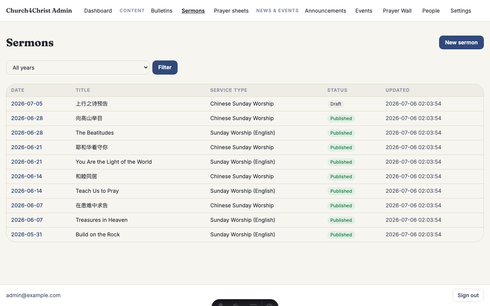
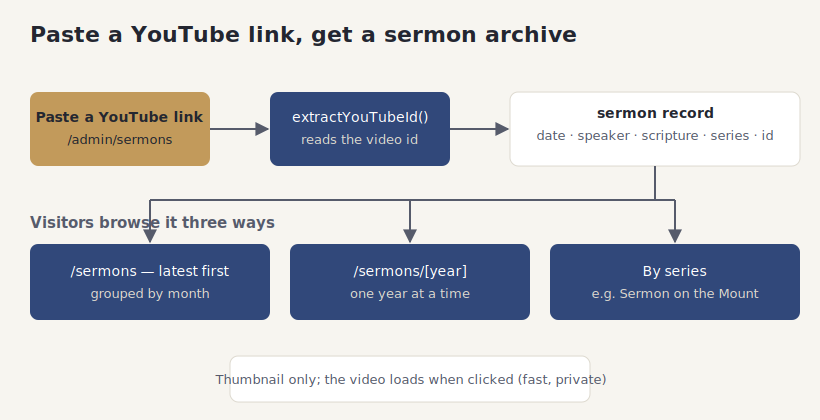

# The sermon archive

## What it does

The sermon archive is your searchable library of past messages. Each sermon carries a date,
a speaker, the scripture passage, an optional series name, and a link to the video. Visitors
can watch any past sermon and browse the whole collection by month, by year, or by series.

Adding a sermon is meant to be almost effortless: you paste the YouTube link, and the site
figures out the video id for you. There is no file to upload and no embed code to copy —
just the link you already have from posting the service video.

On the public pages, the video does not load until someone actually clicks play. Until then
the page shows a lightweight thumbnail. That keeps the archive fast and avoids loading a
video player for every sermon on the page.

## How your team uses it

**Adding a sermon.** Open the sermons section in the admin area, start a new entry, and fill
in the date, speaker, scripture, and series. Paste the YouTube link into the video field —
you can paste the full `youtube.com/watch?v=…` address or the short `youtu.be/…` one, and the
site pulls out the video id either way.

**Series.** Give a run of messages the same series name — for example, "Sermon on the Mount"
or "Psalms of Ascent" — and the site groups them together so visitors can follow the whole
teaching series in order. A series is just a name you reuse; there is nothing separate to set
up first, and a sermon that is not part of any series is perfectly fine on its own.

**Draft first, if you like.** A sermon can be saved as a draft while you gather the details —
say you have the date and speaker but the video is not posted yet — and published later. Only
published sermons show up in the public archive, so nothing half-finished leaks out.

**Editing and fixing.** Open any past sermon to correct a typo in the title, fix the scripture
reference, or swap the video link. As with the rest of the admin area, each save keeps the
previous version, so a bad edit can be rolled back from the sermon's history.

**How visitors browse it.** The public archive lists sermons newest-first, grouped by month,
with a shortcut to jump to a specific year. Each card shows the title, speaker, date, and
scripture, and plays the video in place when clicked.

If a video's thumbnail is ever missing, the card falls back to a styled placeholder instead
of a broken image, so the archive always looks tidy.

**The year archive.** Alongside the newest-first list, visitors can open a single year on its own
page — useful when someone remembers roughly when a message was given but not its title. Each
year's page shows just that year's sermons, still grouped by month.

**Good to know:**

- You do not need to upload anything — the video stays on YouTube, and the site just links to it.
- The video player only loads after a click, so a page full of sermons still loads fast.
- Each service (for example, English worship vs. Chinese worship) keeps its own sermons, so the
  two archives never get tangled together.
- Getting the date and speaker right matters more than the title — that is what people search by.
- A series name is optional and free-form; you can start using one at any time, even partway
  through a run of messages, and reuse it as often as you like.

## How it fits together

The diagram shows the paste-a-link workflow on top and the three ways visitors browse the
archive below.

## For developers

- **Link parsing:** `src/lib/youtube.ts` (`extractYouTubeId`) accepts watch, short, and
  embed URL shapes and returns the bare id (or null).
- **Editing:** `src/lib/adminDb.ts` (sermon upsert + revision snapshot) with
  `src/pages/admin/sermons/index.astro` + `[id].astro`.
- **Public archive:** `src/pages/[locale]/sermons/index.astro` and
  `src/pages/[locale]/sermons/[year].astro`, rendering
  `src/components/SermonCard.astro`, `SermonMonthGrid.astro`, and the click-to-load facade in
  `src/components/YouTubeEmbed.astro`.
- **Data:** sermons are keyed by `(service_type_id, sermon_date)` and carry a `series` column
  for grouping.
- **Tests:** `test/youtube.test.ts`, `test/adminDb.content.test.ts`, `test/publicDb.test.ts`.
