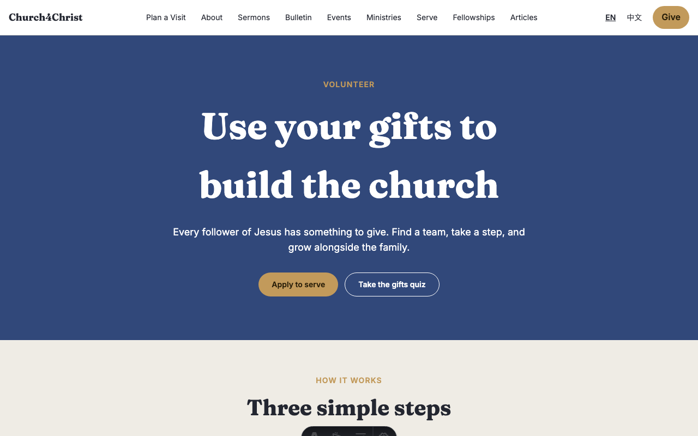
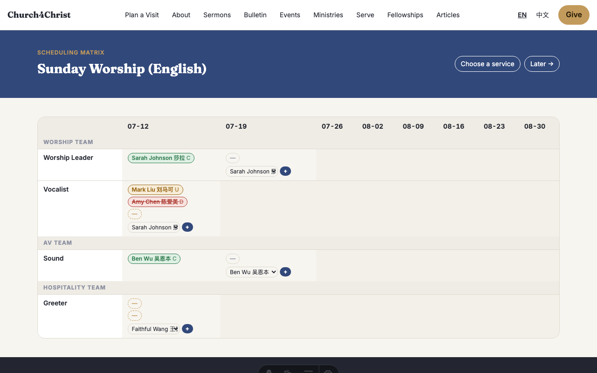
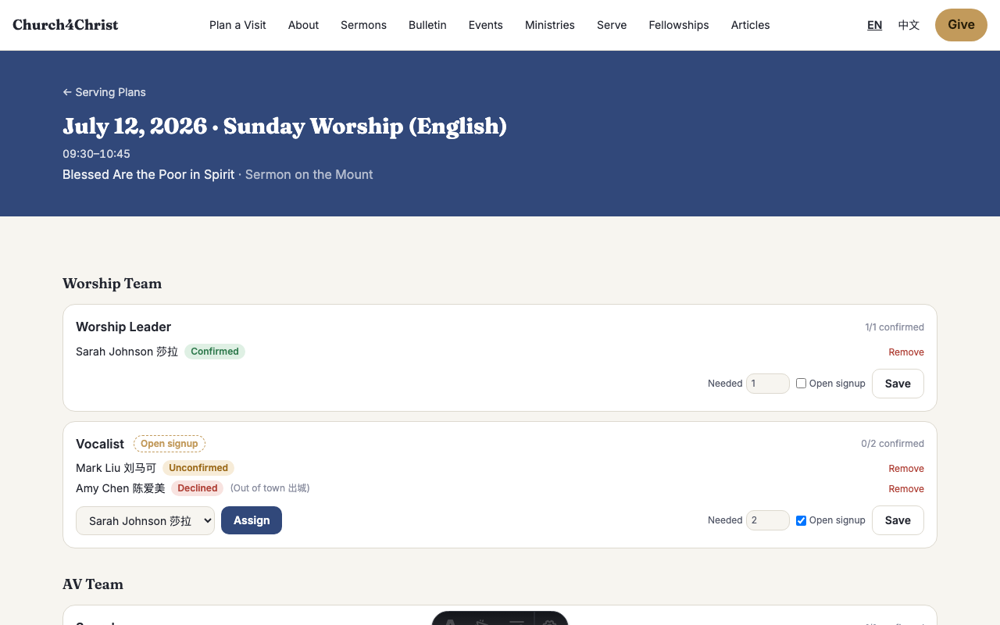
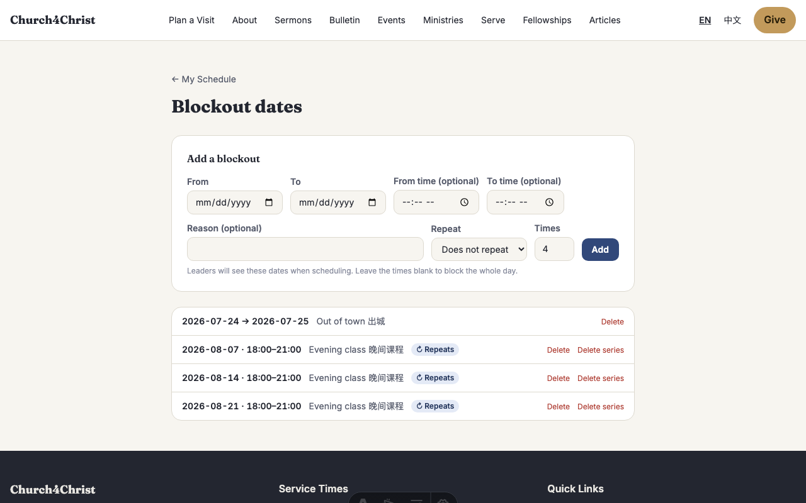
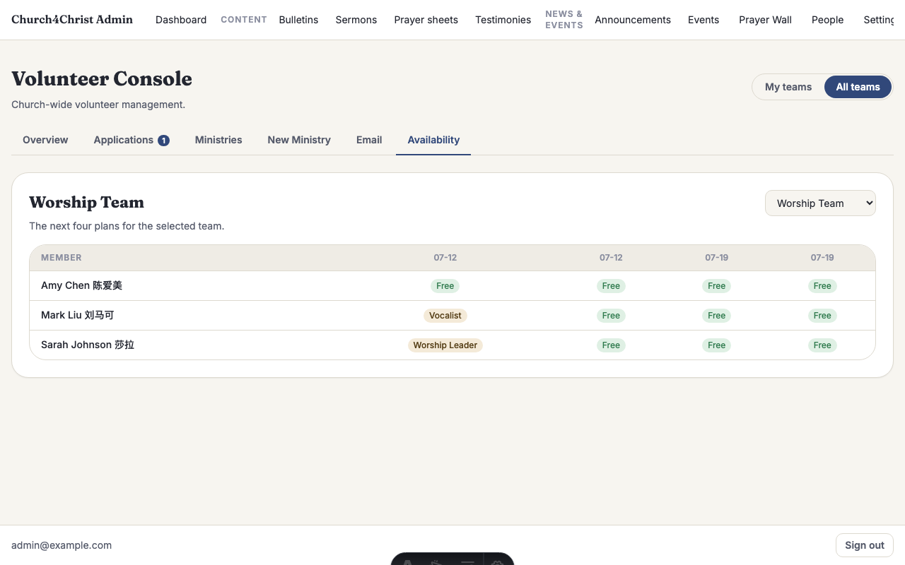
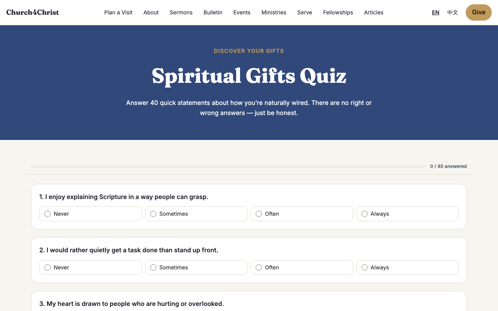
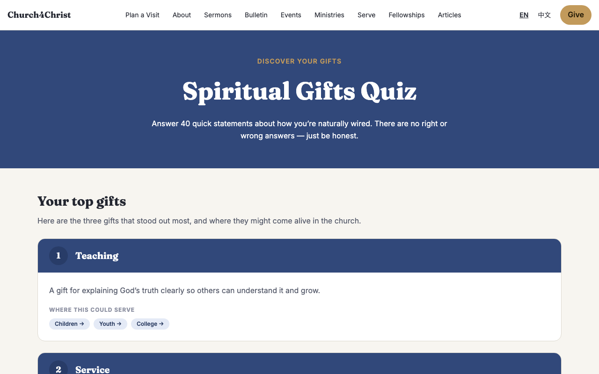
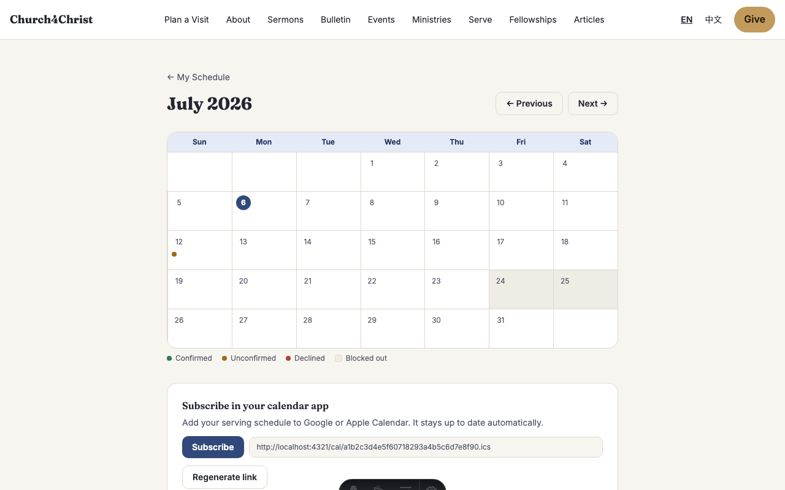
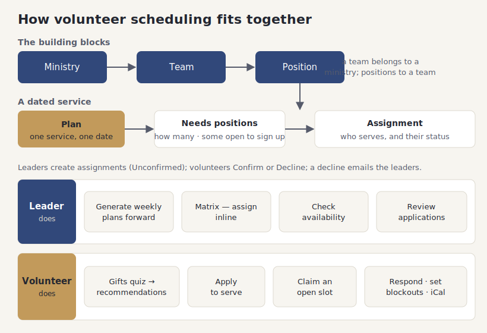

# The serve module (volunteer scheduling)

## What it does

The serve module (volunteer scheduling) is how your church organizes people to serve:
worship, children, hospitality, tech, and every other team. It answers the weekly
questions — who is on next Sunday, what roles are still open, who has not confirmed yet —
and it lets volunteers see and respond to their own schedule.

Everything is built from four simple pieces. A **ministry** (like Worship) contains one or
more **teams**; a team defines its **positions** (like Vocalist or Sound); and a **plan** is
one dated service that needs some of those positions filled. When a leader puts a person in a
position on a plan, that is an **assignment**. Assignments start as Unconfirmed, and the
volunteer either Confirms or Declines.

Around that core are the everyday tools: a spreadsheet-style matrix for scheduling a whole
month at once, open slots volunteers can claim themselves, blockout dates so no one is booked
while they are away, an availability view, a spiritual-gifts quiz that suggests where someone
might serve, an apply-to-serve flow, automatic reminder and digest emails, and a personal
calendar each volunteer can subscribe to.

## How your team uses it

**The serve landing page.** Volunteers start here: their upcoming assignments, open slots they
could pick up, and links to the gifts quiz and to apply.

**Setting up teams.** An admin creates a ministry and its teams. A new-ministry wizard walks
you through naming the ministry, adding teams, and listing each team's positions in one guided
flow, so a new area of serving is ready in a few minutes.

**Scheduling with the matrix.** This is the leader's main tool. The matrix lays out plans down
one axis and positions across the other, so a leader can fill an entire month at a glance.
Click a cell to assign someone; the site warns if that person is already booked elsewhere that
day or has a blockout, and the leader can still go ahead if they mean to.

**One plan at a time.** Each plan also has its own page showing every position, who is on it,
and their status (Unconfirmed, Confirmed, Declined). Leaders generate future plans in one step —
the site copies a service's needs forward week by week, up to about a year ahead.

**Volunteers respond.** When a leader assigns someone, that volunteer gets an email with a
single-use link to accept or decline — no sign-in required. A decline immediately emails the
team's leaders so they can find a replacement instead of discovering the gap on Sunday.
Volunteers can also **claim** an open slot themselves from the serve page.

**Blockouts.** A volunteer marks the dates they are unavailable — a weekend away, a season of
travel — as single days, ranges, or repeating dates. Leaders see those blockouts while
scheduling, so people are not booked when they cannot be there.

**Availability, at a glance.** Leaders can open an availability view that shows, for a team,
who is free and who is blocked across upcoming plans — useful when you need to fill a hole fast.

**The gifts quiz.** People who are not sure where to serve can take a short spiritual-gifts
assessment: 40 statements answered on a simple "never to always" scale.

The results highlight a person's top gifts and, from those, recommend ministries that fit —
which they can add to their interests so leaders know they are open to serving there.

**Applying to serve.** When someone wants to join a team, they apply from the site. The team's
leaders get an email, review the application, and approve or decline it; the applicant is
emailed the result either way. Every open team and serving date is also gathered onto one
**opportunity board** at `/serve/opportunities` that anyone can browse and apply from — see
[People & households](people-households.md).

**My schedule and calendar.** Every volunteer has a personal schedule and a month calendar,
plus a private subscribe link that adds their serving dates to Apple Calendar, Google Calendar,
or Outlook — so their commitments show up next to the rest of their life.

**Reminders and the weekly digest.** The site nudges people automatically: a reminder to anyone
still unconfirmed as their service approaches, and a weekly digest listing each person's serving
for the coming week. These run on their own; a leader never has to send them by hand. (Which
reminders run is controlled on the Email tab — see [Email and automation](email-automation.md).)

## How it fits together

The diagram shows the four building blocks across the top, how a plan turns into assignments,
and two swimlanes for what leaders do and what volunteers do.

## For developers

- **Structure & scheduling:** `src/lib/ministryDb.ts` (ministries/teams, the new-ministry
  wizard), `src/lib/teamDb.ts`, and `src/lib/planDb.ts` (`ensureWeeklyPlans`, `assignPerson`,
  `getConflicts`, `claimOpenSlot`, `respondToAssignment`, `getTeamAvailability`). Pages live
  under `src/pages/[locale]/serve/` (`plans`, `matrix`, `teams`, `apply`, `gifts`) and the
  admin console tabs in `src/components/admin/`.
- **Volunteer self-service:** `src/lib/myDb.ts` (schedule + blockouts), `src/lib/calendar.ts`
  and `src/lib/ical.ts` (the `webcal` feed at `src/pages/cal/[token].ics.ts`).
- **Gifts & applications:** `src/lib/giftQuiz.ts` (scoring, normalized per gift) with the
  question bank in `src/data/gift-questions.json`, and `src/lib/giftDb.ts`
  (`addRecommendedToInterests`). Applications route through `src/lib/notify.ts`.
- **Reminders/digest:** `src/lib/digest.ts` (`sendReminders`, `sendWeeklyDigest`), fired by the
  crons in `src/worker.ts`.
- **Tests:** `test/planDb.test.ts`, `test/ministryDb.test.ts`, `test/teamDb.test.ts`,
  `test/ministryWizard.test.ts`, `test/giftQuiz.test.ts`, `test/giftDb.test.ts`,
  `test/myDb.test.ts`, `test/ical.test.ts`, `test/digest.test.ts`, `test/notify.test.ts`.
